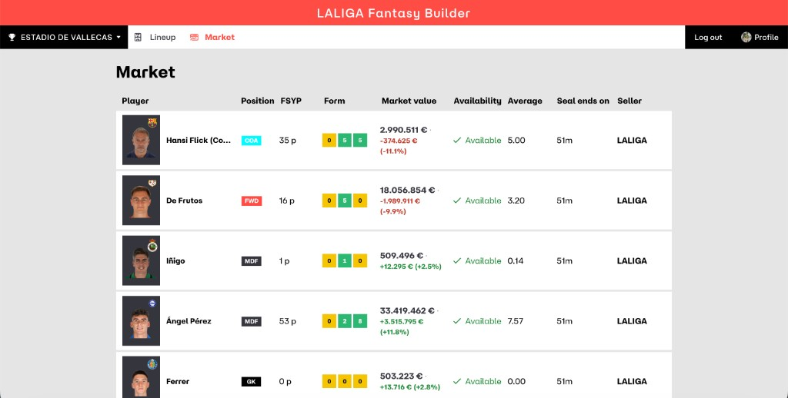

# Market API

Authenticated LaLiga league market, bids, listings, and offers under
`{CMP}/league/{leagueId}/...`. All public routes use the `/market` prefix.
To add a route, follow [Adding endpoints](../adding-endpoints.md).

## Routes

| Method | Path | Upstream | Response model |
|--------|------|----------|----------------|
| `GET` | `/market/leagues/{league_id}` | `{CMP}/league/{id}/market` | `MarketSnapshot` |
| `GET` | `/market/leagues/{league_id}/history` | `.../market/history` | `list[MarketHistoryEntry]` |
| `GET` | `/market/leagues/{league_id}/player-teams/{player_team_id}/offers` | `.../playerTeam/{id}/offer` | `PlayerTeamOffers` |
| `POST` | `/market/leagues/{league_id}/{market_id}/bids` | `.../market/{id}/bid` | `MarketMutationResult` |
| `PUT` | `/market/leagues/{league_id}/{market_id}/bids/{bid_id}` | `.../bid/{bidId}` | `MarketMutationResult` |
| `DELETE` | `/market/leagues/{league_id}/{market_id}/bids/{bid_id}` | `.../bid/{bidId}/cancel` | `MarketMutationResult` |
| `POST` | `/market/leagues/{league_id}/listings` | `.../market/sell` | `MarketMutationResult` |
| `POST` | `/market/leagues/{league_id}/immediate-sales` | `.../market/immediate-sale` | `MarketMutationResult` |
| `POST` | `/market/leagues/{league_id}/direct-offers` | `.../market/direct-offer` | `MarketMutationResult` |
| `DELETE` | `/market/leagues/{league_id}/{market_id}` | `.../market/{id}/delete` | `MarketMutationResult` |
| `POST` | `/market/leagues/{league_id}/{market_id}/offers/{offer_id}/accept` | `.../offer/{id}/accept` | `MarketMutationResult` |
| `POST` | `/market/leagues/{league_id}/{market_id}/offers/{offer_id}/reject` | `.../offer/{id}/reject` | `MarketMutationResult` |
| `DELETE` | `/market/leagues/{league_id}/{market_id}/offers/{offer_id}` | `.../offer/{id}/cancel` | `MarketMutationResult` |

All require `Authorization: Bearer <internal JWT>`. Read models use
`extra="allow"`. Write bodies use `extra="forbid"`.

Upstream confidence: current market and squad-entry offers are **High**;
history and all mutations are **Medium** (community catalog).

## Current market snapshot shape

`GET /market/leagues/{league_id}` runs upstream JSON through
`as_market_snapshot` in `schemas/payload.py` before `MarketSnapshot`
validation. Fantasy has returned more than one envelope for the same resource:

| Upstream body | Normalized API object |
|---------------|------------------------|
| `null` | `{ "marketPlayers": [], "userBids": [] }` |
| JSON array of listing objects | `{ "marketPlayers": <array> }` |
| Object with nested `market` containing `marketPlayers` / `userBids` | Unwrapped nested object |
| Object already shaped like `MarketSnapshot` | Passed through |

Wrong types (for example a top-level string) still fail closed as **502**
(`UpstreamError`), not an empty 200. Tests cover a captured snapshot fixture,
array, null, and nested `market` cases in `tests/test_market.py`.

## Frontend integration

The [market screen](../frontend.md#market-screen) uses this domain for listings,
`userBids`, and bid mutations (`POST` / `PUT` / `DELETE` on `…/bids`). UI
behaviour (eligibility, bidded state, tooltips, pending-bid cache) is documented
there — not duplicated here. Automated `fantasy-market` and browser-session
flows remain **read-only**.



## Identifiers

| Id | Source |
|----|--------|
| `leagueId` | `GET /leagues` (`id`) |
| `playerTeamId` | Team roster or market payloads (squad-entry id) |
| `marketId`, `bidId`, `offerId` | Market / offer responses |

Listing and direct-offer bodies name the field `playerId`, but Fantasy
expects the **squad-entry id** (`playerTeamId`), not the master footballer id.
`salePrice` on a listing is a whole-euro amount from 1 through 999999999.
The app also requires that amount to be at least the player's current
market value.

Immediate sale sends only `playerId`. Fantasy prices the player at half
the current market value, credits the manager, and removes the squad entry.
That upstream path is **Medium** confidence (community capture of
`POST .../market/immediate-sale`; body observed as the squad-entry id only).

## Notes

- **Ownership:** this API does not verify that ids belong to the JWT user;
  Fantasy enforces access. Obtain ids from `GET /leagues`, team squads, or
  market reads.
- **CLI:** `fantasy-market` and `fantasy-browser-session market-analysis` are
  **read-only** (no bids, sales, or offers in automated flows).

```bash
cd backend/api
uv run fantasy-market --league-id 123 --json
uv run fantasy-market --league-id 123 --player-team-id pt-9 --json
```

```bash
cd backend/auth
uv run fantasy-browser-session market-analysis --json
```

## Sample payloads

- [`assets/fantasy_market-json-tree.json`](../../../assets/fantasy_market-json-tree.json)
  — field tree inferred from `fantasy-market --json` aggregate output.
- `backend/api/tests/fixtures/market_captured_snapshot.json` — real upstream
  snapshot used in route tests (array / wrapper edge cases are covered separately
  in `tests/test_market.py`).
