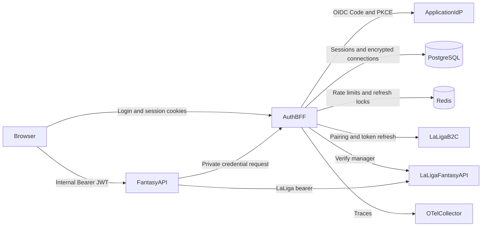
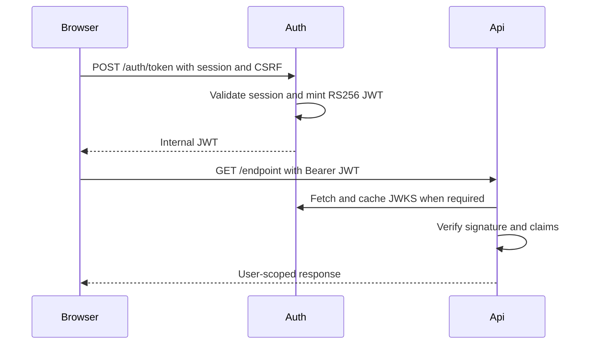
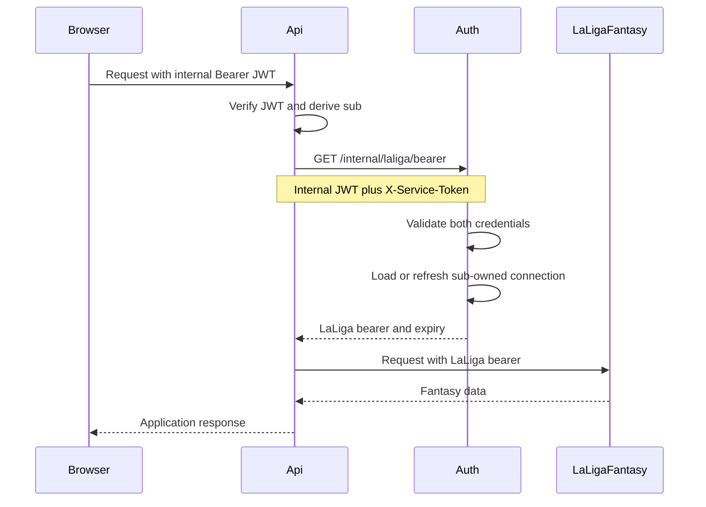
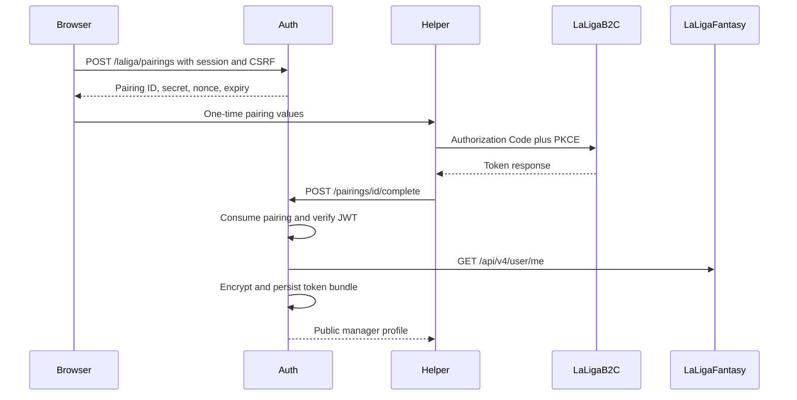

# Architecture

## Repository layout

The backend is split into independently deployable sibling services.

```text
backend/
├── auth/    Authentication, sessions, pairing, vault, token refresh
└── api/     Fantasy Builder application endpoints
```

Supporting infrastructure:

- Keycloak provides local application OIDC identity.
- PostgreSQL persists sessions, pairings, and encrypted LaLiga connections.
- Redis provides distributed rate limiting and refresh coordination.
- OpenTelemetry exports auth traces.

## System context



## Service responsibilities

### Auth BFF

`backend/auth` is the security boundary and owns:

- OIDC login, callback, ID-token verification, and logout;
- opaque browser sessions and CSRF tokens;
- internal JWT signing and public JWKS;
- LaLiga pairing and ownership confirmation;
- LaLiga access and refresh tokens;
- AES-GCM vault encryption;
- token refresh and `needs_reauth` state;
- the private credential endpoint.

Auth follows a ports-and-adapters structure:

```text
api/          HTTP routes and request dependencies
application/  Session, pairing, credentials, and token use cases
domain/       Users, tokens, and errors
ports/        Storage, identity, vault, and client protocols
adapters/     HTTP, JWKS, JWT, Postgres, Redis, and AES-GCM implementations
```

### Fantasy API

`backend/api` owns application features and:

- validates auth-issued internal JWTs using the auth JWKS;
- derives the current user exclusively from the verified `sub`;
- requests short-lived LaLiga bearers through the private auth interface;
- calls LaLiga Fantasy on behalf of that verified user;
- maps auth and upstream failures into stable API errors;
- exposes OpenAPI/Swagger from committed `backend/api/openapi.json`.

The API does not open encrypted credentials, refresh LaLiga tokens, or accept
auth session cookies.

#### Module layout

```text
backend/api/src/fantasy_api/
├── api/              # FastAPI controllers (leagues, teams, me, …)
├── services/         # JWT → LaLiga bearer → repository orchestration
├── repositories/     # Upstream path construction (per domain)
├── clients/          # AuthCredentialsClient, LaligaFantasyClient
├── schemas/          # Pydantic models (OpenAPI source)
├── domain/           # AppUser, UpstreamError, …
├── security/         # Internal JWT validation
├── openapi.py        # OpenAPI generation and ERROR_RESPONSES
└── cli/              # fantasy-leagues, fantasy-teams (local dev helpers)
```

Process-lifetime wiring lives in `api/deps.py` (`AppContainer`): one shared
`LaligaFantasyClient` and `AuthCredentialsClient` per worker, closed on
shutdown.

#### LaLiga proxy domains

LaLiga-backed features follow the same **controller → service → repository →
client** (CRS) stack. Each domain gets its own service and repository; they
do not share a generic proxy class.

| Domain | Public prefix | Upstream prefix | Methods |
|--------|---------------|-----------------|---------|
| Leagues | `/leagues/...` | `{CMP}/leagues/...` | GET (reads) |
| Teams | `/teams/...` | `{CMP}/teams/...` | GET + PUT (lineup write) |
| Players | `/players/...` | `{CMP}/players`, `{CMP}/player/...` | GET (catalog + market value public; league card authenticated) |

`{CMP}` = `{LALIGA_FANTASY_ORIGIN}/api/v1/competition/{LALIGA_COMPETITION_ID}`.

Guides:

- [Adding leagues endpoints](api/leagues/adding-leagues-endpoints.md)
- [Adding teams endpoints](api/teams/adding-teams-endpoints.md)
- [Adding players endpoints](api/players/adding-players-endpoints.md)
- [Proxy endpoint pitfalls](api/proxy-endpoint-pitfalls.md) — fail-closed
  proxy rules, read/write schemas, OpenAPI, CLI, and test expectations

#### Shared proxy building blocks

Cross-domain helpers (extend these rather than duplicating logic):

| Module | Role |
|--------|------|
| `services/laliga.py` | `with_laliga_bearer(credentials, jwt, repo_method, …)` |
| `repositories/paths.py` | Percent-encode path segments; build `{CMP}/…` paths |
| `schemas/payload.py` | `as_object`, `as_object_list` — fail on unexpected JSON shape |
| `api/payload.py` | Map parser `ValueError` → `UpstreamError` (502) |
| `clients/laliga_fantasy.py` | GET (optional bearer for public reads)/PUT; JSON errors → `UpstreamError` |
| `schemas/common.FlexibleModel` | Read models with `extra="allow"` for upstream passthrough |

Write routes use **separate** request models (`extra="forbid"`, required fields
for full-replace upstream semantics). Read routes must not silently coerce bad
upstream JSON into empty `{}` or `[]` — see the pitfalls doc.

#### Helper CLIs

`fantasy-leagues`, `fantasy-teams`, and `fantasy-players` are not part of the runtime API. They
exchange session cookies for an internal JWT (or accept `--jwt`; players public reads need no JWT) and call local
API routes for manual exploration. Shared flags and token exchange live in
`cli/common.py`.

## Trust boundaries

### Public browser-to-auth boundary

Public auth routes accept session cookies. Mutations additionally enforce
double-submit CSRF and allowed origins.

### Public browser-to-API boundary

API routes accept an internal Bearer JWT. They do not accept auth cookies.
Because authentication is in the `Authorization` header rather than ambient
cookies, API routes do not use the auth service's CSRF mechanism.

### Private API-to-auth boundary

The private credential route requires:

1. an internal JWT that identifies the application user;
2. `X-Service-Token`, supplied only by the API;
3. network isolation for `/internal/*`.

The internal JWT prevents the API from selecting an arbitrary user. The
service token and private network prevent browsers from using the credential
route directly.

### Auth-to-LaLiga boundary

Only auth communicates with LaLiga B2C for pairing and refresh. Both auth and
API may call LaLiga Fantasy, but the API gets only the current short-lived
bearer required for that call.

## Main request flows

### Authenticated application request



### LaLiga-backed application request



### LaLiga pairing



## Persistence and lifecycle

Memory adapters are intended for tests and local development.

With `USE_MEMORY_STORE=false`:

- PostgreSQL stores sessions, pairings, and connection records;
- pairing consumption is an atomic database update;
- connection token bundles are encrypted before persistence;
- Redis stores distributed rate-limit windows and refresh locks;
- startup validates required secrets and connectivity;
- migrations can be applied under a PostgreSQL advisory lock;
- readiness checks verify PostgreSQL and Redis;
- shutdown closes both clients.

The deterministic development vault key and generated internal JWT key are
not production features. Production requires configured key material.

## Error model

Auth produces stable categories:

- `unauthorized`: missing or invalid session/service credential;
- `needs_reauth`: LaLiga connection is absent or cannot refresh;
- `forbidden`: ownership violation;
- `jwt_invalid` or validation categories: invalid signed token;
- pairing categories such as replay, expiry, or rate limit;
- provider categories without leaking upstream response bodies.

The API maps outcomes through `fantasy_api.domain.errors` and global handlers
in `main.py`. Responses use a stable `{ "error", "detail" }` body; upstream
Fantasy or auth bodies are never forwarded verbatim.

| API `error` | Typical cause | HTTP |
|-------------|---------------|------|
| `unauthorized` | Missing/invalid internal JWT | 401 |
| `needs_reauth` | No LaLiga connection or refresh failed | 401 |
| `fantasy_unauthorized` | Fantasy rejected the bearer | 401 |
| `fantasy_error` | Fantasy non-2xx, non-JSON body, or unexpected payload shape | 502 / forwarded status (e.g. 503) |

Validation errors on request bodies (unknown JSON keys, missing required write
fields) return **422** before any upstream call.

Resource ownership for mutations (e.g. which `team_id` a JWT may update) is
enforced by LaLiga Fantasy unless the feature docs state an explicit API-side
check. Clients should obtain ids from authenticated list routes (e.g.
`GET /leagues`).

## Quality gates and OpenAPI

Local and CI checks keep the monorepo consistent:

- **Pre-commit** (repo root): ruff, black, OpenAPI regeneration when API
  routes/schemas change, pytest with ≥90% coverage on `backend/auth` and
  `backend/api`.
- **GitHub Actions** (`.github/workflows/ci.yml`): same lint and test pipeline
  on push to `main` and on pull requests.

OpenAPI is generated from route `response_model`, `ERROR_RESPONSES`, and
Pydantic schemas (`fantasy_api.openapi.build_openapi_schema`). The committed
`backend/api/openapi.json` must match the generator before merge. See
[OpenAPI / Swagger](api/openapi.md).

## Deployment constraints

- Auth and API are independently deployable.
- API and auth share a private network for `/internal/*`.
- Only public auth routes and intended API routes should be exposed by ingress.
- JWT private keys, the vault key, and the service token belong in a secret
  manager, not source control.
- Auth and API must use identical internal JWT issuer and audience values.
- The API's `AUTH_JWKS_URL` must resolve to the auth JWKS endpoint.
- Key rotation must keep old public keys available until all issued tokens
  have expired.
