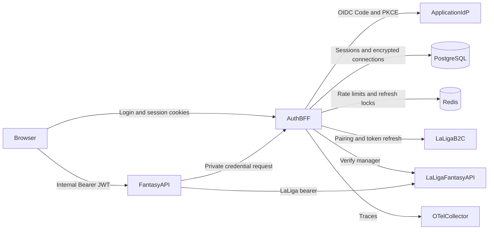
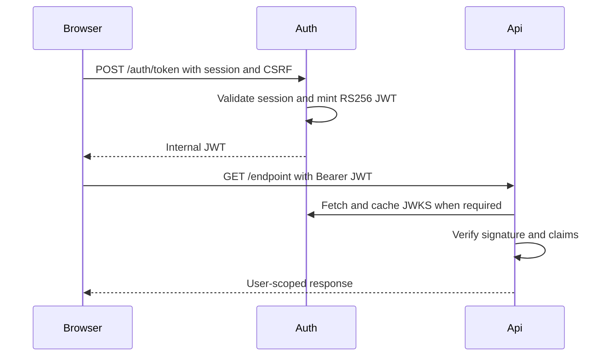
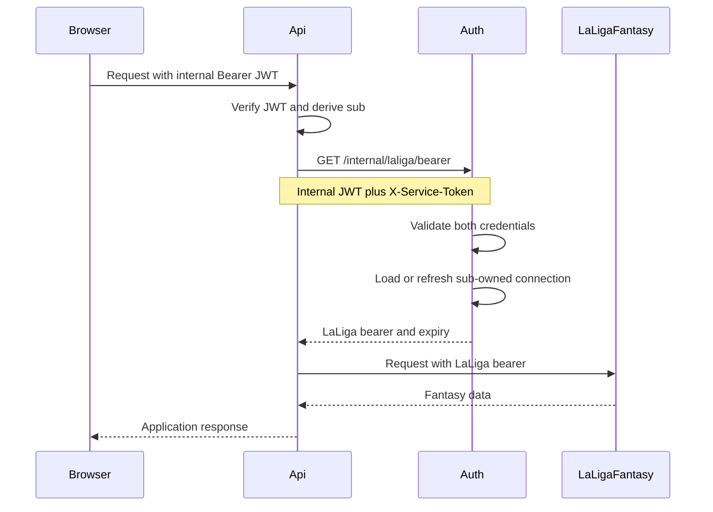
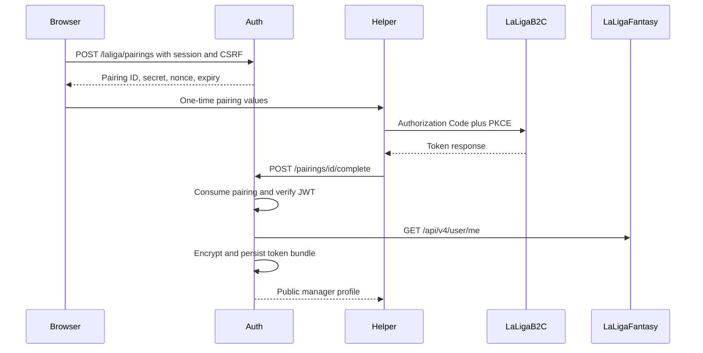

# Architecture

## Repository layout

The backend is split into independently deployable sibling services.

```text
backend/
├── auth/    Authentication, sessions, pairing, vault, token refresh
└── api/     Fantasy Builder application endpoints
```

Supporting infrastructure:

- Keycloak provides local application OIDC identity.
- PostgreSQL persists sessions, pairings, and encrypted LaLiga connections.
- Redis provides distributed rate limiting and refresh coordination.
- OpenTelemetry exports auth traces.

## System context



## Service responsibilities

### Auth BFF

`backend/auth` is the security boundary and owns:

- OIDC login, callback, ID-token verification, and logout;
- opaque browser sessions and CSRF tokens;
- internal JWT signing and public JWKS;
- LaLiga pairing and ownership confirmation;
- LaLiga access and refresh tokens;
- AES-GCM vault encryption;
- token refresh and `needs_reauth` state;
- the private credential endpoint.

Auth follows a ports-and-adapters structure:

```text
api/          HTTP routes and request dependencies
application/  Session, pairing, credentials, and token use cases
domain/       Users, tokens, and errors
ports/        Storage, identity, vault, and client protocols
adapters/     HTTP, JWKS, JWT, Postgres, Redis, and AES-GCM implementations
```

### Fantasy API

`backend/api` owns application features and:

- validates auth-issued internal JWTs using the auth JWKS;
- derives the current user exclusively from the verified `sub`;
- requests short-lived LaLiga bearers through the private auth interface;
- calls LaLiga Fantasy on behalf of that verified user;
- maps auth failures into stable API errors.

Leagues reads use a controller–service–repository layout
(`api/` → `services/` → `repositories/` → `clients/laliga_fantasy.py`) and
proxy competition league resources under
`/api/v1/competition/{id}/leagues/...`. See
[Adding leagues endpoints](adding-leagues-endpoints.md).

The API does not know how to open encrypted credentials or refresh LaLiga
tokens.

## Trust boundaries

### Public browser-to-auth boundary

Public auth routes accept session cookies. Mutations additionally enforce
double-submit CSRF and allowed origins.

### Public browser-to-API boundary

API routes accept an internal Bearer JWT. They do not accept auth cookies.
Because authentication is in the `Authorization` header rather than ambient
cookies, API routes do not use the auth service's CSRF mechanism.

### Private API-to-auth boundary

The private credential route requires:

1. an internal JWT that identifies the application user;
2. `X-Service-Token`, supplied only by the API;
3. network isolation for `/internal/*`.

The internal JWT prevents the API from selecting an arbitrary user. The
service token and private network prevent browsers from using the credential
route directly.

### Auth-to-LaLiga boundary

Only auth communicates with LaLiga B2C for pairing and refresh. Both auth and
API may call LaLiga Fantasy, but the API gets only the current short-lived
bearer required for that call.

## Main request flows

### Authenticated application request



### LaLiga-backed application request



### LaLiga pairing



## Persistence and lifecycle

Memory adapters are intended for tests and local development.

With `USE_MEMORY_STORE=false`:

- PostgreSQL stores sessions, pairings, and connection records;
- pairing consumption is an atomic database update;
- connection token bundles are encrypted before persistence;
- Redis stores distributed rate-limit windows and refresh locks;
- startup validates required secrets and connectivity;
- migrations can be applied under a PostgreSQL advisory lock;
- readiness checks verify PostgreSQL and Redis;
- shutdown closes both clients.

The deterministic development vault key and generated internal JWT key are
not production features. Production requires configured key material.

## Error model

Auth produces stable categories:

- `unauthorized`: missing or invalid session/service credential;
- `needs_reauth`: LaLiga connection is absent or cannot refresh;
- `forbidden`: ownership violation;
- `jwt_invalid` or validation categories: invalid signed token;
- pairing categories such as replay, expiry, or rate limit;
- provider categories without leaking upstream response bodies.

The API maps invalid internal JWTs to `unauthorized`, maps LaLiga relinking to
`needs_reauth`, and treats other auth failures as upstream errors.

## Deployment constraints

- Auth and API are independently deployable.
- API and auth share a private network for `/internal/*`.
- Only public auth routes and intended API routes should be exposed by ingress.
- JWT private keys, the vault key, and the service token belong in a secret
  manager, not source control.
- Auth and API must use identical internal JWT issuer and audience values.
- The API's `AUTH_JWKS_URL` must resolve to the auth JWKS endpoint.
- Key rotation must keep old public keys available until all issued tokens
  have expired.
