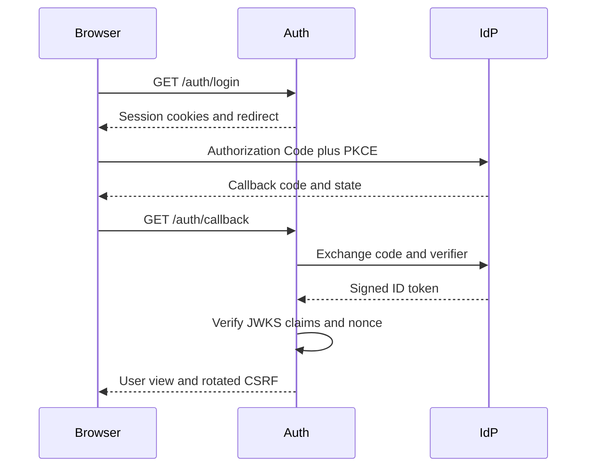

# Authentication

## Overview

The repository uses three different credential types. They have separate
purposes and must not be interchanged.

1. **Application session** — an opaque `fantasy_session` cookie managed by
   `backend/auth`.
2. **Internal access token** — a short-lived RS256 JWT minted by auth for the
   `fantasy-api` audience.
3. **LaLiga delegation** — encrypted LaLiga access and refresh tokens owned
   exclusively by auth.

Application identity comes from the configured OIDC provider. LaLiga identity
is an optional delegated account linked to that application user.

## Application login

The browser starts login with `GET /auth/login`.

Auth creates a pending server-side session containing:

- OIDC state and nonce;
- a PKCE verifier;
- a CSRF token;
- the session expiry.

Auth sets two cookies:

- `fantasy_session`: opaque, `HttpOnly`, `Secure` according to configuration;
- `fantasy_csrf`: readable by the browser so it can send `X-CSRF-Token`.

Both cookies use the configured `COOKIE_SAMESITE` policy. The default is
`lax`, which supports a top-level OIDC callback. `none` requires secure
cookies.

The browser is redirected to the OIDC provider. The provider returns to
`GET /auth/callback?code=...&state=...`. Auth then:

1. checks the pending session and state;
2. exchanges the code using PKCE;
3. verifies the ID-token signature through the provider JWKS;
4. verifies `iss`, `aud`, `exp`, `sub`, and nonce;
5. binds the verified `sub` to the session;
6. removes the pending OIDC fields and rotates the CSRF token.

The ID token is not used as an application API token.



## Browser session and CSRF rules

Safe auth reads require the valid session cookie. Browser mutations require:

- a valid session;
- `X-CSRF-Token`;
- the same value in the CSRF cookie;
- the same value in the server-side session;
- an `Origin` included in `CORS_ORIGINS` when the header is present.

These checks are implemented by `get_current_user()` and `require_csrf()` in
`backend/auth/src/fantasy_auth/api/deps.py`.

`POST /auth/logout` requires CSRF when a session cookie is present. A failed
CSRF check does not delete the session. A request without a session remains
an idempotent success.

## Internal JWT exchange

After login, the browser exchanges its session for an API token:

```http
POST /auth/token
Cookie: fantasy_session=...
Cookie: fantasy_csrf=...
Origin: https://app.example.com
X-CSRF-Token: ...
```

The response contains:

```json
{
  "access_token": "<internal-jwt>",
  "token_type": "Bearer",
  "expires_in": 900,
  "expires_at": 1770000000
}
```

The internal JWT is signed with RS256 and contains:

- `sub`: application user ID;
- `iss`: `INTERNAL_JWT_ISSUER`;
- `aud`: `INTERNAL_JWT_AUDIENCE`, normally `fantasy-api`;
- `iat` and `exp`;
- optional public `email` and `name` claims.

Auth publishes the verification key at
`GET /.well-known/jwks.json`. The API caches these keys and requires the
signature, issuer, audience, expiry, and subject.

The browser should keep this short-lived JWT in memory and send it as:

```http
Authorization: Bearer <internal-jwt>
```

Do not put this token in a URL or log it. Avoid persistent browser storage
where possible.

## LaLiga pairing

LaLiga access is optional. An authenticated browser creates a one-time pairing
with `POST /laliga/pairings`, protected by session and CSRF.

For local development, the preferred entry point is:

```bash
./scripts/authenticate-laliga.sh
```

The equivalent package command is:

```bash
cd backend/auth
uv run authenticate-laliga
```

This automation:

1. creates `backend/auth/.env` from the example when missing;
2. starts the local Keycloak service;
3. synchronizes auth dependencies with `uv`;
4. starts and health-checks auth when it is not already running;
5. opens `/auth/login`;
6. securely prompts for the session and CSRF cookie values;
7. runs the LaLiga PKCE pairing helper;
8. verifies `/laliga/connection`.

Application and LaLiga login remain interactive by design. Normal CLI code
cannot read the browser's HttpOnly session cookie, and user consent must not
be bypassed. Retrieve `fantasy_session` and `fantasy_csrf` from browser
developer tools after application login and paste them at the prompts.

On macOS, the helper reads the final `authredirect://...` URL from the
clipboard after confirmation. Use `--stdin` to paste it in the terminal or
`--callback-file PATH` to read it from a file.

Useful automation flags:

- `--skip-keycloak`: use an existing IdP;
- `--skip-server`: require auth to be already running;
- `--skip-sync`: skip dependency synchronization;
- `--no-browser`: print URLs without opening them;
- `--no-keep-server`: stop a CLI-started auth server after pairing;
- `--api-base` and `--origin`: target a non-default local endpoint.

When the CLI starts auth, it uses an in-memory store and keeps the process
alive by default. Stopping it removes the in-memory pairing state. Use a
persistent deployment for credentials that must survive process restarts.

The helper performs LaLiga Authorization Code + PKCE and calls
`POST /laliga/pairings/{pairing_id}/complete` with the one-time pairing secret.
Auth:

1. rate-limits completion attempts;
2. atomically consumes the pairing;
3. verifies the LaLiga JWT signature, issuer, audience, expiry, and nonce;
4. confirms the manager through `GET /api/v4/user/me`;
5. encrypts the token bundle with AES-GCM;
6. stores it under the application user's `sub`.

Raw LaLiga tokens are never returned to the browser.

## Private credential contract

When an API endpoint needs LaLiga, `backend/api` calls:

```http
GET /internal/laliga/bearer
Authorization: Bearer <internal-jwt>
X-Service-Token: <service-token>
```

Auth verifies both credentials. The application user comes only from the
verified JWT `sub`; the endpoint does not accept a user ID parameter.

The response contains a currently valid LaLiga bearer and expiry:

```json
{
  "bearer_token": "<laliga-bearer>",
  "token_type": "Bearer",
  "expires_at": 1770000000
}
```

`CredentialProvider` refreshes expired credentials and coordinates refreshes.
If the refresh token is no longer valid, auth marks the connection as needing
reauthentication and returns:

```json
{
  "error": "needs_reauth",
  "detail": "needs_reauth"
}
```

The API maps this to its own `NeedsReauthError`.

The bearer endpoint is private. Network policy must prevent public access to
`/internal/*`; `X-Service-Token` is an additional control, not a replacement
for network isolation.

## Configuration

Important auth settings:

- `APP_OIDC_*`: application identity provider endpoints and client settings;
- `COOKIE_SECURE`, `COOKIE_SAMESITE`, cookie names, and `CORS_ORIGINS`;
- `INTERNAL_JWT_ISSUER`, `INTERNAL_JWT_AUDIENCE`, and
  `INTERNAL_JWT_TTL_SECONDS`;
- `INTERNAL_JWT_PRIVATE_KEY_PEM` and `INTERNAL_JWT_PUBLIC_KEY_PEM`;
- `INTERNAL_SERVICE_TOKEN`;
- `TOKEN_VAULT_KEY_BASE64`;
- `DATABASE_URL` and `REDIS_URL`;
- `LALIGA_*`: LaLiga B2C and Fantasy endpoints.

Important API settings:

- `AUTH_JWKS_URL`;
- `INTERNAL_JWT_ISSUER` and `INTERNAL_JWT_AUDIENCE`;
- `AUTH_INTERNAL_BASE_URL`;
- `INTERNAL_SERVICE_TOKEN`;
- `CORS_ORIGINS`.

Production auth startup fails if the persistent stores, vault key, internal
JWT keys, JWKS URL, or service token are missing.

## Security invariants

- Never authorize with a user ID from a path, query, or request body.
- Never expose LaLiga refresh tokens, sealed bundles, or the vault key.
- Never expose `INTERNAL_SERVICE_TOKEN` to browser code.
- Never make `/internal/*` publicly routable.
- Never disable issuer, audience, expiry, signature, or subject validation.
- Use the session/CSRF dependency for auth-side browser mutations.
- Use the internal Bearer dependency for API endpoints.
- Redact `Authorization`, tokens, codes, secrets, and passwords from logs.
- Rotate internal JWT keys and the service token using the deployment secret
  manager; publish current verification keys through JWKS.
