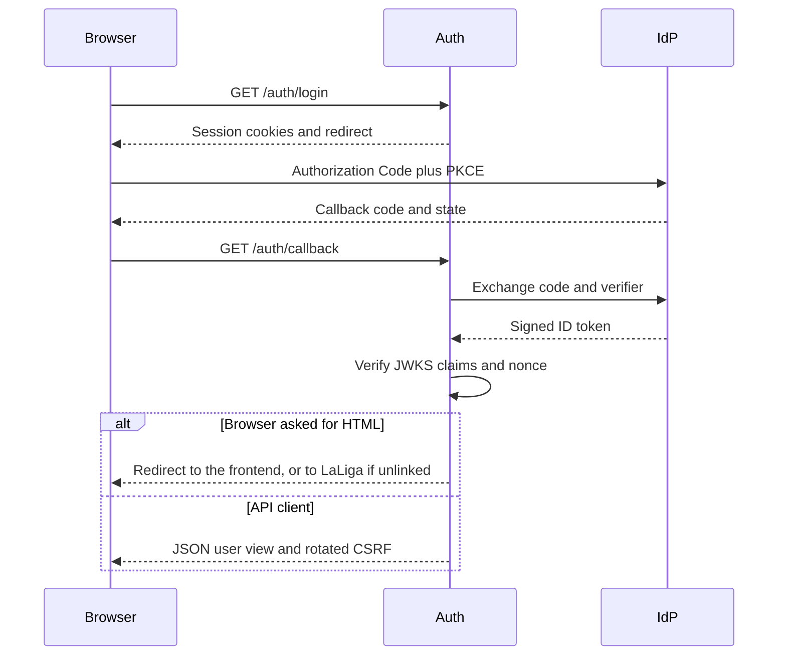

# Authentication

## Overview

The repository uses three different credential types. They have separate
purposes and must not be interchanged.

1. **Application session** — an opaque `fantasy_session` cookie managed by
   `backend/auth`.
2. **Internal access token** — a short-lived RS256 JWT minted by auth for the
   `fantasy-api` audience.
3. **LaLiga delegation** — encrypted LaLiga access and refresh tokens owned
   exclusively by auth.

Application identity comes from the configured OIDC provider. LaLiga identity
is an optional delegated account linked to that application user.

## Application login

The browser starts login with `GET /auth/login`.

Auth creates a pending server-side session containing:

- OIDC state and nonce;
- a PKCE verifier;
- a CSRF token;
- the session expiry.

Auth sets two cookies:

- `fantasy_session`: opaque, `HttpOnly`, `Secure` according to configuration;
- `fantasy_csrf`: readable by the browser so it can send `X-CSRF-Token`.

Both cookies use the configured `COOKIE_SAMESITE` policy. The default is
`lax`, which supports a top-level OIDC callback. `none` requires secure
cookies.

The browser is redirected to the OIDC provider. The provider returns to
`GET /auth/callback?code=...&state=...`. Auth then:

1. checks the pending session and state;
2. exchanges the code using PKCE;
3. verifies the ID-token signature through the provider JWKS;
4. verifies `iss`, `aud`, `exp`, `sub`, and nonce;
5. binds the verified `sub` to the session;
6. removes the pending OIDC fields and rotates the CSRF token.

The ID token is not used as an application API token.



## Browser session and CSRF rules

Safe auth reads require the valid session cookie. Browser mutations require:

- a valid session;
- `X-CSRF-Token`;
- the same value in the CSRF cookie;
- the same value in the server-side session;
- an `Origin` included in `CORS_ORIGINS` when the header is present.

These checks are implemented by `get_current_user()` and `require_csrf()` in
`backend/auth/src/fantasy_auth/api/deps.py`.

`POST /auth/logout` requires CSRF when a session cookie is present. A failed
CSRF check does not delete the session. A request without a session remains
an idempotent success.

## Internal JWT exchange

After login, the browser exchanges its session for an API token:

```http
POST /auth/token
Cookie: fantasy_session=...
Cookie: fantasy_csrf=...
Origin: https://app.example.com
X-CSRF-Token: ...
```

The response contains:

```json
{
  "access_token": "<internal-jwt>",
  "token_type": "Bearer",
  "expires_in": 900,
  "expires_at": 1770000000
}
```

The internal JWT is signed with RS256 and contains:

- `sub`: application user ID;
- `iss`: `INTERNAL_JWT_ISSUER`;
- `aud`: `INTERNAL_JWT_AUDIENCE`, normally `fantasy-api`;
- `iat` and `exp`;
- optional public `email` and `name` claims.

Auth publishes the verification key at
`GET /.well-known/jwks.json`. The API caches these keys and requires the
signature, issuer, audience, expiry, and subject.

The browser should keep this short-lived JWT in memory and send it as:

```http
Authorization: Bearer <internal-jwt>
```

Do not put this token in a URL or log it. Avoid persistent browser storage
where possible.

## LaLiga pairing

The browser flow is the diagram in
[Architecture](../architecture.md#browser-login). Auth keeps the PKCE verifier
and pairing secret on the session. `GET /laliga/login` repeats that hop for a
session that is already signed in.

LaLiga returns to `authredirect://com.lfp.laligafantasy`, not to the frontend.
The macOS URL handler posts that URL to
`POST /laliga/pairings/complete-redirect`. Auth then:

1. rate-limits the caller;
2. matches `state` to the pending session;
3. exchanges the code with B2C;
4. atomically consumes the pairing;
5. verifies the LaLiga JWT and nonce;
6. confirms the manager through `GET /api/v4/user/me`;
7. encrypts the bundle under the application user's `sub`.

The handler opens `FRONTEND_ORIGIN`. The response has no tokens.

Developer CLIs still use `POST /laliga/pairings` and
`POST /laliga/pairings/{id}/complete`. Those commands are in
[`backend/auth/README.md`](../../backend/auth/README.md).

## Private credential contract

When an API endpoint needs LaLiga, `backend/api` calls:

```http
GET /internal/laliga/bearer
Authorization: Bearer <internal-jwt>
X-Service-Token: <service-token>
```

Auth verifies both credentials. The application user comes only from the
verified JWT `sub`; the endpoint does not accept a user ID parameter.

The response contains a currently valid LaLiga bearer and expiry:

```json
{
  "bearer_token": "<laliga-bearer>",
  "token_type": "Bearer",
  "expires_at": 1770000000
}
```

`CredentialProvider` refreshes expired credentials and coordinates refreshes.
If the refresh token is no longer valid, auth marks the connection as needing
reauthentication and returns:

```json
{
  "error": "needs_reauth",
  "detail": "needs_reauth"
}
```

The API maps this to its own `NeedsReauthError`.

The bearer endpoint is private. Network policy must prevent public access to
`/internal/*`; `X-Service-Token` is an additional control, not a replacement
for network isolation.

## Configuration

Important auth settings:

- `APP_OIDC_*`: application identity provider endpoints and client settings;
- `COOKIE_SECURE`, `COOKIE_SAMESITE`, cookie names, and `CORS_ORIGINS`;
- `INTERNAL_JWT_ISSUER`, `INTERNAL_JWT_AUDIENCE`, and
  `INTERNAL_JWT_TTL_SECONDS`;
- `INTERNAL_JWT_PRIVATE_KEY_PEM` and `INTERNAL_JWT_PUBLIC_KEY_PEM`;
- `INTERNAL_SERVICE_TOKEN`;
- `TOKEN_VAULT_KEY_BASE64`;
- `DATABASE_URL` and `REDIS_URL`;
- `LALIGA_*`: LaLiga B2C and Fantasy endpoints.

Important API settings:

- `AUTH_JWKS_URL`;
- `INTERNAL_JWT_ISSUER` and `INTERNAL_JWT_AUDIENCE`;
- `AUTH_INTERNAL_BASE_URL`;
- `INTERNAL_SERVICE_TOKEN`;
- `CORS_ORIGINS`.

Production auth startup fails if the persistent stores, vault key, internal
JWT keys, JWKS URL, or service token are missing.

## Security invariants

- Never authorize with a user ID from a path, query, or request body.
- Never expose LaLiga refresh tokens, sealed bundles, or the vault key.
- Never expose `INTERNAL_SERVICE_TOKEN` to browser code.
- Never make `/internal/*` publicly routable.
- Never disable issuer, audience, expiry, signature, or subject validation.
- Use the session/CSRF dependency for auth-side browser mutations.
- Use the internal Bearer dependency for API endpoints.
- Redact `Authorization`, tokens, codes, secrets, and passwords from logs.
- Rotate internal JWT keys and the service token using the deployment secret
  manager; publish current verification keys through JWKS.
