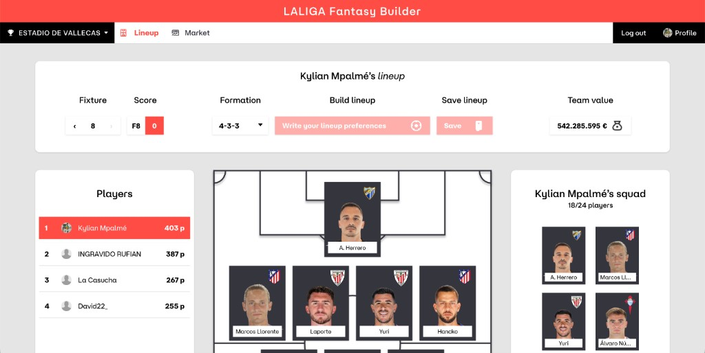
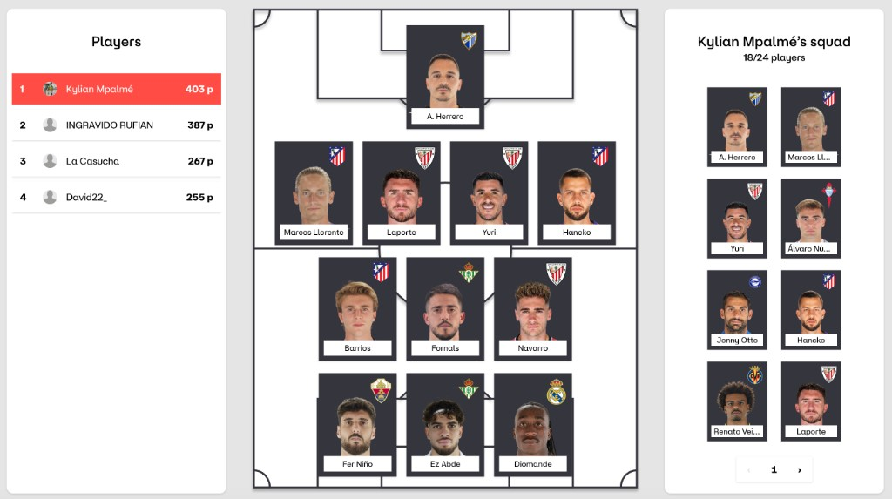

# Frontend

React app in `frontend/` (Vite, Bun). It is the browser entry point for
LaLiga Fantasy Builder: sign-in, league selection, lineup editing, and an
interactive market board. It never calls LaLiga directly and keeps the
internal JWT in memory only.

- System map: [Architecture](architecture.md)
- HTTP routes the UI calls: [API overview](api/README.md)

## Screenshots

Assets live under [`docs/images/`](images/).

## Running locally

Same-origin proxying matches production Nginx:

- `uv run poe dev` from the repo root (auth, API, and Vite), or
- `cd frontend && bun run dev:all` when backends are already up.

App URL: http://localhost:3000. `/auth`, `/laliga`, and `/api` proxy to auth
and the API.

## Routes

| Path | Screen | Primary API domains |
|------|--------|---------------------|
| `/` | Lineup — formation, pitch, squad, standings | [Leagues](api/leagues/README.md), [Teams](api/teams/README.md), [Calendar](api/calendar/README.md) |
| `/market` | Market — listings, bids, release clauses | [Market](api/market/README.md), [Buyout](api/buyout/README.md), [Players](api/players/README.md), [Calendar](api/calendar/README.md) |

The shell header switches routes. The league dropdown applies to both screens.

## Authentication

After Keycloak login, the app exchanges the session for an internal JWT
(`POST /auth/token` with CSRF) and sends `Authorization: Bearer …` on `/api`
requests. `needs_reauth` prompts the user to link LaLiga again. See
[Authentication](authentication/authentication.md).

## Shared building blocks

| Area | Location |
|------|----------|
| API paths and JSON helpers | `frontend/src/api/client.ts`, `format.ts`, `mappers.ts` |
| TanStack Query hooks | `frontend/src/api/queries.ts` |
| Modal and money display | `frontend/src/components/Modal.tsx`, `ValueBox.tsx` |
| Hover tooltip panel styles | `frontend/src/components/TooltipPanel.css` |
| Live clock for countdowns | `frontend/src/hooks/useNow.ts` |

## Lineup screen

Code: `frontend/src/features/lineup/`.

- Loads leagues, remembers selection, and supports `/?team={teamId}` to open
  another manager’s squad when that team appears in standings.
- Matchweek navigation, formation picker, lineup save (`PUT /teams/{team_id}/lineup`,
  full replace — [Teams API](api/teams/README.md)), standings, pitch, and
  paginated squad panel.
- Shared player tiles and score badges are reused on the market table.

## Market screen

Code: `frontend/src/features/market/` (`model/`, `cells/`, `actions/`,
`MarketPage.tsx`, `useMarketBoard.ts`). Row helpers are re-exported from
`marketRows.ts`.

### Toolbar

- **Your money** from `GET /api/teams/{team_id}/money` (league object fallback).
- Negative balance shows a warning icon with a tooltip: balance must be positive
  before the next matchday to score.
- **Search and filters** (`marketFilters.ts`, `MarketFilterPanel.tsx`): text search
  with a “Search in” scope (player, seller, team, or all), optional min/max ranges
  for market value, points and form, availability chips, and a seller shortcut
  dropdown. Active constraints show a badge on **Filters**; **Clear** resets every
  filter. Filter state stays on the page across market refetches. Text matching uses
  `useDeferredValue` so the listing does not re-animate on every keystroke. Panel
  and row visibility use `motion/react` with `domAnimation` and
  `MotionConfig reducedMotion="user"`.

### Data loading (`useMarketBoard`)

| # | Request | Purpose |
|---|---------|---------|
| 1 | `GET /api/market/leagues/{league_id}` | Listings and `userBids` ([Market snapshot](api/market/README.md)) |
| 2 | `GET /api/players` | Catalog (names, photos, positions) |
| 3 | `GET /api/calendar/current` | Last played matchweek for form |
| 4 | `GET /api/players/{id}/market-value` | Per listed master id (trend + tooltips) |
| 5 | `GET /api/calendar/weeks/{week}/stats` | Last three played weeks for form badges |
| 6 | `GET /api/teams/{team_id}` | Caller squad size and squad value (eligibility) |
| 7 | `GET /api/teams/{team_id}` (seller teams) | Opponent rosters when buyout lock times are missing on listings |

After bid mutations, the client refetches market, money, and squad data. A
short-lived **pending-bid overlay** reapplies local bid/cancel state on top of
stale snapshots until Fantasy confirms the change (`model/pendingBids.ts`).

### Table columns

| Column | Notes |
|--------|--------|
| Player | Photo, name (red when you have a bid); bid amount tooltip on name |
| Position | Abbrev badge (`GKP`, `DEF`, `MDF`, `ATK`, `COA`); hover shows full role name |
| FSYP | Points plus season average; hover panel: total, season average, form (last 3) |
| Form | Three played matchweeks at a time, oldest→newest; ‹ earlier, › later (full season) |
| Market value | Price and 5-day change; hover: last, highest, lowest, 5d/14d ago with % vs current |
| Availability | SVG icons + hover text for next matchday readiness |
| Seal end | Countdown; **red** when under one hour remains |
| Sell options | Seller link (`/?team=…`) or `LALIGA`; **Options** / **Bidded** action menu. On your own listings the menu offers **Withdraw from market** (confirmation modal, `DELETE /api/market/leagues/{id}/{marketId}`) and a disabled **Immediate sell** entry until a documented Fantasy route exists |

### Actions (user-confirmed only)

Each row’s menu depends on listing type and your bid state. Dialogs use grouped
euro amounts (es-ES). CLIs and browser-session flows stay read-only.

| Action | When | API |
|--------|------|-----|
| **Hire** | LaLiga listing, no active bid | `POST …/bids` |
| **Purchase bid** | Opponent listing | `POST …/bids` or `POST …/direct-offers` when `directOffer` |
| **Modify bid** / **Cancel bid** | You already bid | `PUT` / `DELETE …/bids/{bid_id}` |
| **Pay release clause** | Opponent, clause unlocked, balance OK | [Buyout pay](api/buyout/README.md) |

**Eligibility (client-side before dialogs):**

- Squad cap: fewer than 24 players and `players + active bids < 24` for new bids.
- Positive balance: bid amount ≥ market value and &lt; spending power.
- Negative balance: debt after bid ≤ 20% of squad market value.
- Coaches (`positionId` 5): **Hire** disabled; hover shows premium-only message
  (`marketMessages.ts`).

**Hover warnings on disabled menu items:**

- Locked release clause: cannot activate yet + countdown until unlock (from
  listing or seller roster `buyoutClauseLockedEndTime`).
- Coach hire: LaLiga Fantasy premium subscribers only.

**Bidded UX:** gray **Bidded** trigger with bid icon, **Modify bid**, red
**Cancel bid**; bid amount tooltips on name and button.

**Errors:** upstream bid `400` / `fantasy_error` maps to a refresh-and-retry
message when listing state changed (`marketActionErrors.ts`).

User-facing copy constants: `marketMessages.ts`, `marketActionErrors.ts`,
`bidTooltip.ts`.

### Tests

`frontend/src/features/market/**/*.test.ts`, plus `api/format.test.ts` and
`client.test.ts` for shared helpers.
