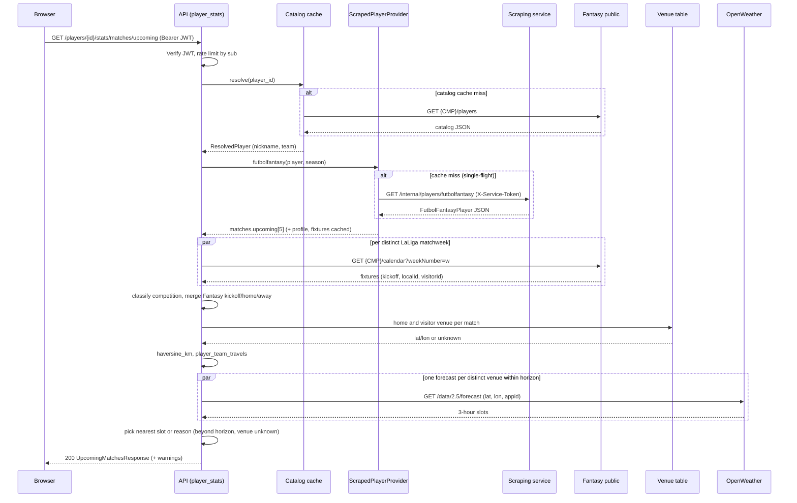

# Plan: player stats endpoint (`/players/{player_id}/stats/...`)

**Decision (2026-10-04).** Non-LaLiga fixture stats come from FutbolFantasy
competition pages (parser plan section 5). Source id **D** is those pages;
`source` is `futbolfantasy`.

**Pipeline.** The scraper returns the HTML pages for that player. The parser
turns them into one JSON document. `GET /internal/players/futbolfantasy` runs
both. The API calls only that endpoint. The call budget is **30 seconds**.

**Points.** Each stat carries `fantasy_points` (LaLiga Fantasy Oficial only)
and `dazn_points` (the DAZN 0–4 column only). Biwenger, Marca, Mister, Comunio
and any other mode are ignored. A missing points figure is `0`. Each sum is
checked against its own match total.

**Recoveries.** `balones_robados`, `balones_recuperados` and recuperaciones are
the same stat.

Status: **implemented** (plan 3 of 3; consumes the `backend/scraping` scraper and
parser libraries).

**Implementation note (2026-10-04, updated).** In `backend/scraping`:

- **Done:** FutbolFantasy **parser** (`ParserService.parse`, `merge_competitions`,
  `to_markdown`, `to_player_report` + `FantasySupplement`); **scraper HTTP**
  (`POST /internal/scrape/players`, linked-data, routes, cache, probe when
  `DEBUG=true`); CLIs `fantasy-scraper` and `fantasy-parse`; **`PlayerDocumentService`**
  and **`GET /internal/players/futbolfantasy`** (scrape + parse + merge). The parser
  accepts **live** FutbolFantasy HTML (production markup) as well as trimmed test
  fixtures — see [parser-discovery.md](../scraping/parser-discovery.md).
- **Done (API):** six **`/players/{player_id}/stats/*`** routes, CLI
  `fantasy-player-stats`, and tests in `backend/api`.

Until the facade exists, integration inside the scraping image is:
`POST /internal/scrape/players` (or `fantasy-scraper scrape`) →
`ParserService.parse(profile, companions=[market_widget, …])` → optional
`merge_competitions` for extra competition pages. Operator steps:
[scraping README](../scraping/README.md#scrape-then-parse-dev-workflow).

This API plan still returns **JSON segments only** (decision D7); it does not
import `fantasy_scraping`. Published **API** OpenAPI has no per-match stats or
market deltas; upstream `lastStats` and `market-value` behaviour is in **§1.5.0**
and **§1.5.4** (CC-11 maps the same data into `FantasySupplement`). Scraping
OpenAPI: `backend/scraping/openapi.json`.

This plan adds a **segmented, read-only** statistics API for the future Players
tab. Each segment (per-fixture stats, market-value window, recent matches,
upcoming matches, global profile) is its own route so the frontend can load
them independently. It mixes LaLiga Fantasy (public and bearer), FutbolFantasy
scrapes (LaLiga profile and the other competition slugs), and OpenWeatherMap,
plus two computed values (market deltas and kilometres between stadiums).

Read first: [`AGENTS.md`](../../AGENTS.md),
[Architecture](../architecture.md),
[Adding endpoints](../api/adding-endpoints.md),
[Proxy endpoint pitfalls](../api/proxy-endpoint-pitfalls.md),
[Developing authenticated endpoints](../authentication/developing-authenticated-endpoints.md),
[Players API](../api/players/README.md),
[Calendar API](../api/calendar/README.md),
[Market API](../api/market/README.md),
[OpenAPI / Swagger](../api/openapi.md).

## Contents

1. [Goal, scope, assumptions, data audit](#1-goal-scope-assumptions-data-audit)
2. [Route design](#2-route-design)
3. [Pydantic schema tree](#3-pydantic-schema-tree)
4. [Layers (CRS), wiring, settings](#4-layers-crs-wiring-settings)
5. [Matching, classification, merging](#5-matching-classification-merging)
6. [Security and contract rules](#6-security-and-contract-rules)
7. [CLI](#7-cli)
8. [Tests](#8-tests)
9. [Docs and generated artefacts](#9-docs-and-generated-artefacts)
10. [Milestones, risks, open questions](#10-milestones-risks-open-questions)
11. [Example responses](#11-example-responses)
12. [Frontend consumer notes](#12-frontend-consumer-notes)

---

## 1. Goal, scope, assumptions, data audit

### 1.1 Interpretation of "player/stats"

The source document asks for an endpoint "under the players route, `player/stats`".
The API prefix is already **plural**: `/players`, and every player-scoped route
is `/players/{player_id}/...` (`market-value`, `league/{league_id}`). This plan
therefore reads the request as:

```text
/players/{player_id}/stats            -> index of segments
/players/{player_id}/stats/{segment}  -> one segment per route
```

`player_id` is the **master footballer id** (`CatalogPlayer.id`), never
`playerTeamId`. No `/player/stats` (singular) route is created.

### 1.2 Goal

Give the Players tab everything it needs from one API, with each block
loadable on its own, honest provenance per value, and no invented data.

### 1.3 Scope

| In scope | Notes |
|----------|-------|
| 6 read-only `GET` routes | Index plus five segments (section 2) |
| Per-fixture stats: quantity **and** points for 19 stats | Section 1.5 mapping |
| Market-value window with presets, custom range, absolute and relative deltas | Pure computation on the public Fantasy history |
| Last 5 and next 5 matches, competition classification, weather, kilometres | Scrape + Fantasy calendar + OpenWeather + static venues |
| Global profile (injury, start probability, injury risk, history, max profitable bid, hierarchy, news) | Scrape only |
| API-side clients: `clients/scraping.py`, `clients/openweather.py` | Section 4 |
| Read-only CLI `fantasy-player-stats` | Section 7 |
| Tests, OpenAPI, endpoint-schemas, docs | Sections 8 and 9 |

### 1.4 Non-goals

- Building the scraper or parser (separate plans; this plan only consumes them,
  section 4.5 lists the consumed contract).
- Frontend implementation (only the short consumer notes in section 12).
- Historic seasons. Everything is the **current season** (derived from the
  clock, section 3.3). A `season` query is an explicit later extension.
- Road or rail distance. "Kilometres travelled" is great-circle distance
  (section 4.4). The response carries `mode: "great_circle"` so a routed mode
  can be added without a breaking change.
- Forecasts beyond what OpenWeather returns, climate averages, or any
  estimated value. Out-of-horizon weather is `null` plus a reason.
- A single "give me everything" aggregate route (section 2.1, decision D3).
- Writes of any kind. No bids, clauses, lineups, or shields.
- Persisting scraped data in a database (process-local TTL caches only).
- Exposing raw scraped HTML/Markdown, `ParserService.to_markdown`, or
  `ParserService.to_player_report` through the API (debug-only on the host via
  `fantasy-parse` in `backend/scraping`, if at all).

### 1.5 Data-availability audit

Legend. **Confidence** is how well the repo proves the source today:
**Proven** = route and shape exist in code/tests/docs; **Partial** = route
proven, field shape not; **Unverified** = plausible, nothing in the repo proves
it; **Scrape** = depends on a third-party HTML page that can change.

#### 1.5.0 Published OpenAPI vs this plan

The **published** Fantasy OpenAPI (`backend/api/openapi.json`) does **not**
expose:

- per-**match** statistical breakdown (quantity + points per event), or
- market history with `from` / `to`, presets (temporada, 30/14/10/5 días), or
  precomputed absolute/relative deltas.

What LaLiga **does** expose today:

- **`playerMaster.lastStats[]`**: roughly **five jornadas** (`weekNumber`,
  `totalPoints`, `stats.<key>` as arrays of integers). This is **weekly**, not
  per partido. Keys are not enumerated in OpenAPI (`PlayerStatWeek.stats` is an
  open object; `GET /players` lists `lastStats` without a fixed schema).
- **`GET /players/{player_id}/market-value`**: the full daily
  `{date, marketValue}` series (public). No query filters; no delta fields.

This plan adds **new** read routes under `/players/{player_id}/stats/...` that
**compose** scrape + catalog + those upstream payloads + pure client-side maths
(section 3.4). The offline parser report
(`ParserService.to_player_report` + `FantasySupplement`, see CC-11 and
`docs/scraping/parser.md`) mirrors the same split: FutbolFantasy JSON from
scrape; Fantasy weeks and market series supplied by the caller.

#### 1.5.1 Per-fixture statistics (19 stats, quantity and points)

What the repo actually knows about Fantasy per-stat data:

- `assets/leagues_info_structure.json` and `assets/fantasy_leagues-json-tree.json`
  show `playerMaster.lastStats[]` entries with `weekNumber`, `totalPoints`,
  `isInIdealFormation`, and a `stats` object. The inferred value type of each
  key is **an array of integers** (`"mins_played": ["integer"]`), and the tree
  shows exactly five entries. The captured keys are:
  `mins_played, goals, goal_assist, offtarget_att_assist, pen_area_entries,
  penalty_won, penalty_save, saves, effective_clearance, penalty_failed,
  own_goals, goals_conceded, yellow_card, second_yellow_card, red_card,
  total_scoring_att, won_contest, ball_recovery, poss_lost_all,
  penalty_conceded, marca_points`.
- `PlayerStatWeek.stats` is `dict[str, Any]` in `schemas/leagues.py`. No
  committed fixture holds real values, so **what each array element means is
  unverified**. The working hypothesis **H1** is `[quantity, points]`;
  alternatives are `[points]`, `[quantity]`, or a variable-length list.
- `CatalogPlayer.lastStats` already exists as `list[Any]` on the **public**
  catalog model. Whether the public catalog carries the same per-stat arrays
  is unverified. If it does, the Fantasy source needs **no bearer and no
  `league_id`** (source A0 below).
- `/calendar/weeks/{week}/stats` exposes only `weekPoints` per player: totals,
  no breakdown.
- There is no `dazn_points` key (`marca_points` is the Marca rating, not DAZN)
  and no big-chance key (`offtarget_att_assist` is most likely "pass leading
  to a shot off target", i.e. an assist without a goal, **not** a big chance).
  Do not map either without evidence.

Source options for the LaLiga rows, ordered by preference:

| Id | Source | Auth | Coverage | Status |
|----|--------|------|----------|--------|
| A0 | Public catalog `GET /players` entry `lastStats[].stats` | None upstream | Last 5 weeks, all players, already cached for resolution | **Unverified** |
| A1 | `GET /players/{id}/league/{leagueId}` -> `playerMaster.lastStats` | JWT + bearer + `league_id` | Last 5 weeks | **Partial** (keys known, values unknown) |
| B | futbolfantasy expanded layer ("Puntos estadísticos": event count + `X p`) via parser `fixtures` | JWT only (scrape) | Whole season, includes DAZN points | **Scrape** |
| C | `GET /calendar/weeks/{w}/stats` `weekPoints` | JWT only | Per-week **total** points only | **Proven** |
| D | FutbolFantasy competition page (`champions-…`, `copa-del-rey-…`, …) via `parse_futbolfantasy` | JWT only (scrape) | Non-LaLiga competitions, counts; FutbolFantasy points when the row has `N p` | **Scrape** |

Fallback chain per `(fixture, stat)`: `A0 -> A1 -> B` for LaLiga rows, `D` for
other competitions (same site, other slug), `C` only fills the fixture total. The first source that
supplies a value for that stat wins; the field's `source` says which one. If two
sources disagree on count or points, Fantasy (A0/A1) wins and the row gets a
`source_conflict` warning (section 3.2). A field no source provides is
`{count: null, points: null, source: "unavailable"}`.

**Discovery milestone M0 decides A0 vs A1 vs B** (section 10). Until then the
plan keeps `league_id` as an **optional** query on `/stats/fixtures`; if A0 is
verified the parameter is dropped before the first release.

#### 1.5.2 Field-by-field audit

| # | Requested field | Primary source | Fantasy key (observed in structure asset) | futbolfantasy label | Confidence | Known gap |
|---|-----------------|----------------|-------------------------------------------|---------------------|------------|-----------|
| 1 | Minutes played | A0/A1 | `mins_played` | Minutos jugados | Partial | Points meaning of the array unverified |
| 2 | Goals | A0/A1 | `goals` | Goles | Partial | Penalty goals separate in B only |
| 3 | Assists | A0/A1 | `goal_assist` | Asistencias de gol | Partial | `offtarget_att_assist` is a different stat |
| 4 | Big chances created | B | **none** | Ocasiones claras creadas | Scrape | FutbolFantasy only; no Fantasy key |
| 5 | Balls into box | A0/A1 | `pen_area_entries` | Balones al área | Partial | |
| 6 | Penalties committed | A0/A1 | `penalty_conceded` | Penaltis cometidos | Partial | `penalty_won` (provoked) is not requested |
| 7 | Penalties saved | A0/A1 | `penalty_save` | Penaltis parados | Partial | Goalkeepers only |
| 8 | Saves | A0/A1 | `saves` | Paradas | Partial | Goalkeepers only |
| 9 | Clearances | A0/A1 | `effective_clearance` | Despejes efectivos | Partial | |
| 10 | Penalties missed | A0/A1 | `penalty_failed` | Penaltis fallados | Partial | |
| 11 | Own goals | A0/A1 | `own_goals` | Goles en propia meta | Partial | |
| 12 | Goals conceded | A0/A1 | `goals_conceded` | Goles encajados | Partial | Outfield players: goals while on pitch |
| 13 | Yellow cards | A0/A1 | `yellow_card` | Tarjetas amarillas | Partial | `second_yellow_card` not exposed (decision in M0) |
| 14 | Red card | A0/A1 | `red_card` | Tarjeta roja | Partial | |
| 15 | Shots | A0/A1 | `total_scoring_att` | Tiros | Partial | |
| 16 | Successful dribbles | A0/A1 | `won_contest` | Regates con éxito | Partial | |
| 17 | Recoveries | A0/A1 | `ball_recovery` | Balones robados = balones recuperados = recuperaciones | Partial | One field, `ball_recoveries` |
| 18 | Balls lost | A0/A1 | `poss_lost_all` | Posesiones perdidas | Partial | |
| 19 | DAZN points | B | **none** (`marca_points` is not DAZN) | Columna "Puntos DAZN" (0-4) | Scrape | LaLiga only; points only, no count |

Every Fantasy key mapping is a **hypothesis until M0**. Non-LaLiga per-match
fields use the FutbolFantasy slugs in the parser plan, section 5.3.

#### 1.5.3 Everything else

| Requested data | Source | Endpoint / origin | Route | Confidence | Known gap |
|----------------|--------|-------------------|-------|------------|-----------|
| Market value history (daily) | Fantasy public | `GET {CMP}/player/{id}/market-value` | `/stats/market` | **Proven** (`PlayerMarketValue{date, marketValue}`) | Date format (date vs datetime), history length, unknown-id behaviour unverified |
| Market deltas (absolute, relative), min, max | Computed | n/a | `/stats/market` | Proven (pure maths) | Policies in section 3.4 |
| Last 5 matches: date, matchweek, result, minutes | futbolfantasy widget (parser `matches.recent[5]`) | page scrape | `/stats/matches/recent` | Scrape | Widget has no opponent or competition column; J is competition-relative |
| Last 5: competition | FutbolFantasy widget + Fantasy calendar + heuristics | section 5 | same | Partial | `other` with warning when unclassified |
| Last 5: per-fixture stats (LaLiga) | A0/A1/B | section 1.5.1 | same | see 1.5.1 | |
| Last 5: per-fixture stats (other competitions) | FutbolFantasy competition page (parser section 5) | page scrape | same | Scrape | Widget alone has no stat breakdown; the competition slug must be fetched |
| Next 5 matches: date, matchweek, home/away, competition | futbolfantasy widget (`matches.upcoming[5]`) + Fantasy calendar for LaLiga rows | scrape + `GET {CMP}/calendar?weekNumber=` | `/stats/matches/upcoming` | Scrape + Proven | Kickoff time only in widget for non-LaLiga |
| Weather | OpenWeatherMap | `GET /data/2.5/forecast` (5 day / 3 h, free) | same | **Unverified** against a live key | Horizon about 5 days; see section 4.3 |
| Kilometres between stadiums | Computed (haversine) + committed venue table | `domain/venues.py` | same | Proven (maths); venue data to be curated | Foreign clubs need table entries |
| Injury, status | futbolfantasy header + Fantasy `playerStatus` (catalog) | scrape + `GET /players` | `/stats/profile` | Scrape + Proven | |
| Start probability, injury risk, hierarchy | futbolfantasy header | scrape | `/stats/profile` | Scrape | Free-text labels (`Dios`, `Bajo`) need enum mapping with `raw` kept |
| Injury history | futbolfantasy "Lesiones" table | scrape | `/stats/profile` | Scrape | Open end date is `Actualidad` |
| Max profitable bid | futbolfantasy market widget | scrape | `/stats/profile` | Scrape | May read `Sin rentabilidad` (no amount) |
| Related news | futbolfantasy | scrape | `/stats/profile` | **Unverified** (not in the sample sheet) | Parser plan must confirm it exists |

#### 1.5.4 Upstream routes for jornada stats and market (reference)

**Estadísticas por jornada.** Each stat lives at
`playerMaster.lastStats[].stats.<clave>`. Each `lastStats` item is one **jornada**
(`weekNumber`, `totalPoints`), not one partido. Captured payloads show about
**five** jornadas, not the full season. `GET /calendar/weeks/{week}/stats` only
returns `weekPoints` totals and does **not** replace this breakdown.

| Upstream route | Auth | Where `lastStats` appears |
|----------------|------|---------------------------|
| `GET /players/{player_id}/league/{league_id}` | JWT + LaLiga bearer | `playerMaster.lastStats[]` (`playerMaster` is a loose object in OpenAPI) |
| `GET /leagues/{league_id}/teams` | JWT + bearer | `players[].playerMaster.lastStats[]` (`PlayerStatWeek` in code) |
| `GET /leagues/{league_id}/teams/{team_id}` | JWT + bearer | Same as team list |
| `GET /players` | Public catalog | `lastStats` array without a fixed per-key schema (A0; **unverified** parity with league card) |

Working mapping from product fields to Fantasy JSON keys (same as
`assets/leagues_info_structure.json` and `FantasySupplement.weeks[].stats` in the
parser). Each value is an **array of integers**; hypothesis **H1** is
`[cantidad, puntos]` (M0). There is **no** Fantasy key for grandes ocasiones
creadas or Puntos DAZN (`marca_points` is Marca, not DAZN).

| Product field | Fantasy key | Notes |
|---------------|-------------|--------|
| Minutos jugados | `mins_played` | |
| Goles | `goals` | |
| Asistencias | `goal_assist` | Not `offtarget_att_assist` |
| Grandes ocasiones creadas | — | Scrape / FutbolFantasy only |
| Balones al área | `pen_area_entries` | |
| Penaltis cometidos | `penalty_conceded` | Not `penalty_won` |
| Penaltis parados | `penalty_save` | |
| Paradas | `saves` | |
| Despejes efectivos | `effective_clearance` | |
| Penaltis fallados | `penalty_failed` | |
| Goles en propia | `own_goals` | |
| Goles encajados | `goals_conceded` | |
| Tarjetas amarillas | `yellow_card` | `second_yellow_card` exists upstream; out of scope unless M0 adds it |
| Tarjeta roja | `red_card` | |
| Tiros | `total_scoring_att` | |
| Regates con éxito | `won_contest` | |
| Recuperaciones | `ball_recovery` | |
| Balones perdidos | `poss_lost_all` | |
| Puntos DAZN | — | Scrape / FutbolFantasy only |
| Total jornada (sin desglose) | `lastStats[].totalPoints` | |

**Valor de mercado.**

| Need | Upstream | Field | Not provided upstream |
|------|----------|-------|------------------------|
| Daily series | `GET /players/{player_id}/market-value` | `date`, `marketValue` | Public. No `from`/`to`. Full history as returned by LaLiga. |
| Snapshot value | `GET /players` | `marketValue` | Catalog photo, not the chart series |
| Snapshot in league card | `GET /players/{player_id}/league/{league_id}` | `playerMaster.marketValue` | JWT + bearer; single int |
| Absolute / relative delta | — | — | **Computed** in `domain/market_window.py` (section 3.4) and in the parser report presets (`to_player_report`, anchor `meta.extracted_on`) |

For a window, filter/normalise the market-value list by `date`, take first and
last sample in the interval (with carry-forward in the API segment; the parser
report uses observed points only unless the caller pre-fills gaps). Map the
normalised list to `FantasySupplement.market_points[]` as `{date, value}`.

### 1.6 Assumptions and decisions log

| Id | Decision | Rationale |
|----|----------|-----------|
| D1 | Routes live under `/players/{player_id}/stats/...` | Section 1.1; matches existing prefix |
| D2 | One router module `api/player_stats.py`, new OpenAPI tag `player-stats` | `api/players.py` stays small; Swagger groups the segments |
| D3 | Index route returns a **segment catalogue**, not data. No `include=` aggregate | Segments hit different upstreams with different failure modes; the frontend asked for independent loads; the CLI composes segments client-side. Revisit only if a consumer needs one round trip |
| D4 | **Every** stats route requires the internal JWT, including `/stats/market` | Owner 2026-10-04. The upstream market history is public; this route is not |
| D5 | No `league_id` on these routes. LaLiga bearer is not fetched for them. Source A1 is out | Owner 2026-10-04. Fixture stats use A0, then FutbolFantasy |
| D6 | Response models keep `null` fields (`response_model_exclude_none=False`) | `null` means "not exposed upstream", which differs from "field absent". Existing routes use `exclude_none=True`; these deliberately do not |
| D7 | API defines its own tolerant wire models for scraping JSON; it does **not** import `fantasy_scraping` | Separate images; contract is JSON fixtures (section 4.5) |
| D8 | Process-local TTL caches with single-flight; no Redis | Matches how the API is deployed (stateless workers); scraper has its own cache |
| D9 | `delta_rel` is a **percentage**: `round((end - start) / start * 100, 4)`. A day move of −0,18 % is `-0.18`, not `-18` and not `-0.0018`. `null` when `start` is 0 | Owner 2026-10-04 |
| D10 | New domain errors: `NotFoundError` (404). Scraping failures reuse `UpstreamError` with new categories | Handler pattern already exists |
| D11 | Season is derived from the clock (July 1 boundary), not from upstream | No season endpoint is proven |
| D12 | Jornada Fantasy stats (`lastStats`) feed **week** aggregates and `/stats/fixtures` enrichment, not a native upstream per-match API | OpenAPI has no per-match stat endpoint; `to_player_report` uses `FantasyWeek` keyed by `weekNumber` ≈ scraped `matchday` for LaLiga rows only (CC-11) |

---

## 2. Route design

### 2.1 Overview

| # | Method | Path | Auth | Upstreams | Response model | Cache-Control |
|---|--------|------|------|-----------|----------------|---------------|
| 1 | `GET` | `/players/{player_id}/stats` | JWT | Catalog (cached) | `PlayerStatsIndex` | `private, max-age=300` |
| 2 | `GET` | `/players/{player_id}/stats/fixtures` | JWT | Catalog A0, FutbolFantasy, Fantasy calendar | `PlayerFixtureStatsResponse` | `private, max-age=600` |
| 3 | `GET` | `/players/{player_id}/stats/market` | JWT | Fantasy `market-value` | `PlayerMarketResponse` | `private, max-age=300` |
| 4 | `GET` | `/players/{player_id}/stats/matches/recent` | JWT | Catalog, FutbolFantasy, Fantasy calendar | `RecentMatchesResponse` | `private, max-age=600` |
| 5 | `GET` | `/players/{player_id}/stats/matches/upcoming` | JWT | Catalog, scraper, Fantasy calendar, OpenWeather | `UpcomingMatchesResponse` | `private, max-age=900` |
| 6 | `GET` | `/players/{player_id}/stats/profile` | JWT | Catalog, scraper | `PlayerProfileResponse` | `private, max-age=900` |

All TTLs are defaults from settings (section 4.6). Authenticated responses also
send `Vary: Authorization`.

Every stats route, including `/stats/market`, requires the internal JWT.
The upstream market history is public. This route is not. No `league_id` and
no LaLiga bearer on these routes. The existing
`/players/{player_id}/league/{league_id}` route is untouched.

### 2.2 Cross-cutting rules

**Identifiers.**

```python
PlayerIdPath = Annotated[
    str,
    Path(pattern=r"^[0-9]{1,10}$", description="Master footballer id (`CatalogPlayer.id`)."),
]
```

The pattern is tighter than the existing `str` paths because the id also feeds a
scraper query. M0 must confirm that every catalog id is numeric; otherwise
widen to `^[A-Za-z0-9_-]{1,32}$`. `leagueId` is only an optional query, never a
path, and is encoded with `repositories/paths.segment` before reaching Fantasy.

**Resolution and 404.** Segments 1, 2, 4, 5, 6 resolve `player_id` through the
cached catalog (section 2.4). Unknown id -> `NotFoundError("player not found")`
-> `404 {"error": "not_found", "detail": "player not found"}`. The market route
does **not** resolve through the catalog (no extra dependency for a public
read); an unknown id yields whatever Fantasy returns, mapped through the usual
rules (empty list -> 200 with `no_market_data`).

**Failure model: primary versus enrichment.** Each segment names its *primary*
source(s). A primary failure fails the segment; an *enrichment* failure
degrades the segment with a warning and `null` fields.

| Segment | Primary | Enrichment |
|---------|---------|------------|
| fixtures | at least one of A0, B (for LaLiga rows) | FutbolFantasy competition pages (D), Fantasy calendar (dates), C |
| matches/recent | futbolfantasy `matches.recent` | Fantasy calendar, A0/B stats, D for non-LaLiga |
| matches/upcoming | futbolfantasy `matches.upcoming` | Fantasy calendar, venue table, OpenWeather |
| profile | futbolfantasy `profile` | Catalog `playerStatus` |
| market | Fantasy `market-value` | none |

**Auth-class errors always propagate** (they are request-level, not
segment-level): `unauthorized`, `needs_reauth`, `fantasy_unauthorized`.

**Status codes.**

| HTTP | `error` | When |
|------|---------|------|
| 200 | n/a | Success, possibly with `warnings` (partial) |
| 401 | `unauthorized` | Missing/invalid internal JWT |
| 401 | `needs_reauth` | Only when `league_id` is given and auth has no usable LaLiga connection |
| 401 | `fantasy_unauthorized` | Fantasy rejected the bearer (A1) |
| 404 | `not_found` | `player_id` not in the catalog |
| 404 | `stats_source_not_found` | Player exists but the scraper could not find the page (primary scraped source) |
| 422 | (FastAPI validation) | Bad path/query; `from > to`; unknown query key (strict query models) |
| 429 | `rate_limited` | Per-`sub` limiter (section 6); sets `Retry-After` |
| 502 | `fantasy_error` | Fantasy non-2xx, non-JSON, or unexpected shape |
| 502 | `scraping_error` | Scraper returned an unexpected status, non-JSON, or a body failing the wire model |
| 503 | `scraping_unavailable` | Scraper unreachable, timed out, or returned 429/503; or `SCRAPING_BASE_URL` unset (`scraping_disabled`) |

Add `PLAYER_STATS_ERROR_RESPONSES` to `openapi.py`
(`{**ERROR_RESPONSES, 404, 429}`); the public market route uses it without
`401`, like `_PUBLIC_ERROR_RESPONSES` in `api/players.py`. Error bodies are
always `{error, detail}` with fixed, token-free `detail` strings.

**Partial segments and warnings.** Every segment response carries
`warnings: list[SegmentWarning]` and `sources: list[SourceStatus]`
(section 3.2). A warning never contains an upstream body, URL with credentials,
or exception text.

**Caching.** `Cache-Control` per the table above, set through the `Response`
parameter. Server-side caches are described in section 4.

**`response_model_exclude_none`.** Set to `False` on all six routes (D6).
Consequences: OpenAPI shows nullable fields, `endpoint-schemas.md` marks them
as optional types, and clients can distinguish "unknown" from "absent". Models
are built field by field (never `model_validate(upstream)`), so unknown
upstream keys cannot leak through `extra="allow"`.

### 2.3 Route specifications

#### Route 1: `GET /players/{player_id}/stats` (index)

- **Params:** `player_id` (path).
- **Returns:** `PlayerStatsIndex`: resolved `PlayerRef`, `season`, and a
  `segments` list. Each descriptor has `name`, `href` (relative path,
  e.g. `/players/4288/stats/market`), `auth` (`jwt` | `public`),
  `sources` (e.g. `["fantasy"]`, `["futbolfantasy", "fantasy"]`),
  `requires_scraper` (bool), `available` (bool: false when the scraper or
  OpenWeather is not configured), `query` (supported query names).
- **No scraping or weather calls.** Pure catalog lookup, so the index is cheap
  and is the right call for the Players tab shell.
- **Errors:** 401, 404.

#### Route 2: `GET /players/{player_id}/stats/fixtures`

- **Query (strict model `FixturesQuery`):**
  `competition: list[Competition] | None` (repeatable; default all),
  `last: int = Query(10, ge=1, le=60)`,
- **Behaviour:** builds one row per fixture (newest first, then truncated to
  `last`, default 10, maximum 60). LaLiga rows use catalog `lastStats` when it
  has the stat, otherwise FutbolFantasy. Other competitions use the FutbolFantasy
  competition page. No `league_id` and no LaLiga bearer.
- **Auth:** JWT.
- **Returns:** `PlayerFixtureStatsResponse`.
- **Errors:** 401, 404, 422, 429, 502, 503. A FutbolFantasy failure on a
  non-LaLiga row is a warning. If that competition was the only requested
  source, the segment is 503.

#### Route 3: `GET /players/{player_id}/stats/market`

- **Query (strict model `MarketQuery`):**
  `preset: MarketPreset | None` (`season`, `30d`, `14d`, `10d`, `5d`),
  `from: date | None` (alias of Python field `from_`), `to: date | None`.
- **Rules:** `preset` is mutually exclusive with `from`/`to`; no parameters
  means `preset=30d`; `to` defaults to today (Europe/Madrid); `from` is
  required when `to` is given; `from > to` -> 422; span over
  `MAX_WINDOW_DAYS = 400` -> 422; `to` in the future is clamped with a
  warning, not rejected (browsers in other timezones).
- **Returns:** `PlayerMarketResponse` with the requested `MarketWindow` and a
  `presets` list holding the five default windows' summaries (computed from the
  same history, no extra upstream call), so the UI can render all tab labels
  with deltas from one request.
- **Math and edge policy:** section 3.4.
- **Errors:** 422, 429, 502, 503 (Fantasy forwarded status). No 401.

#### Route 4: `GET /players/{player_id}/stats/matches/recent`

- **Query (`RecentMatchesQuery`):** `limit: int = Query(5, ge=1, le=5)`,
  `include_stats: bool = True`, `league_id` (as in route 2).
- **Behaviour:** takes `matches.recent` from the parser, classifies each match
  (section 5.2), merges LaLiga rows with Fantasy-authoritative stats and
  non-LaLiga rows with FutbolFantasy competition pages (section 5.3).
  `include_stats=false` skips Fantasy and per-match stat enrichment (cheap mode).
- **Returns:** `RecentMatchesResponse`.

#### Route 5: `GET /players/{player_id}/stats/matches/upcoming`

- **Query (`UpcomingMatchesQuery`):** `limit: int = Query(5, ge=1, le=5)`,
  `include_weather: bool = True`.
- **Behaviour:** takes `matches.upcoming`, overlays Fantasy calendar data for
  LaLiga rows, resolves venues, computes kilometres, then asks OpenWeather per
  venue. Sequence diagram in section 10.4.
- **Returns:** `UpcomingMatchesResponse`.

#### Route 6: `GET /players/{player_id}/stats/profile`

- **Query:** none (strict model with no fields: any query key -> 422).
- **Returns:** `PlayerProfileResponse` (section 3.6).

### 2.4 Resolving `player_id` to a scrape target

The scraper needs a name, not a Fantasy id. Resolution happens in
`services/player_resolver.py`:

1. Load the catalog with `PlayersRepository.list_players()` (public,
   about 840 entries) and index it by `str(id)` in a dict.
2. Cache the index in process for `PLAYER_CATALOG_TTL_SECONDS` (default 900)
   with single-flight (one refresh at a time; concurrent callers await it).
   On refresh failure keep serving the stale index up to 4x the TTL and add a
   `catalog_stale` warning; with no index at all raise the upstream error.
3. Build `ResolvedPlayer(id, name, nickname, slug, team_id, team_name,
   position_id, fantasy_status)` from `CatalogPlayer`. `team_name` comes from
   `CatalogPlayer.team` when present, else from the club directory (section 5.1).
4. Scrape query name: `nickname or name`. futbolfantasy slugs follow the
   nickname (`/jugadores/raphinha/...`), while `name` is often the full legal
   name. `team_name` is sent as an optional disambiguation hint (two players
   with similar nicknames). The scraper does the Hamming matching; the API
   never builds a futbolfantasy URL.
5. Unknown id -> `NotFoundError`.

A catalog entry with `id` missing or non-string is ignored, not fatal.
`as_model_list` is used to validate the catalog, so a non-list body is 502.

---

## 3. Pydantic schema tree

File: `backend/api/src/fantasy_api/schemas/player_stats.py`. Conventions:

- `class StatsModel(FlexibleModel)` is the base for every response model
  (`extra="allow"`, repo convention for read models). They are always built
  explicitly, never from raw upstream dicts (D6, section 6).
- Query models inherit `class StrictQuery(BaseModel)` with
  `model_config = ConfigDict(extra="forbid", populate_by_name=True)`.
  FastAPI expands them into individual query parameters in OpenAPI.
- Dates are `datetime.date`; instants are timezone-aware `datetime`; money is
  `int` euros; ratios are `float`.
- Enums are `StrEnum`.

### 3.1 Enums

```python
class Competition(StrEnum):
    LALIGA = "laliga"
    CONFERENCE_LEAGUE = "conference_league"
    EUROPA_LEAGUE = "europa_league"
    CHAMPIONS_LEAGUE = "champions_league"
    COPA_DEL_REY = "copa_del_rey"
    SUPERCOPA = "supercopa"
    OTHER = "other"

class StatSource(StrEnum):
    FANTASY_CATALOG = "fantasy_catalog"        # A0
    FANTASY_LEAGUE_CARD = "fantasy_league_card"  # A1
    FANTASY_CALENDAR = "fantasy_calendar"      # C (totals only)
    FUTBOLFANTASY = "futbolfantasy"            # B and D
    DERIVED = "derived"                        # e.g. PKatt - PK
    UNAVAILABLE = "unavailable"

class StatKey(StrEnum):  # the 19 canonical stats
    MINUTES_PLAYED = "minutes_played"
    GOALS = "goals"
    ASSISTS = "assists"
    BIG_CHANCES_CREATED = "big_chances_created"
    BALLS_INTO_BOX = "balls_into_box"
    PENALTIES_COMMITTED = "penalties_committed"
    PENALTIES_SAVED = "penalties_saved"
    SAVES = "saves"
    CLEARANCES = "clearances"
    PENALTIES_MISSED = "penalties_missed"
    OWN_GOALS = "own_goals"
    GOALS_CONCEDED = "goals_conceded"
    YELLOW_CARDS = "yellow_cards"
    RED_CARD = "red_card"
    SHOTS = "shots"
    SUCCESSFUL_DRIBBLES = "successful_dribbles"
    RECOVERIES = "recoveries"
    BALLS_LOST = "balls_lost"
    DAZN_POINTS = "dazn_points"

class MarketPreset(StrEnum):
    SEASON = "season"
    D30 = "30d"
    D14 = "14d"
    D10 = "10d"
    D5 = "5d"

class MatchResult(StrEnum):
    WIN = "W"
    DRAW = "D"
    LOSS = "L"

class InjuryRisk(StrEnum):
    LOW = "low"
    MEDIUM = "medium"
    HIGH = "high"
    UNKNOWN = "unknown"

class WeatherReason(StrEnum):
    BEYOND_HORIZON = "beyond_forecast_horizon"
    VENUE_UNKNOWN = "venue_unknown"
    KICKOFF_UNKNOWN = "kickoff_unknown"
    PROVIDER_UNAVAILABLE = "provider_unavailable"
    DISABLED = "disabled"
```

### 3.2 Shared models

| Model | Fields (type) | Notes |
|-------|---------------|-------|
| `PlayerRef` | `id: str`, `name: str \| None`, `nickname: str \| None`, `slug: str \| None`, `team_id: int \| None`, `team_name: str \| None`, `position_id: int \| None` | From the catalog |
| `SegmentWarning` | `code: str`, `source: str \| None`, `detail: str \| None` | `detail` max 200 chars, no control characters, never an upstream body |
| `SourceStatus` | `name: str` (`fantasy`, `futbolfantasy`, `openweather`, `calendar`) | |
| `SegmentEnvelope` | `player_id: str`, `player: PlayerRef \| None`, `season: str` (e.g. `"2026/27"`), `generated_at: datetime`, `sources: list[SourceStatus]`, `warnings: list[SegmentWarning]` | Base class for every segment response |
| `StatValue` | `count: int \| None`, `fantasy_points: int`, `dazn_points: int`, `source: StatSource` | Missing points are `0`. Oficial and DAZN only |
| `FixtureStats` | one `StatValue` per `StatKey` (19 explicit fields, default `StatValue(count=None, points=None, source=UNAVAILABLE)`) | Explicit fields give a readable OpenAPI; a `dict[StatKey, StatValue]` would not |

Stable warning codes (extend only by adding): `scraping_partial`, `parser_warning`,
`source_conflict`,
`competition_unclassified`, `schedule_mismatch`, `venue_unknown`,
`weather_unavailable`, `catalog_stale`, `unexpected_stat_shape`,
`stat_unavailable`, `no_market_data`, `from_clamped_to_first_sample`,
`to_clamped_to_today`, `to_clamped_to_last_sample`, `window_outside_history`,
`zero_start_value`, `single_point_window`, `dropped_invalid_points`.

`dazn_points` is `0` outside LaLiga. `minutes_played.count` is minutes.
The sum of `fantasy_points` is checked against the Oficial match total, and the
sum of `dazn_points` against the DAZN match total. A mismatch warns
`points_total_mismatch` and does not change the figures.

### 3.3 Fixtures segment

| Model | Fields |
|-------|--------|
| `FixtureRef` | `date: date \| None`, `competition: Competition`, `competition_label: str \| None` (raw label kept), `matchweek: int \| None`, `home_team: str \| None`, `away_team: str \| None`, `is_home: bool \| None`, `opponent: str \| None`, `home_score: int \| None`, `away_score: int \| None`, `result: MatchResult \| None` |
| `FixtureStatsRow` | `fixture: FixtureRef`, `minutes_played: int \| None`, `fantasy_points_total: int \| None`, `stats: FixtureStats`, `warnings: list[SegmentWarning]` |
| `PlayerFixtureStatsResponse` | extends `SegmentEnvelope`: `fixtures: list[FixtureStatsRow]` |

`season` is `"{start_year}/{end_yy}"`, computed by `domain/season.py`
(`current_season(today: date) -> Season`) with the July 1 boundary: before
July 1 the season began the previous year. `Season` also exposes
`start: date` (July 1 of the start year) and `futbolfantasy_slug` (`"26-27"`).

### 3.4 Market segment and window maths

| Model | Fields |
|-------|--------|
| `MarketSeriesPoint` | `date: date`, `value: int`, `delta_abs: int \| None`, `delta_rel: float \| None`, `filled: bool` |
| `MarketExtreme` | `date: date`, `value: int` |
| `MarketWindow` | `preset: MarketPreset \| None`, `from_: date` (alias `from`), `to: date`, `days: int`, `start_value: int \| None`, `end_value: int \| None`, `delta_abs: int \| None`, `delta_rel: float \| None`, `min: MarketExtreme \| None`, `max: MarketExtreme \| None`, `series: list[MarketSeriesPoint]` |
| `MarketPresetSummary` | `preset: MarketPreset`, `from_: date`, `to: date`, `start_value`, `end_value`, `delta_abs`, `delta_rel` (no series) |
| `PlayerMarketResponse` | extends `SegmentEnvelope`: `window: MarketWindow`, `presets: list[MarketPresetSummary]`, `current_value: int \| None`, `currency: Literal["EUR"] = "EUR"` |

Pure function, no I/O, in `domain/market_window.py`:

```python
def build_market_window(
    history: Sequence[tuple[date, int]],
    *,
    request: WindowRequest,        # preset OR (from_, to)
    today: date,                   # Europe/Madrid date, injected
    season_start: date,
    include_series: bool = True,
) -> MarketWindow: ...
```

Normalisation (`normalise_history(raw) -> tuple[list[tuple[date, int]], int]`):

1. Parse each entry's `date` as ISO date or datetime. A naive datetime is read
   as Europe/Madrid; an aware one is converted to Europe/Madrid. Take
   `.date()`. (If M0 shows date-only strings this collapses to `date.fromisoformat`.)
2. Require `marketValue` to be a non-negative `int` (or integral float).
3. Several samples on one day: keep the **last by timestamp**.
4. Entries failing 1-2 are dropped and counted; the count becomes a
   `dropped_invalid_points` warning. If the list was non-empty and **all** were
   dropped, raise `UpstreamError(502, "fantasy_error")` (unexpected shape).
5. Sort ascending by date.

Window resolution:

1. `first = history[0].date`, `last = history[-1].date`.
2. `anchor = min(today, last)`. Preset windows are anchored on `anchor`, not on
   `today`, so a stale feed still yields a full window (this matches
   `marketValueSnapshot` in the frontend, which anchors on the latest sample).
3. Presets: `N d` -> `from = anchor - N days`, `to = anchor`.
   `season` -> `from = season_start`, `to = anchor`.
4. Custom range: used literally, then clamped:
   - `to > today` -> `to = today` (`to_clamped_to_today`);
   - `to > last` -> `to = last` (`to_clamped_to_last_sample`);
   - `from < first` -> `from = first` (`from_clamped_to_first_sample`).
5. If after clamping `from > to` (range entirely outside history) return an
   empty window with `window_outside_history`; all numbers `null`.
6. Daily series for every date in `[from, to]` inclusive. A day without a
   sample **carries forward** the latest earlier value and gets `filled=true`
   (market value is a step function). There is never extrapolation beyond
   `last`, and never back-fill before `first`.
7. `start_value = series[0].value`, `end_value = series[-1].value`.
8. `delta_abs = end_value - start_value` (int, signed).
9. `delta_rel = None` if `start_value == 0`, else
   `round((end_value - start_value) / start_value * 100, 4)` (percentage;
   −0,18 % is `-0.18`). Zero start also adds `zero_start_value`.
10. Per-point `delta_abs`/`delta_rel` are **day over day** (value minus
    previous day's value; relative to the previous day's value, `None` when it
    is zero); the first point has `null` deltas. Cumulative change from the
    window start is `value - start_value`, which the chart can compute.
11. `min`/`max` over the window; ties resolve to the **earliest** date.
12. A one-day window (`from == to`) has one point, null deltas, and
    `single_point_window`.
13. `days = (to - from).days` (a `5d` window has 5 days and 6 points).
14. `presets` summaries reuse steps 2-9 with `include_series=False`; presets
    whose `from` precedes `first` are clamped the same way and carry
    `from_clamped_to_first_sample` on the envelope (not duplicated per preset).

`WindowRequest` validation (`MarketQuery`, model validator):

- `preset` with `from`/`to` -> 422 ("preset is exclusive with from/to").
- `to` without `from` -> 422.
- `from` alone -> `to = today`.
- `from > to` -> 422.
- `(to - from).days > MAX_WINDOW_DAYS` (400) -> 422.
- Nothing given -> `preset = 30d`.

Table-driven test cases are listed in section 8.3.

### 3.5 Matches segments

| Model | Fields |
|-------|--------|
| `MinutesPlayed` | `minutes: int \| None`, `started: bool \| None`, `note: str \| None` (e.g. `"Sale 76'"`, max 40 chars) |
| `RecentMatch` | `fixture: FixtureRef`, `minutes: MinutesPlayed`, `fantasy_points_total: int \| None`, `stats: FixtureStats \| None` (null when `include_stats=false`), `warnings: list[SegmentWarning]` |
| `RecentMatchesResponse` | `SegmentEnvelope` + `matches: list[RecentMatch]` (newest first, at most 5) |
| `Venue` | `club_key: str`, `stadium: str \| None`, `city: str \| None`, `lat: float`, `lon: float`, `country: str \| None` |
| `Travel` | `distance_km: float \| None`, `mode: Literal["great_circle"]`, `from_venue: Venue \| None` (home stadium), `to_venue: Venue \| None` (visitor stadium), `player_team_travels: bool \| None`, `reason: str \| None` (e.g. `venue_unknown`) |
| `WeatherSnapshot` | `temperature_c: float`, `feels_like_c: float \| None`, `humidity_pct: int \| None`, `wind_speed_ms: float \| None`, `precipitation_probability: float \| None` (0-1), `rain_mm: float \| None`, `condition: str` (Spanish description), `condition_code: int \| None`, `icon: str \| None`, `forecast_for: datetime` (UTC slot used), `granularity: Literal["3h", "daily"]`, `source: Literal["openweather"]` |
| `MatchWeather` | `snapshot: WeatherSnapshot \| None`, `reason: WeatherReason \| None` (set iff `snapshot` is null), `venue: Venue \| None` (where the forecast was requested) |
| `UpcomingMatch` | `fixture: FixtureRef` (scores null), `kickoff: datetime \| None` (aware, Europe/Madrid), `weather: MatchWeather`, `travel: Travel`, `warnings: list[SegmentWarning]` |
| `UpcomingMatchesResponse` | `SegmentEnvelope` + `matches: list[UpcomingMatch]` (soonest first, at most 5) |

`FixtureRef.matchweek` is **competition-relative** (Champions League
matchday 2 is not LaLiga matchweek 2); the field's docstring and the
consumer notes say so (section 5.2).

### 3.6 Profile segment

| Model | Fields |
|-------|--------|
| `Injury` | `active: bool \| None`, `diagnosis: str \| None`, `since: date \| None`, `expected_return: date \| None`, `availability_text: str \| None` (e.g. `"Disponible para la jornada 8"`), `fantasy_status: str \| None` (catalog `playerStatus`) |
| `StartProbability` | `matchweek: int \| None`, `percent: int \| None` (0-100), `raw: str \| None` |
| `InjuryRiskInfo` | `level: InjuryRisk`, `raw: str \| None` |
| `InjuryHistoryEntry` | `start: date \| None`, `end: date \| None` (null when ongoing), `ongoing: bool`, `diagnosis: str \| None`, `duration_days: int \| None` |
| `MaxProfitableBid` | `amount: int \| None`, `profitable: bool \| None`, `raw: str \| None` (e.g. `"Sin rentabilidad"`) |
| `Hierarchy` | `label: str \| None` (raw, e.g. `"Dios"`), `rank: int \| None` (only if the parser exposes an ordinal) |
| `NewsItem` | `title: str` (max 200), `url: HttpUrl \| None` (http/https only), `published_at: datetime \| None`, `source: str \| None` |
| `PlayerProfileResponse` | `SegmentEnvelope` + `injury: Injury`, `start_probability: StartProbability`, `injury_risk: InjuryRiskInfo`, `injury_history: list[InjuryHistoryEntry]`, `max_profitable_bid: MaxProfitableBid`, `hierarchy: Hierarchy`, `news: list[NewsItem]` (at most 10) |

Free-text labels are mapped to enums through small lookup tables in the mapper
(`Bajo`/`Medio`/`Alto` -> `LOW`/`MEDIUM`/`HIGH`, anything else -> `UNKNOWN`)
and the original string is always kept in `raw`.

### 3.7 Index

| Model | Fields |
|-------|--------|
| `SegmentDescriptor` | `name: str`, `href: str`, `auth: Literal["jwt", "public"]`, `sources: list[str]`, `requires_scraper: bool`, `available: bool`, `query: list[str]` |
| `PlayerStatsIndex` | `player: PlayerRef`, `season: str`, `segments: list[SegmentDescriptor]`, `generated_at: datetime` |

### 3.8 Query models

```python
class StrictQuery(BaseModel):
    model_config = ConfigDict(extra="forbid", populate_by_name=True)

class FixturesQuery(StrictQuery):
    competition: list[Competition] | None = None
    last: int = Field(10, ge=1, le=60)
    league_id: str | None = Field(None, min_length=1, max_length=32, pattern=r"^[0-9]+$")

class MarketQuery(StrictQuery):
    preset: MarketPreset | None = None
    from_: date | None = Field(None, alias="from")
    to: date | None = None
    # @model_validator(mode="after"): exclusivity, ordering, MAX_WINDOW_DAYS

class RecentMatchesQuery(StrictQuery):
    limit: int = Field(5, ge=1, le=5)
    include_stats: bool = True
    league_id: str | None = Field(None, min_length=1, max_length=32, pattern=r"^[0-9]+$")

class UpcomingMatchesQuery(StrictQuery):
    limit: int = Field(5, ge=1, le=5)
    include_weather: bool = True

class ProfileQuery(StrictQuery): ...  # no fields; unknown keys -> 422
```

Controllers take them as `Annotated[FixturesQuery, Query()]`. `fastapi>=0.115`
(already the project minimum) supports Pydantic query-parameter models.

### 3.9 Scraping wire models (consumed, tolerant)

File `schemas/scraped.py`, all `FlexibleModel`, all fields optional so an
extra or missing key degrades into a warning instead of a crash. Only the
subset the API reads is declared (the full list is requested from the parser
plan in section 4.5):

```python
class ScrapedStat(FlexibleModel):          # one stat in one fixture
    count: int | None = None
    points: int | None = None

class ScrapedFixture(FlexibleModel):       # futbolfantasy `fixtures[]` (LaLiga rows)
    matchweek: int | None = None
    home_team: str | None = None           # 3-letter code or name
    away_team: str | None = None
    home_score: int | None = None
    away_score: int | None = None
    minutes: int | None = None
    fantasy_points: int | None = None
    dazn_points: int | None = None
    stats: dict[str, ScrapedStat] | None = None   # keys = canonical StatKey values

class ScrapedMatch(FlexibleModel):         # matches.recent[] / matches.upcoming[]
    date: date | None = None
    kickoff_time: str | None = None        # "18:30"
    matchweek: int | None = None
    competition_raw: str | None = None
    is_home: bool | None = None
    opponent: str | None = None
    score: str | None = None               # "1-3"
    minutes: int | None = None
    minutes_note: str | None = None
    warnings: list[str] | None = None

class ScrapedProfile(FlexibleModel): ...   # injury, start_probability, injury_risk,
                                           # injury_history, max_profitable_bid,
                                           # hierarchy, news (see section 3.6)

class FutbolFantasyWire(FlexibleModel):
    meta: dict[str, Any] | None = None
    fixtures: list[ScrapedFixture] | None = None
    matches: ScrapedMatches | None = None  # recent[5], upcoming[5]
    profile: ScrapedProfile | None = None
    market: dict[str, Any] | None = None
    warnings: list[str] | None = None

```

A *missing* top-level subtree the segment needs (e.g. `profile` absent for the
profile route) is a 502 `scraping_error` (fail closed); a `null` leaf is simply
`null`.

**Wire vs parser JSON.** Golden files under
`backend/scraping/tests/parser/golden/*.json` are the source of truth for shape
and field names on the scraping side. Parser models serialize with **camelCase**
aliases (`matchday`, `displayName`, nested `StatLine` with `count` / `points` /
`status`). This plan’s Python wire models use **snake_case** for the public API
(D7, R6). The API layer maps camelCase scraping JSON → snake_case responses; it
does not import `fantasy_scraping`. Validate wire models against goldens (and
committed copies under `backend/api/tests/fixtures/scraping/` when added).

---

## 4. Layers (CRS), wiring, settings

### 4.1 Module layout (new and touched files)

```text
backend/api/src/fantasy_api/
├── api/player_stats.py              NEW  controller (6 routes)
├── api/deps.py                      EDIT container fields + build_container
├── main.py                          EDIT include router, NotFoundError handler
├── openapi.py                       EDIT tag, PLAYER_STATS_ERROR_RESPONSES, public op
├── config.py                        EDIT settings (4.6)
├── clients/scraping.py              NEW  ScrapingClient
├── clients/openweather.py           NEW  OpenWeatherClient
├── repositories/player_stats.py     NEW  paths + calls for scraping, weather, teams-master
├── repositories/paths.py            EDIT api_path() for /api/v3/...
├── services/player_stats.py         NEW  orchestrator (per-segment methods)
├── services/player_resolver.py      NEW  catalog index + cache
├── services/scraped_player.py       NEW  cache + single-flight + semaphore over the scraper
├── services/stat_merge.py           NEW  fallback chain and conflict handling (pure)
├── domain/errors.py                 EDIT NotFoundError
├── domain/season.py                 NEW
├── domain/ttl_cache.py              NEW  AsyncTtlCache (single-flight)
├── domain/market_window.py          NEW  section 3.4
├── domain/competitions.py           NEW  alias table + classifier
├── domain/clubs.py                  NEW  ClubDirectory (id/code/name matching)
├── domain/venues.py                 NEW  VenueDirectory
├── domain/geo.py                    NEW  haversine_km
├── domain/weather.py                NEW  slot selection + horizon rules
├── domain/data/venues.json          NEW  committed venue table
├── domain/data/club_aliases.json    NEW  committed alias overrides
├── schemas/player_stats.py          NEW  section 3
├── schemas/scraped.py               NEW  section 3.9
├── security/rate_limit.py           NEW  per-sub sliding window
└── cli/player_stats.py              NEW  section 7
```

The controller never imports `httpx`. Services never log or return tokens.
Pure modules under `domain/` do no I/O and take the clock as an argument.

### 4.2 Controller, `api/player_stats.py`

```python
router = APIRouter(tags=["player-stats"])

@router.get("/players/{player_id}/stats", response_model=PlayerStatsIndex,
            response_model_exclude_none=False, responses=PLAYER_STATS_ERROR_RESPONSES,
            summary="List the stats segments available for a player")
async def get_stats_index(player_id: PlayerIdPath, response: Response,
                          authorization: str | None = Header(default=None, description=...)
                          ) -> PlayerStatsIndex: ...

@router.get("/players/{player_id}/stats/fixtures", ...)
async def get_fixture_stats(player_id: PlayerIdPath, query: Annotated[FixturesQuery, Query()],
                            response: Response, authorization: ...) -> PlayerFixtureStatsResponse: ...

@router.get("/players/{player_id}/stats/market", responses=PLAYER_STATS_ERROR_RESPONSES, ...)
async def get_market_stats(player_id: PlayerIdPath, query: Annotated[MarketQuery, Query()],
                           response: Response, authorization: ...) -> PlayerMarketResponse: ...

# recent, upcoming, profile follow the same shape
```

Pattern (same as `api/players.py`): `user, jwt = await get_current_user(authorization)`;
call `get_container().player_stats_service.<segment>(...)`; set
`response.headers["Cache-Control"]`. The rate limiter dependency
(`enforce_rate_limit(user.user_id)`) runs on the scraped segments after JWT
validation. Google docstrings per the repo style (`enrich_operation_from_docstring`
strips `Args`/`Returns`).

### 4.3 Services

`services/player_resolver.py`

```python
class PlayerResolver:
    def __init__(self, players: PlayersRepository, *, ttl_seconds: int) -> None: ...
    async def resolve(self, player_id: str) -> ResolvedPlayer: ...      # NotFoundError
    async def laliga_club_ids(self) -> frozenset[int]: ...  # distinct CatalogPlayer.teamId
```

`services/scraped_player.py`

```python
class ScrapedPlayerProvider:
    def __init__(self, repository: PlayerStatsRepository, *, ttl_seconds: int,
                 max_concurrency: int) -> None: ...
    async def futbolfantasy(self, player: ResolvedPlayer, season: Season) -> FutbolFantasyWire: ...
```

Key facts: one scrape of futbolfantasy produces `fixtures`, `matches`, and
`profile` together, so the provider caches the **whole parsed player** per
`(player_id, season)` for `SCRAPED_PLAYER_TTL_SECONDS`. A Players-tab page load
that fires four segment requests therefore triggers one scrape. The cache is
`AsyncTtlCache` (single-flight per key: concurrent misses await one fetch), a
global `asyncio.Semaphore(SCRAPING_MAX_CONCURRENCY)` bounds in-flight scraper
calls, and failures are negatively cached for 30 s to stop retry storms.

`services/player_stats.py`

```python
class PlayerStatsService:
    def __init__(self, *, resolver: PlayerResolver, players: PlayersRepository,
                 calendar: CalendarRepository, credentials: AuthCredentialsClient,
                 scraped: ScrapedPlayerProvider, stats_repo: PlayerStatsRepository,
                 clubs: ClubDirectory, venues: VenueDirectory,
                 clock: Callable[[], datetime], settings: Settings) -> None: ...

    async def index(self, player_id: str) -> PlayerStatsIndex: ...
    async def fixtures(self, internal_jwt: str, player_id: str, q: FixturesQuery
                       ) -> PlayerFixtureStatsResponse: ...
    async def market(self, player_id: str, q: MarketQuery) -> PlayerMarketResponse: ...
    async def recent_matches(self, internal_jwt: str, player_id: str,
                             q: RecentMatchesQuery) -> RecentMatchesResponse: ...
    async def upcoming_matches(self, player_id: str, q: UpcomingMatchesQuery
                               ) -> UpcomingMatchesResponse: ...
    async def profile(self, player_id: str) -> PlayerProfileResponse: ...
```

- **Concurrency inside a segment:** `asyncio.gather(..., return_exceptions=True)`
  over independent enrichment calls (Fantasy calendar weeks, per-venue
  forecasts). Each result is inspected: `UnauthorizedError`,
  `NeedsReauthError`, and `UpstreamError` with status 401 are **re-raised**;
  any other `UpstreamError` from an enrichment source becomes a warning and a
  `SourceStatus(status="unavailable")`; `BaseException` that is not an
  `Exception` (cancellation) is never swallowed.
- **Fantasy calendar enrichment:** for each distinct LaLiga matchweek needed,
  `CalendarRepository.get_fixtures(week)` (public). Finished weeks are cached
  24 h, the current week 5 min, bounded by a semaphore of 6 (the repo's
  documented Fantasy concurrency guidance).
- **Bearer (A1) only:** `with_laliga_bearer(self._credentials, internal_jwt,
  self._players_card, player_id, league_id)` where `_players_card` is
  `PlayersRepository.get_league_player`. Only
  `playerMaster.lastStats` is extracted and cached (key `player_id`, TTL
  600 s); the full league card (manager, buyout, shield) is user/league-scoped
  and is **never** cached or returned.
- **Clock:** `clock` returns an aware `datetime` in UTC; `today` is
  `clock().astimezone(MADRID).date()`. Tests inject a fixed clock; no
  `freezegun`.
- **Merging** is delegated to `services/stat_merge.py`:

```python
def merge_fixture_stats(
    layers: Sequence[tuple[StatSource, Mapping[StatKey, ScrapedStat]]],
) -> tuple[FixtureStats, list[SegmentWarning]]: ...
```

  First non-null value per stat in layer order wins; a later layer that
  disagrees on a non-null count or points adds one `source_conflict` warning
  for that row.

### 4.4 Repository and clients

`repositories/player_stats.py`

```python
class PlayerStatsRepository:
    def __init__(self, fantasy: LaligaFantasyClient, scraping: ScrapingClient,
                 weather: OpenWeatherClient, *, competition_id: int = 1) -> None: ...

    async def get_teams_master(self) -> Any:            # {API}/v3/teams-master, public
    async def get_futbolfantasy(self, name: str, season_slug: str,
                                team: str | None) -> Any: ...
    async def get_forecast(self, lat: float, lon: float) -> Any: ...
```

`repositories/paths.py` gains `api_path(*parts) -> str` building
`/api/<parts>` with `segment()` on each part (needed for `/api/v3/teams-master`,
which is under `{API}`, not `{CMP}`). Every path segment in this domain goes
through `segment()`. Scraper `name`/`team` travel as **query parameters**, never
path segments, and are length-capped (80 chars) and stripped of control
characters before sending.

`clients/scraping.py`

```python
class ScrapingClient:
    def __init__(self, *, base_url: str, service_token: SecretStr,
                 timeout_seconds: float, transport: httpx.AsyncBaseTransport | None = None
                 ) -> None: ...      # one shared httpx.AsyncClient
    @property
    def enabled(self) -> bool: ...   # base_url non-empty
    async def get_json(self, path: str, params: Mapping[str, str]) -> Any: ...
    async def aclose(self) -> None: ...
```

Behaviour: sends `X-Service-Token` and `Accept: application/json`; only a
**relative path** chosen from a fixed set of constants is accepted (no caller
URL, so no SSRF); `base_url` comes from settings only. Error mapping to
`UpstreamError`:

| Scraper outcome | `status_code` | `category` |
|-----------------|---------------|------------|
| `enabled` is false | 503 | `scraping_disabled` |
| connect error, read timeout, pool timeout | 503 | `scraping_unavailable` |
| 404 | 404 | `stats_source_not_found` |
| 429, 503 | 503 | `scraping_unavailable` |
| 401, 403 | 502 | `scraping_error` (misconfigured token; detail is generic) |
| other non-2xx | 502 | `scraping_error` |
| 2xx non-JSON or empty body | 502 | `scraping_error` |

Exception text is never copied into the message; `raise ... from None` after
logging only the exception type and the scraper path (no query values).

`clients/openweather.py`

```python
class OpenWeatherClient:
    def __init__(self, *, api_key: SecretStr | None, base_url: str,
                 timeout_seconds: float, transport=None) -> None: ...
    @property
    def enabled(self) -> bool: ...
    async def forecast(self, lat: float, lon: float) -> Any: ...
```

- Endpoint: `GET {base}/data/2.5/forecast?lat&lon&units=metric&lang=es&appid=<key>`
  (5-day / 3-hour, free tier; returns `list[40]` slots with `dt` (UTC epoch),
  `main.temp`, `main.feels_like`, `main.humidity`, `weather[0]`, `wind.speed`,
  `pop`, `rain.3h`). The shape is **to be confirmed with the user's key in M0**.
- `appid` can only be sent as a query parameter, so URL logging is a leak
  vector: the client sets `logging.getLogger("httpx").setLevel(WARNING)` at
  construction (httpx logs request URLs at INFO), never interpolates the key
  into messages, and maps every `httpx.HTTPError` to
  `UpstreamError("weather unavailable", 503, "weather_unavailable")` with
  `from None` (httpx error strings contain the full URL).
- Quota: free tier is about 60 calls/min. The service asks **once per venue**
  (a forecast covers every match at that venue) and caches by
  `(round(lat, 2), round(lon, 2))` for `WEATHER_TTL_SECONDS` (1800); a
  semaphore of 3 bounds concurrent calls. 401/429/5xx become
  `weather_unavailable` and the segment still succeeds with
  `weather.reason = provider_unavailable`.
- `enabled` is false when no key is configured -> `reason = disabled`.

`domain/weather.py` (pure):

```python
FORECAST_HORIZON = timedelta(hours=120)
SLOT_TOLERANCE = timedelta(minutes=90)

def pick_slot(slots: Sequence[ForecastSlot], kickoff_utc: datetime, now_utc: datetime
              ) -> ForecastSlot | WeatherReason: ...
```

Rules: upcoming matches are future by definition, so a kickoff already in the
past is dropped by the service with a `schedule_mismatch` warning; a missing
kickoff time yields `KICKOFF_UNKNOWN`; a kickoff after `now + FORECAST_HORIZON`
or after the last slot yields `BEYOND_HORIZON`; otherwise the slot with minimal
`|dt - kickoff|` is chosen, provided it is within `SLOT_TOLERANCE`.
**Planning note:** with the free 5-day forecast, the example sheet in the source
document (today 2026-10-03, next match 2026-10-10) would show weather `null`
for all five upcoming matches until three to five days before kickoff. That is
a provider limit, not a bug; see open question Q3 (One Call 3.0 gives 8 days).

`domain/geo.py`:

```python
EARTH_RADIUS_KM = 6371.0088

def haversine_km(lat1: float, lon1: float, lat2: float, lon2: float) -> float: ...
```

"Kilometres travelled" is defined as the **great-circle distance between the
home team's stadium and the visiting team's stadium**, rounded to 0.1 km. The
response adds `player_team_travels` (true when the player's team is the
visitor), because for a home match the distance is the *opponent's* trip.
Road distance is a non-goal.

`domain/venues.py`:

```python
@dataclass(frozen=True, slots=True)
class VenueEntry:
    club_key: str; fantasy_id: int | None; slug: str | None; name: str
    stadium: str; city: str; country: str; lat: float; lon: float
    aliases: tuple[str, ...]

class VenueDirectory:
    @classmethod
    def load(cls) -> "VenueDirectory": ...        # reads domain/data/venues.json once
    def for_club(self, *, fantasy_id: int | None, name: str | None) -> VenueEntry | None: ...
```

`venues.json` is a committed, reviewed table: the 20 current LaLiga clubs (keys
by Fantasy `id`, resolvable without `teams-master`), the lower-division clubs in
`assets/teams_master.json`, and foreign clubs by alias as they appear in the
European competitions (grown from the `venue_unknown` log counter). A club that
plays temporarily away from its stadium (works, ground sharing) needs a table
edit; the file is reviewed each August with the season rollover. Unknown club
-> `distance_km = null`, `reason = venue_unknown`, `weather.reason =
venue_unknown`. Neutral-venue matches (Supercopa, finals) are `venue_unknown`
unless a future parser field names the venue (open question Q6).

### 4.5 Consumed scraping contract (to reconcile with the scraper and parser plans)

**Target.** The API calls `GET /internal/players/futbolfantasy` and receives JSON.
`PlayerDocumentService` inside `backend/scraping` calls `ScraperService` and
then `ParserService`. The API does not parse HTML.

**Interim (today).** The API (or tests) can call `POST /internal/scrape/players`
with `include: profile, market, competition, …` (see
[player-stats-scraper.md](player-stats-scraper.md) and `backend/scraping/openapi.json`),
then run the same parse/merge logic the facade will encapsulate. Market numbers
usually need **`market_widget`** in `include` and `ParserService.parse(...,
companions=[widget_page])`; profile-only HTML leaves `market` partial or empty.

| Id | Needed from the scraping side | Why |
|----|-------------------------------|-----|
| CC-1 | `GET /internal/players/futbolfantasy?player_name=&season=&team=` returns the parsed `FutbolFantasyPlayer` JSON (`meta`, `fixtures`, `matches`, `profile`, `market`, `warnings`) | One call feeds four segments |
| CC-2 | Non-LaLiga fixture rows merged via **`ParserService.merge_competitions`** after parsing one page per `season_slug` | Implemented in parser; facade must orchestrate multi-page scrape + merge |
| CC-3 | Auth by `X-Service-Token` on `/internal/*`; Compose probes **`GET /health/live`** and **`GET /health/ready`** (no token); **`GET /internal/health`** (token) for index/cache stats | Same pattern as auth `/internal/*` |
| CC-4 | `{count, fantasy_points, dazn_points}` per stat. Oficial and DAZN only | Owner 2026-10-04 |
| CC-5 | Missing count stays `null`. Missing points are `0`. Check both sums against their match totals | Owner 2026-10-04 |
| CC-6 | Errors: `404 {"error": "player_not_found"}`, `429`, `502`, `503`; bodies carry no page content. Parser `UnsupportedLayoutError` → `scrape_layout_changed` (502); live HTML may still parse with warnings | Maps to section 4.4 |
| CC-7 | Responses include `meta.scraped_at` and `meta.source_url` | `SourceStatus.fetched_at` |
| CC-8 | Optional `team` hint for disambiguation; deterministic result for the same inputs | Hamming match ties |
| CC-9 | Profile includes `news[]` (title, url, date) if the page has it, else `profile.news = []` with a warning | News availability is unverified |
| CC-10 | The API waits **30 s** for the internal futbolfantasy call (scrape + parse + merge budget) | Owner 2026-10-04; align `scraping_timeout_seconds` (§4.6) |
| CC-11 | Parser output matches `FutbolFantasyPlayer` / `ParsedPlayer` (see `docs/scraping/parser.md`, goldens under `backend/scraping/tests/parser/golden/`) | API wire models map fields; no package import |

**Markdown report (out of API scope).** `to_player_report(player, supplement)` is
a pure renderer for tooling. The API builds the same *inputs* the supplement
expects when segments are loaded, but returns structured JSON, not Markdown:

| `FantasySupplement` field | API segment / upstream |
|---------------------------|-------------------------|
| `weeks[]` (`week_number` ← `weekNumber`, `total_points` ← `totalPoints`, `stats` with upstream keys such as `mins_played`, `goals`, `goal_assist`) | Map from A0 (`GET /players` catalog `lastStats`, unverified) or from team/league payloads when bearer is available; **decision D5** targets catalog-only for v1. Typical length ≈ **5** jornadas (section 1.5.4). Wire models use snake_case; supplement keeps **upstream key names** in `stats`. |
| `market_points[]` (`date`, `value` ← `marketValue`) | Normalised output of `GET /players/{id}/market-value` after `/stats/market` fetch (section 3.4). Upstream has no deltas; report section `### Valor de mercado` presets match API preset maths (D9). |
| `upcoming[]` (`date`, `weather`, `distance_km`) | `matches/upcoming` segment (OpenWeather + `domain/venues.py`) |

LaLiga rows in the report prefer a Fantasy week whose `week_number` equals the
scraped `matchday` (jornada label on the FutbolFantasy widget, not guaranteed
1:1 with a single partido). Non-LaLiga rows use FutbolFantasy per-match stats
only. `big_chances_created` and DAZN have no Fantasy stat keys in the supplement
(section 1.5.4).

Contract tests: golden JSON from the parser suite (for example
`backend/scraping/tests/parser/golden/*.json` or committed copies under
`backend/api/tests/fixtures/scraping/futbolfantasy_*.json`); this plan validates
them with the wire models (D7). A parser release that breaks
a golden file fails the API test suite.

### 4.6 Settings, `.env`, Compose

`config.py` additions (all typed; secrets are `SecretStr`):

| Setting | Default | Notes |
|---------|---------|-------|
| `scraping_base_url: str` | `""` | Empty disables scraped segments (503 `scraping_disabled`) |
| `scraping_service_token: SecretStr` | `""` | Distinct from `INTERNAL_SERVICE_TOKEN` (least privilege). A validator fails startup if the base URL is set and the token is empty |
| `scraping_timeout_seconds: float` | `30.0` | Per internal futbolfantasy call (CC-10; scrape + parse + merge) |
| `scraping_max_concurrency: int` | `4` | In-flight scraper calls per worker |
| `openweather_api_key: SecretStr \| None` | `None` | Empty disables weather |
| `openweather_base_url: str` | `https://api.openweathermap.org` | |
| `openweather_timeout_seconds: float` | `5.0` | |
| `player_catalog_ttl_seconds: int` | `900` | |
| `scraped_player_ttl_seconds: int` | `900` | |
| `weather_ttl_seconds: int` | `1800` | |
| `market_history_ttl_seconds: int` | `300` | |
| `teams_master_ttl_seconds: int` | `86400` | |
| `player_stats_rate_limit_per_minute: int` | `60` | Per JWT `sub`, scraped segments |

`backend/api/.env.example` and `backend/api/README.md` document the new
variables (`SCRAPING_BASE_URL`, `SCRAPING_SERVICE_TOKEN`, `OPENWEATHER_API_KEY`,
TTLs). Per the repo convention ("Compose only substitutes names in the root
`.env`; service secrets stay in the service `.env`"):

- root `.env.template` gains `SCRAPING_SERVICE_PORT=8002` (proposal; owned by
  the scraping plan) and `SCRAPING_SERVICE_TOKEN=dev-scraping-token`, because
  both containers need the same token;
- `OPENWEATHER_API_KEY` lives only in `backend/api/.env`.

`docker-compose.yml`:

- `api` gets `SCRAPING_BASE_URL: http://${SCRAPING_SERVICE_HOST:-scraping}:${SCRAPING_SERVICE_PORT:-8002}`,
  `SCRAPING_SERVICE_TOKEN: ${SCRAPING_SERVICE_TOKEN}`, and
  `depends_on: scraping: {condition: service_healthy, required: false}`. The API
  must still boot without the scraper (segments report `scraping_unavailable`).
- The `scraping` service (defined by the scraping plan) must publish **no host
  port** and be reachable only on the `internal` network. Important network
  finding: the existing `internal` network is `internal: true`, which blocks
  outbound traffic, so a scraper that must reach `futbolfantasy.com` also needs
  a non-internal egress network (for example a new `egress` bridge). The API
  already sits on `public`, so OpenWeather needs no change. Coordinate the
  network definition with the scraping plan.
- Dependency note: add `tzdata` to `backend/api/pyproject.toml` because
  `python:3.14-slim` images may not ship a tz database and the plan uses
  `zoneinfo.ZoneInfo("Europe/Madrid")`.

### 4.7 Container, router, OpenAPI

- `AppContainer` gains `scraping_client`, `weather_client`,
  `player_stats_service`; `aclose()` also closes the two new clients (one shared
  `httpx.AsyncClient` each, per the pitfalls doc). `build_container` accepts
  overrides for all three, like the existing services.
- `tests/test_container.py::build_test_container` gains optional
  `scraping_transport` and `weather_transport` arguments. Default: scraping
  disabled (empty base URL) and weather disabled, so the existing test files
  are unaffected; a test that touches them must opt in.
- `main.py`: `from fantasy_api.api import ..., player_stats`;
  `app.include_router(player_stats.router)` after `players.router`; register a
  `NotFoundError` handler returning `404 {"error": "not_found", "detail": ...}`.
  CORS needs no change (GET only).
- `openapi.py`: add tag `player-stats` to `OPENAPI_TAGS`; add
  `("GET", "/players/{player_id}/stats/market")` to `public_operations`;
  extend `API_DESCRIPTION` with one sentence on scraped segments.
- `domain/errors.py`: `class NotFoundError(ApiError)` with the same shape as
  `UnauthorizedError`.

---

## 5. Matching, classification, merging

### 5.1 Club identity across sources

Sources name clubs differently: Fantasy uses numeric `teamId`/`localId`/
`visitorId`; `teams-master` has `id`, `name`, `shortName`, `slug`, `dspId`;
futbolfantasy LaLiga rows use 3-letter codes (the source sheet shows
`SEV, BAR, RAC, LEV, VAL, RAY, ELC, ATH`, which equal `teams-master`
`shortName`); FutbolFantasy and foreign opponents may use longer labels.

`domain/clubs.py`:

```python
class ClubDirectory:
    def __init__(self, teams_master: Sequence[Mapping[str, Any]],
                 laliga_ids: frozenset[int], aliases: Mapping[str, str]) -> None: ...
    def match(self, label: str, *, prefer_laliga: bool = True) -> Club | None: ...
    def by_id(self, club_id: int) -> Club | None: ...
```

Matching order for a label: (1) exact `shortName` among first-division clubs
(`shortName` is **not unique**: `CEL` is both Celta and Celta Fortuna, so the
first-division set from the catalog's distinct `teamId`s breaks the tie);
(2) exact normalised `name`; (3) committed alias from `club_aliases.json`
(`"Barça" -> "FC Barcelona"`); (4) normalised name with club-type tokens
(`fc`, `cf`, `cd`, `ud`, `rcd`, `real`, `sd`, `rc`, `club`, `deportivo`)
stripped. Normalisation: Unicode NFKD, remove diacritics, `casefold`, collapse
punctuation. No fuzzy matching by default: a wrong club is worse than an
unmatched one. A label that matches nothing keeps its raw string and the match
is still returned; `club` is `None` and the venue lookup falls back to the
alias path in `venues.json` (foreign clubs).

`teams-master` is fetched through `PlayerStatsRepository.get_teams_master()`,
cached 24 h, and failure is non-fatal: the directory falls back to the
committed venue table and aliases (which also carry Fantasy ids), and a
`schedule_mismatch` warning is added only when a LaLiga club cannot be
identified.

### 5.2 Competition classification and matchweek semantics

`domain/competitions.py`:

```python
def classify_competition(raw: str | None) -> Competition: ...
def normalise_competition_label(raw: str) -> str: ...   # casefold, strip accents/punctuation
```

Alias rules, evaluated **in this order** (first hit wins; order matters because
"Europa" is a substring of "Conference" labels in some sources):

1. `conference` (`europa conference league`, `conf lg`, `uecl`) -> `conference_league`
2. `champions` (`champions lg`, `uefa champions`, `ucl`) -> `champions_league`
3. `europa league` (`europa lg`, `uel`) -> `europa_league`
4. `copa del rey` -> `copa_del_rey`
5. `supercopa de espana`, `supercopa` **not** followed by `europa`/`uefa` -> `supercopa`
6. `la liga`, `laliga`, `primera division`, `ea sports`, `laliga ea sports` -> `laliga`
7. everything else (friendlies, UEFA Super Cup, Copa Catalunya, qualifiers not
   named above) -> `other`

Resolution pipeline for a scraped match (recent or upcoming), first success wins:

1. **Fantasy calendar join (LaLiga authority):** find a fixture where
   `{localId, visitorId}` contains the player's `team_id`, `matchweek`
   equals the scraped J, and `matchDate` is within +-1 day of the scraped date.
   Hit -> `laliga`, kickoff/home/away/ids taken from Fantasy.
2. **Parser label:** `competition_raw` through `classify_competition`.
3. **Parser competition slug** on the merged FutbolFantasy payload when the row
   came from a competition page (`fixtures[].competition`).
4. Otherwise `other` with `competition_unclassified`, `competition_label = null`.

A scraped row that *claims* LaLiga (label) but fails step 1 keeps `laliga` with
`schedule_mismatch` (do not silently drop; Fantasy's calendar may lag).

**Matchweek (`Jornada`) semantics.** The widget's `J` is *competition-relative*:
in the source sheet the same list shows `J7, J6, J5, J1, J4` and `J8, J2, J9,
J3, J10`, where `J1`/`J2`/`J3` on non-league dates are Champions League league-phase
matchdays, not LaLiga matchweeks 1-3 (the sheet itself notes "partido no liguero
en calendario"). API rule: `FixtureRef.matchweek` is the number within
`FixtureRef.competition`, and consumers must key on `(competition, matchweek)`.
The LaLiga/Fantasy join (step 1) is only attempted when the label is absent or
`laliga`, so a Champions League "J2" is never matched to LaLiga week 2 by
accident. For non-LaLiga rows the scraped `J` from the widget fills
`matchweek` when it is competition-relative; otherwise `matchweek` may be
`null`.

### 5.3 Merging recent matches and per-fixture rows

Inputs: parser `matches.recent` (date, J, score, minutes, note), parser
`fixtures` (LaLiga per-week and other competitions from merged competition pages),
Fantasy sources A0/A1, Fantasy calendar.

Algorithm for `matches/recent` (and the same row builder for `fixtures`):

1. Take the scraped `matches.recent` rows (newest first, limited).
2. Classify each (5.2).
3. **LaLiga rows:** attach the parser `fixtures` entry with the same
   `matchweek`; fetch Fantasy A0/A1 `lastStats` for that `weekNumber`; build
   `FixtureStats` by `merge_fixture_stats([(FANTASY_*, ...), (FUTBOLFANTASY, ...)])`.
   `fantasy_points_total` = Fantasy `totalPoints`, else scraped
   `fantasy_points`, else calendar `weekPoints` (source C).
   Opponent, scores, and `is_home` come from the Fantasy calendar fixture
   (authority) else from the scraped `fixtures` entry (`SEV 1-3 BAR` ->
   home `SEV`, away `BAR`).
4. **Non-LaLiga rows:** join to the parser `fixtures` row for that competition
   and date (+-1 day) and score. Stats come from FutbolFantasy per-match layers
   (`source=futbolfantasy`). DAZN points apply only when the page publishes
   them (typically LaLiga); big chances use the FutbolFantasy layer when present.
   An unresolved join leaves `stats = null` and adds `scraping_partial`.
5. `result` (`W/D/L`) is computed from the scores and `is_home` (player's
   team perspective), never taken from a label.
6. `minutes`: parser value, else Fantasy `mins_played` on LaLiga rows.

Fantasy wins any conflict; the loser is reported as `source_conflict`.
A competition filter on `/stats/fixtures` is applied after classification.

---

## 6. Security and contract rules

Derived from `AGENTS.md`, the pitfalls doc, and the auth boundary doc.

| Rule | How this plan satisfies it |
|------|----------------------------|
| Authorize from JWT `sub`; never accept caller `user_id` | `get_current_user` on all routes except market; no user id parameter anywhere. Segments contain **no user-scoped data**; the JWT is an access gate and the rate-limit key |
| No LaLiga tokens or vault secrets in responses | Bearer used only inside `with_laliga_bearer` for A1; the response models have no token field; tests assert the bearer string is absent from every body |
| No raw upstream error bodies | `UpstreamError` messages are fixed strings (`"scraping unavailable"`, `"weather unavailable"`); `SegmentWarning.detail` is capped and sanitised; parser `warnings` are forwarded as capped strings only |
| Do not persist or log the bearer | A1 extracts `lastStats` only; the cached object holds no token; the full league card is not cached |
| Fail closed | A missing required subtree, wrong type, non-JSON 200, or a catalog that is not a list of objects -> 502, never `{}`/`[]`. An *empty* but well-formed list is a legitimate empty result |
| Encode every path segment | `paths.segment` for Fantasy; scraper input goes in query parameters; CLI uses `path_segment` |
| No arbitrary URLs / SSRF | The scraper client accepts only constant relative paths and a configured base URL; the API never fetches URLs found in scraped content. `NewsItem.url` is validated `http`/`https` and returned only, never requested |
| API key never logged | `SecretStr` settings; httpx INFO logger raised to WARNING; no `str(exc)` from httpx errors (they embed the URL and `appid`); tests capture logs and assert the key is absent |
| Service token on a private network | `X-Service-Token` on every scraper call; scraper has no host port; token distinct from `INTERNAL_SERVICE_TOKEN`; settings validator rejects base URL without token |
| Rate limiting | In-process sliding window per JWT `sub` (`security/rate_limit.py`, default 60/min) on the four scraped segments -> `429 rate_limited` with `Retry-After`. It is per worker, which is acceptable because the scraper has the authoritative per-site limits. Market has no limiter (cheap, cached) |
| Per-segment timeouts | Scraper 20 s, OpenWeather 5 s, Fantasy default 30 s; segment-level `asyncio.timeout` of 25 s around enrichment fan-outs |
| Concurrency limits against the scraper | `Semaphore(SCRAPING_MAX_CONCURRENCY)`, single-flight per `(player, season)`, negative cache 30 s |
| Read vs write models | Everything here is a read model. No write schema exists, so no `extra="forbid"` body model is needed; the strict models are query models |
| CLIs and browser session read-only | Section 7; no bids/clauses/shields; auth does not import `fantasy_api` |
| HTML/script injection via scraped text | Scraped strings are plain text only: control characters stripped, length-capped; URLs validated; the API returns JSON and the frontend must render text, not HTML |
| Scraping politeness / legal | Scraping `futbolfantasy.com` is subject to its terms and robots rules; the responsible-use paragraph in the Fantasy reference applies analogously. Rate limits are enforced inside the scraper plan, not here |

---

## 7. CLI

**Decision:** new module `fantasy_api/cli/player_stats.py` with script
`fantasy-player-stats`, rather than growing `fantasy-players` (which would
mix a public catalog flow and six segments, and `--json` there already means
"aggregate everything").

Register in `backend/api/pyproject.toml`:

```toml
fantasy-player-stats = "fantasy_api.cli.player_stats:main"
```

```text
uv run fantasy-player-stats --player-id 4288 --segment all --json
uv run fantasy-player-stats --player-id 4288 --segment market --preset 14d
uv run fantasy-player-stats --player-id 4288 --segment fixtures --competition laliga --last 5
uv run fantasy-player-stats --player-id 4288 --segment upcoming --no-weather
```

Implementation points (mirrors `cli/players.py`):

- `add_common_cli_args(parser)`; `resolve_jwt(args, command="fantasy-player-stats")`
  for every segment except `market` (public: JWT optional); `api_get` for HTTP;
  `path_segment` for the id.
- Flags: `--player-id` (required), `--segment {index,fixtures,market,recent,upcoming,profile,all}`
  (default `all`), `--preset`, `--from`, `--to`, `--competition` (repeatable),
  `--last`, `--limit`, `--league-id`, `--no-weather`, `--no-stats`, `--json`.
- **Fail fast before login** with the same bounds as the API:
  `--player-id` must match `^[0-9]{1,10}$`; `--preset` xor `--from/--to`;
  `--from <= --to` (ISO dates); `--last` 1-60; `--limit` 1-5; placeholder ids
  (`123`, `<id>`) rejected like the other CLIs.
- Query values are encoded by `httpx` params, never concatenated; the helper
  `api_get` is extended to accept `params: Mapping[str, Any] | None` (small,
  backwards compatible change to `cli/common.py`).
- `all` calls segments **sequentially** (not in parallel) so the CLI never
  becomes a scraper stress tool, prints each segment, collects per-segment
  failures into an `errors` map, and exits `1` if any segment failed (output is
  still printed).
- Text mode prints a compact summary per segment (market delta lines, next
  matches with weather and km, profile bullets); `--json` prints the raw
  aggregated JSON.
- **Read-only.** There is nothing to mutate; the CLI contains no code path that
  places bids, pays or raises clauses, or activates shields.

**Automated login.** `fantasy-browser-session --exports` (backend/auth) already
prints `FANTASY_SESSION`, `FANTASY_CSRF`, and `INTERNAL_JWT`; `fantasy-player-stats`
consumes `INTERNAL_JWT`, so **no new analysis bundle is required to acceptance-test
this feature**. Optional follow-up (size S, M8b): a `player-stats-analysis`
subcommand in `backend/auth` (`session_analysis.fetch_player_stats_analysis`,
`browser_session/args.py` flags `--player-id`/`--segment`, `flows.run_player_stats_analysis`)
that calls the local API with the session JWT and prints the aggregate, matching
the existing leagues/teams/market/buyout bundles. It must not import
`fantasy_api`, must be read-only, and updates `backend/auth/README.md` and
`backend/api/README.md`. `--no-pair` stays valid for the market segment only.

---

## 8. Tests

Repo conventions: `tests/test_<feature>.py`, four banners
(`# ---- Mocks, fixtures & helpers ---- #`, `# ---- Happy path ---- #`,
`# ---- Error paths ---- #`, `# ---- Edge cases ---- #`), Arrange-Act-Assert,
names `{method}_{state}_{expected}`, `httpx.MockTransport` for all HTTP.
Coverage: `uv run pytest --cov=src --cov-report=term-missing --cov-fail-under=80`
in the API package; the repo **pre-commit hook enforces >= 90 %**, so the
targets below are written to hold 90 % for the new modules.

### 8.1 Fixtures

`backend/api/tests/fixtures/player_stats/` (sanitised, no tokens/emails):

| File | Source |
|------|--------|
| `catalog_entry_with_last_stats.json` | M0 capture of one `GET /players` entry |
| `league_card_player.json` | M0 capture of `GET /players/{id}/league/{leagueId}` (manager and buyout blocks stripped) |
| `calendar_week_stats.json` | M0 capture of `/calendar/weeks/{w}/stats` for one match |
| `market_value_history.json` | M0 capture, 60+ days |
| `openweather_forecast.json` | M0 capture, 40 slots |
| `teams_master_sample.json` | Trimmed from `assets/teams_master.json` |
| `../scraping/futbolfantasy_*.json` | Golden files from the parser plan |

### 8.2 Test modules

| Module | Covers |
|--------|--------|
| `test_player_stats_routes.py` | Route-level matrix (below) for all six routes |
| `test_market_window.py` | Table-driven window maths (8.3) |
| `test_geo.py` | Haversine goldens (8.4) |
| `test_competitions.py` | Classifier table (8.5) |
| `test_clubs.py`, `test_venues.py` | Matching and committed table integrity |
| `test_scraping_client.py` | Header, status mapping, no body leak, disabled mode |
| `test_openweather_client.py` | URL/params, `lang=es`/`units=metric`, 401/429/5xx, key not in logs or errors |
| `test_player_resolver.py` | Index, 404, TTL, stale-on-error, single-flight |
| `test_scraped_player_provider.py` | One scrape feeds four segments, semaphore, negative cache |
| `test_stat_merge.py` | Fallback chain, conflict warning, `unavailable` default |
| `test_weather_slots.py` | Horizon and tolerance rules |
| `test_cli_player_stats.py` | Argument validation before login, `all` aggregation, encoding |
| `test_openapi.py` (edit) | New tag, public market op, nullable fields present |
| `test_config.py` (new/edit) | Token required with base URL; `SecretStr` repr |

### 8.3 Market window cases (table-driven, `pytest.mark.parametrize`)

Fixed `today = 2026-10-03`; history ends `2026-10-03` unless stated.

| Case | Request | Expectation |
|------|---------|-------------|
| preset_5d_full | `5d` | `from=09-28`, 6 points, `delta_abs = end - start`, ratio rounded to 6 d.p. |
| preset_14d_30d_10d | each | `days` equals N; correct start day |
| preset_season | `season` | `from = 2026-07-01` clamped to first sample with `from_clamped_to_first_sample` |
| custom_range | `from=09-20,to=09-30` | literal range, 11 points |
| gap_forward_fill | missing 09-25, 09-26 | those days `filled=true`, value of 09-24 |
| zero_start | start value 0 | `delta_rel is None`, `zero_start_value` |
| from_after_to | `from=10-01,to=09-30` | 422 |
| preset_with_range | `preset=5d&from=...` | 422 |
| to_without_from | `to=09-30` | 422 |
| span_over_max | 401 days | 422 |
| to_in_future | `to=2026-10-10` | clamped to `today`/last, warning |
| stale_feed | history ends 09-30, preset `5d` | anchored on 09-30, no future points |
| window_before_history | range before first sample | empty window, `window_outside_history` |
| single_day | `from=to=09-30` | 1 point, null deltas, `single_point_window` |
| duplicates_same_day | two samples same date | last by timestamp wins |
| tz_boundary | `2026-09-30T22:30:00Z` | counted as `2026-10-01` (Madrid, UTC+2) |
| invalid_entries | null `marketValue`, bad date | dropped + `dropped_invalid_points`; all invalid -> 502 |
| empty_history | `[]` | 200, empty window, `no_market_data` |
| ties_min_max | equal minima | earliest date |
| negative_delta | decrease | negative ints and ratio |

### 8.4 Haversine goldens

| Pair | Expected (tolerance +-1.0 km) |
|------|-------------------------------|
| Same point | `0.0` |
| Camp Nou (41.3809, 2.1228) - Sanchez-Pizjuan (37.3840, -5.9705) | `824.9` |
| Bernabeu (40.4531, -3.6883) - Camp Nou | `499.0` |
| (0, 0) - (1, 0) | `111.2` |
| (0, 0) - (0, 180) | `20015.1` |
| Symmetry | `d(a, b) == d(b, a)` |

The coordinates are test constants, independent of `venues.json`.

### 8.5 Competition classifier

Parametrised labels, including accents and case: `"LaLiga EA Sports"`,
`"La Liga"`, `"Champions Lg"`, `"UEFA Champions League"`, `"Europa League"`,
`"Europa Conference League"`, `"Conf Lg"`, `"Copa del Rey"`, `"Supercopa de España"`,
`"UEFA Super Cup"` (-> `other`), `"Supercopa de Europa"` (-> `other`),
`"Amistoso"` (-> `other`), `None`/`""` (-> `other`). Plus the pipeline test
that a Champions League `J2` is not joined to LaLiga week 2.

### 8.6 Route matrix (per the repo checklist)

For each LaLiga-backed segment (fixtures with `league_id`, recent with
`league_id`):

- upstream URL, `Authorization`, `x-lang: es` on Fantasy calls
- missing and malformed JWT -> 401 (no upstream call made)
- auth `needs_reauth` -> 401 `needs_reauth`, no bearer in the body
- Fantasy 401 -> `fantasy_unauthorized`; 5xx -> sanitised `UpstreamError`
- unexpected shape (catalog `42`, league card as a list, `lastStats` not a
  list, stat array of unexpected length) -> 502, not an empty 200
- non-JSON 200 -> 502
- wrapped catalog (`{"players": [...]}`) works

For each scraped segment: scraper URL/params/`X-Service-Token`; scraper down ->
503 `scraping_unavailable` for that segment only (other segments of the same
player still succeed in a parallel test); scraper 404 -> 404
`stats_source_not_found`; scraper 200 non-JSON -> 502; wire model failure ->
502; `SCRAPING_BASE_URL` empty -> 503 `scraping_disabled`; unknown player ->
404 `not_found`; `player_id` pattern violation and unknown query key -> 422;
rate limit -> 429 with `Retry-After`; response contains no tokens or upstream
bodies; the same player requested through four segments produces **one**
scraper call.

OpenWeather: key absent -> `weather.reason=disabled`; 401/429/5xx and timeout ->
segment 200 with `provider_unavailable` and a warning; kickoff beyond horizon ->
`snapshot=null, reason=beyond_forecast_horizon`; slot chosen = nearest within
90 min; venue unknown -> no OpenWeather call; one call per venue; key never in
body, warnings, or captured logs.

Market: 200 without a JWT (public), `Authorization` ignored, no 401 in OpenAPI.

Fixtures/recent: fallback chain order (A0 present -> A1 and B not required),
A0 missing -> A1, both missing -> B, B only gives counts without points,
conflict -> Fantasy wins + `source_conflict`, competition page missing ->
`scraping_partial` on affected rows, DAZN present only for LaLiga, big chances
from FutbolFantasy when the layer exists.

CLI tests follow `test_cli_players.py` with `patch_httpx_client`.

---

## 9. Docs and generated artefacts

After the route/schema change (AGENTS.md):

```bash
uv run poe generate-openapi
uv run poe generate-endpoint-schemas
```

Commit `backend/api/openapi.json` and `docs/api/endpoint-schemas.md`; never
hand-edit the schema doc. Check that `endpoint_schemas_doc.py` renders the new
query-parameter models, `StrEnum` values, and the 19-field `FixtureStats`
(the generated section will be long; that is expected).

| File | Update |
|------|--------|
| `docs/api/players/README.md` | Routes table (six rows with auth, upstream, model), identifiers, notes on competition-relative matchweek, provenance, cache TTLs, CLI, link to the new page below |
| `docs/api/players/player-stats.md` (new) | Source audit, 19-field mapping, M0 findings, fallback chain, merge rules, warning codes, venue table maintenance, OpenWeather horizon |
| `docs/api/README.md` | Add player stats to the domain paragraph (JWT required, scraped, market public) |
| `docs/architecture.md` | Domain table row for player stats; system-context diagram gets `Scraping` and `OpenWeather` nodes; new "private API-to-scraping boundary" paragraph (service token, no host port, egress network); module layout lists `clients/scraping.py`, `clients/openweather.py`, `domain/*`, new CLI; helper CLIs list |
| `docs/architecture.md` (error model) | Add `not_found`, `rate_limited`, `scraping_unavailable`, `scraping_error`, `stats_source_not_found`, `weather_unavailable` |
| `docs/README.md` | Link the new page and this plan |
| `docs/api/adding-endpoints.md` | One line: a segment route backed by a non-Fantasy upstream follows the same CRS and uses a dedicated client |
| `AGENTS.md` | Domain table row (`/players/{id}/stats`, JWT, scraped segments, market public) and layout table row for `backend/scraping` (coordinate with the scraping plan) |
| `README.md` (root) | Features line for the Players stats API and repo table row (shared edit with the scraping plan) |
| `backend/README.md` | `scraping/` row is owned by the scraping plan; this plan adds nothing |
| `backend/api/README.md` | Routes row, CLI example, new environment variables, scraper/OpenWeather notes |
| `backend/api/.env.example`, root `.env.template`, `docker-compose.yml` | Section 4.6 |
| `.cursor/skills/developing-endpoints/` | Optional: mention non-Fantasy upstream pattern |
| `docs/frontend.md` | Only after frontend work lands |

---

## 10. Milestones, risks, open questions

### 10.1 Milestones

Size: S = under 1 day, M = 1-3 days, L = 3-5 days. "Scraper/parser" columns
mark what must exist from the other two plans.

| Id | Milestone | Size | Depends on | Parallel with scraper/parser work? | Acceptance criteria |
|----|-----------|------|------------|-----------------------------------|---------------------|
| M0 | **Discovery**: capture sanitised payloads into `tests/fixtures/player_stats/` using existing CLIs (`fantasy-players --json`, `fantasy-calendar --week N --json`) and a one-off OpenWeather call; write findings into `docs/api/players/player-stats.md`; decide gates G1-G4 | S-M | none | Yes, fully independent | Gates decided and recorded: **G1** does catalog `lastStats` carry per-stat arrays (A0)? **G2** array element meaning (`[count, points]`?) and the exact 19 mappings, `second_yellow_card` policy; **G3** market-value `date` format, history length, unknown-id behaviour, catalog ids all numeric; **G4** OpenWeather forecast shape/quota with the real key. Fixtures committed |
| M1 | Foundations: enums and schemas, `domain/*` pure modules (market window, geo, season, ttl cache, competitions, weather slots), `NotFoundError`, settings | M | M0 (G3) | Yes | Unit tests for all pure modules; goldens pass; `ruff`/`black` clean |
| M2 | **Market segment** (route 3), JWT required | S-M | M1 | Yes; ships first, needs no scraper | 401 without JWT; matrix of 8.3 green |
| M3 | Resolver, index route, `clients/scraping.py`, `scraped_player` provider, container wiring, rate limiter, Compose env | M | M1; scraper HTTP surface CC-1/CC-3 (can start against `MockTransport` and golden JSON) | Partly: real E2E blocked until the scraper service exists | Index works; client error mapping tests; one-scrape-feeds-four-segments test; API boots with scraper absent |
| M4 | **Profile segment** (route 6) | S-M | M3; parser `profile` tree (CC-1, CC-9) | After the parser freezes the `profile` JSON | Golden profile file maps to `PlayerProfileResponse`; enums and `raw` preserved |
| M5 | **Fixtures segment** (route 2): A0 then FutbolFantasy, `last` default 10 (max 60) | L | M3, M0 (G1, G2); parser fixtures (CC-2, CC-4) | After the parser freezes fixture JSON | 19 fields with `fantasy_points` and `dazn_points`; sum checks |
| M6 | **Recent matches** (route 4) | M | M5; parser `matches.recent` | Follows M5 | Classification pipeline; competition-relative matchweek; W/D/L correct |
| M7 | **Upcoming matches** (route 5): club directory, `venues.json`, haversine, OpenWeather client and slots | L | M3; parser `matches.upcoming`; M0 (G4); venue table curated | Weather/geo parts can start right after M1 | Weather beyond horizon is `null` + reason; km goldens; one forecast call per venue; key never logged |
| M8 | CLI `fantasy-player-stats` (+ optional M8b browser-session bundle) | S (+S) | M2 at least; segments as they land | Yes, incremental | Validation before login; `all` aggregation; encoding test |
| M9 | Docs, `generate-openapi`, `generate-endpoint-schemas`, Compose, coverage >= 90 %, end-to-end check with the real scraper and a real JWT via `fantasy-browser-session --exports` | M | M2-M8; scraper and parser services deployed in Compose | No (integration) | Section 9 list done; pre-commit clean; manual run for one goalkeeper and one outfield player |

Critical path: M0 -> M1 -> M3 -> M5 -> M6, with M2 and M7's pure parts
parallelisable. The **only hard external blockers** are the frozen scraper HTTP
surface (CC-1..CC-3, CC-6) for M3 and the parser JSON shapes (CC-4, CC-5, CC-9)
for M4-M7. Everything else can be built and tested against contract fixtures.

### 10.2 Risk register

| Id | Risk | Likelihood | Impact | Mitigation |
|----|------|------------|--------|------------|
| R1 | Fantasy `lastStats[].stats` arrays do not contain count and points (or hold only points) | Medium | High | M0 discovery; B (futbolfantasy expanded layer) is the designed fallback; `unexpected_stat_shape` fails closed to the next source instead of guessing |
| R2 | Fantasy exposes only the last 5 weeks | High (observed in structure) | Medium | Whole-season rows come from B; `last` default 10 documents the limit |
| R3 | futbolfantasy HTML changes break the parser | High over a season | High | Wire models tolerant; golden-file contract tests; segments degrade to 502 `scraping_error` with a fixed message, not stale lies; short TTLs |
| R4 | Competition page missing for a non-LaLiga row in `matches.recent` | Medium | Medium | `scraping_partial` + null stats; scraper fetches every current-season slug (parser plan §5) |
| R5 | Competition misclassification (widget has no competition column) | Medium | Medium | Ordered pipeline (5.2), `other` + warning, never default to LaLiga |
| R6 | Free OpenWeather forecast (5 days) leaves most upcoming matches without weather | High | Medium | Documented provider limit; `null` + reason; open question Q3 (One Call 3.0) |
| R7 | Venue table incomplete or stale (foreign clubs, temporary grounds) | High | Low | `venue_unknown` + metric; reviewed each August; table integrity test |
| R8 | Open scraping through the API | Low | High | JWT gate, per-`sub` limiter, single-flight, global concurrency cap, negative cache |
| R9 | Scraper outage degrades four segments at once | Medium | Medium | Segments independent of the others (market still works); `available` flag on the index; 503 not 500 |
| R10 | OpenWeather key leaks via URL logging | Medium | High | Logger level, no `str(exc)`, log-capture test |
| R11 | Per-worker caches multiply scrape load with N workers | Medium | Low | Scraper-side cache; short negative cache; document; revisit Redis only if measured |
| R12 | Market `date` timezone assumptions shift a day | Medium | Low | M0 G3; Madrid-boundary test; policy documented |
| R13 | `AppContainer` signature change breaks tests | Low | Low | Defaults in `build_test_container`; single edit site (`tests/test_container.py`) |
| R14 | Large `endpoint-schemas.md` growth (19-field model) | Certain | Low | Accept; generated file |
| R15 | Scraping terms-of-service exposure | Medium | Medium | Cache aggressively, identify the User-Agent per the scraper plan, no redistribution of raw pages, open question Q8 |

### 10.3 Owner answers (2026-10-04)

| Id | Decision |
|----|----------|
| Q1 | `/stats/market` requires the internal JWT, like the other segments. |
| Q2 | Index plus independent segments. No `include=`. |
| Q3 | Free OpenWeather forecast. Weather is `null` beyond about 5 days. |
| Q4 | `delta_rel` is a percentage: `(end - start) / start * 100`. −0,18 % is `-0.18`. |
| Q5 | `/stats/fixtures` returns the last 10 matches when `last` is omitted. `last` accepts 1 to 60. |
| Q6 | Neutral venue: `distance_km` is `null`. |
| Q7 | A second yellow is two yellow cards, −1 each. It is not a red. |
| Q8 | Scraping FútbolFantasy is accepted. No paid stats API. |
| Q9 | Current season only. |
| Q10 | No travel-time estimate. |
| Q11 | No `league_id`. Do not call the league player card. |
| Q12 | Every stat includes `points`. Unknown points are `0`. The sum is compared to the match total. |
| Q13 | Field names are `snake_case`. |

---

### 10.4 Sequence: `GET /players/{player_id}/stats/matches/upcoming`



### 10.5 Segment overview (what the frontend sees)

| Segment | Route suffix | Auth | Primary source | Failure mode when the primary source is down |
|---------|--------------|------|----------------|---------------------------------------------|
| Index | `/stats` | JWT | Catalog | 502/503 (Fantasy) |
| Fixtures | `/stats/fixtures` | JWT | A0/A1/B | 503 if all LaLiga sources fail |
| Market | `/stats/market` | public | Fantasy `market-value` | 502/503 |
| Recent | `/stats/matches/recent` | JWT | futbolfantasy | 503 `scraping_unavailable` |
| Upcoming | `/stats/matches/upcoming` | JWT | futbolfantasy | 503 `scraping_unavailable`; weather degrades alone |
| Profile | `/stats/profile` | JWT | futbolfantasy | 503 `scraping_unavailable` |

---

## 11. Example responses

Illustrative values (taken or adapted from the Raphinha sample sheet in the
source document); ids and some numbers are fictional.

### 11.1 `GET /players/4288/stats`

```json
{
  "player": {
    "id": "4288", "name": "Raphael Dias Belloli", "nickname": "Raphinha",
    "slug": "raphinha", "team_id": 4, "team_name": "FC Barcelona", "position_id": 4
  },
  "season": "2026/27",
  "generated_at": "2026-10-03T20:31:12Z",
  "segments": [
    {"name": "fixtures", "href": "/players/4288/stats/fixtures", "auth": "jwt",
     "sources": ["fantasy", "futbolfantasy"], "requires_scraper": true,
     "available": true, "query": ["competition", "last", "league_id"]},
    {"name": "market", "href": "/players/4288/stats/market", "auth": "public",
     "sources": ["fantasy"], "requires_scraper": false, "available": true,
     "query": ["preset", "from", "to"]},
    {"name": "matches/recent", "href": "/players/4288/stats/matches/recent", "auth": "jwt",
     "sources": ["futbolfantasy", "fantasy"], "requires_scraper": true,
     "available": true, "query": ["limit", "include_stats", "league_id"]},
    {"name": "matches/upcoming", "href": "/players/4288/stats/matches/upcoming", "auth": "jwt",
     "sources": ["futbolfantasy", "fantasy", "openweather"], "requires_scraper": true,
     "available": true, "query": ["limit", "include_weather"]},
    {"name": "profile", "href": "/players/4288/stats/profile", "auth": "jwt",
     "sources": ["futbolfantasy", "fantasy"], "requires_scraper": true,
     "available": true, "query": []}
  ]
}
```

### 11.2 `GET /players/4288/stats/fixtures?last=2&competition=laliga`

Abridged: only 6 of the 19 `StatValue` keys are shown; the others have the same
shape.

```json
{
  "player_id": "4288",
  "player": {"id": "4288", "nickname": "Raphinha", "team_id": 4, "team_name": "FC Barcelona"},
  "season": "2026/27",
  "generated_at": "2026-10-03T20:31:14Z",
  "sources": [
    {"name": "fantasy", "status": "ok", "cached": true, "fetched_at": "2026-10-03T20:20:01Z"},
    {"name": "futbolfantasy", "status": "ok", "cached": false, "fetched_at": "2026-10-03T20:31:13Z"}
  ],
  "warnings": [],
  "fixtures": [
    {
      "fixture": {
        "date": "2026-09-19", "competition": "laliga", "competition_label": "LaLiga",
        "matchweek": 7, "home_team": "Sevilla FC", "away_team": "FC Barcelona",
        "is_home": false, "opponent": "Sevilla FC",
        "home_score": 1, "away_score": 3, "result": "W"
      },
      "minutes_played": 76,
      "fantasy_points_total": 21,
      "stats": {
        "minutes_played": {"count": 76, "points": 2, "source": "fantasy_catalog"},
        "goals": {"count": 2, "points": 8, "source": "fantasy_catalog"},
        "yellow_cards": {"count": 1, "points": -1, "source": "fantasy_catalog"},
        "big_chances_created": {"count": 1, "points": 2, "source": "futbolfantasy"},
        "dazn_points": {"count": null, "points": 4, "source": "futbolfantasy"},
        "saves": {"count": null, "points": null, "source": "unavailable"}
      },
      "warnings": []
    }
  ]
}
```

### 11.3 `GET /players/4288/stats/market?preset=5d`

```json
{
  "player_id": "4288",
  "player": null,
  "season": "2026/27",
  "generated_at": "2026-10-03T20:31:15Z",
  "sources": [{"name": "fantasy", "status": "ok", "cached": false, "fetched_at": "2026-10-03T20:31:15Z"}],
  "warnings": [],
  "current_value": 172907890,
  "currency": "EUR",
  "window": {
    "preset": "5d", "from": "2026-09-28", "to": "2026-10-03", "days": 5,
    "start_value": 169996294, "end_value": 172907890,
    "delta_abs": 2911596, "delta_rel": 0.017127,
    "min": {"date": "2026-09-28", "value": 169996294},
    "max": {"date": "2026-09-30", "value": 174212368},
    "series": [
      {"date": "2026-09-28", "value": 169996294, "delta_abs": null, "delta_rel": null, "filled": false},
      {"date": "2026-09-29", "value": 172554218, "delta_abs": 2557924, "delta_rel": 0.015047, "filled": false},
      {"date": "2026-09-30", "value": 174212368, "delta_abs": 1658150, "delta_rel": 0.009609, "filled": false},
      {"date": "2026-10-01", "value": 174165821, "delta_abs": -46547, "delta_rel": -0.000267, "filled": false},
      {"date": "2026-10-02", "value": 173214975, "delta_abs": -950846, "delta_rel": -0.005459, "filled": false},
      {"date": "2026-10-03", "value": 172907890, "delta_abs": -307085, "delta_rel": -0.001773, "filled": false}
    ]
  },
  "presets": [
    {"preset": "season", "from": "2026-08-07", "to": "2026-10-03",
     "start_value": 69641365, "end_value": 172907890,
     "delta_abs": 103266525, "delta_rel": 1.482833},
    {"preset": "5d", "from": "2026-09-28", "to": "2026-10-03",
     "start_value": 169996294, "end_value": 172907890,
     "delta_abs": 2911596, "delta_rel": 0.017127}
  ]
}
```

(`presets` is abridged to two of five entries; the season entry's `from` is the
first sample on or after July 1 and carries `from_clamped_to_first_sample` in
the envelope warnings in the real response.)

### 11.4 `GET /players/4288/stats/matches/recent?limit=2`

```json
{
  "player_id": "4288", "player": {"id": "4288", "nickname": "Raphinha"},
  "season": "2026/27", "generated_at": "2026-10-03T20:31:16Z",
  "sources": [
    {"name": "futbolfantasy", "status": "ok", "cached": true, "fetched_at": "2026-10-03T20:31:13Z"}
  ],
  "warnings": [],
  "matches": [
    {
      "fixture": {"date": "2026-09-19", "competition": "laliga", "competition_label": "LaLiga",
                  "matchweek": 7, "home_team": "Sevilla FC", "away_team": "FC Barcelona",
                  "is_home": false, "opponent": "Sevilla FC",
                  "home_score": 1, "away_score": 3, "result": "W"},
      "minutes": {"minutes": 76, "started": true, "note": "Sale 76'"},
      "fantasy_points_total": 21,
      "stats": {"minutes_played": {"count": 76, "points": 2, "source": "fantasy_catalog"}},
      "warnings": []
    },
    {
      "fixture": {"date": "2026-09-09", "competition": "champions_league", "competition_label": "Champions Lg",
                  "matchweek": 1, "home_team": "FC Barcelona", "away_team": "Club Brugge",
                  "is_home": true, "opponent": "Club Brugge",
                  "home_score": 5, "away_score": 1, "result": "W"},
      "minutes": {"minutes": 70, "started": true, "note": "Sale 70'"},
      "fantasy_points_total": null,
      "stats": {
        "minutes_played": {"count": 70, "points": null, "source": "futbolfantasy"},
        "dazn_points": {"count": null, "points": null, "source": "unavailable"},
        "big_chances_created": {"count": null, "points": null, "source": "unavailable"}
      },
      "warnings": []
    }
  ]
}
```

(`stats` abridged to three keys per row.) The second match shows why `matchweek`
is competition-relative: `1` is a Champions League matchday.

### 11.5 `GET /players/4288/stats/matches/upcoming?limit=2`

```json
{
  "player_id": "4288", "player": {"id": "4288", "nickname": "Raphinha"},
  "season": "2026/27", "generated_at": "2026-10-03T20:31:18Z",
  "sources": [
    {"name": "futbolfantasy", "status": "ok", "cached": true, "fetched_at": "2026-10-03T20:31:13Z"},
    {"name": "calendar", "status": "ok", "cached": false, "fetched_at": "2026-10-03T20:31:17Z"},
    {"name": "openweather", "status": "ok", "cached": false, "fetched_at": "2026-10-03T20:31:18Z"}
  ],
  "warnings": [{"code": "venue_unknown", "source": "venues", "detail": "club_brugge"}],
  "matches": [
    {
      "fixture": {"date": "2026-10-10", "competition": "laliga", "competition_label": "LaLiga",
                  "matchweek": 8, "home_team": "FC Barcelona", "away_team": "Girona FC",
                  "is_home": true, "opponent": "Girona FC",
                  "home_score": null, "away_score": null, "result": null},
      "kickoff": "2026-10-10T18:30:00+02:00",
      "weather": {"snapshot": null, "reason": "beyond_forecast_horizon",
                  "venue": {"club_key": "fc-barcelona", "stadium": "Camp Nou",
                            "city": "Barcelona", "lat": 41.3809, "lon": 2.1228, "country": "ES"}},
      "travel": {"distance_km": 87.1, "mode": "great_circle",
                 "from_venue": {"club_key": "fc-barcelona", "stadium": "Camp Nou", "city": "Barcelona",
                                "lat": 41.3809, "lon": 2.1228, "country": "ES"},
                 "to_venue": {"club_key": "girona-fc", "stadium": "Montilivi", "city": "Girona",
                              "lat": 41.9609, "lon": 2.8283, "country": "ES"},
                 "player_team_travels": false, "reason": null},
      "warnings": []
    },
    {
      "fixture": {"date": "2026-10-13", "competition": "champions_league", "competition_label": "Champions Lg",
                  "matchweek": 2, "home_team": "Club Brugge", "away_team": "FC Barcelona",
                  "is_home": false, "opponent": "Club Brugge",
                  "home_score": null, "away_score": null, "result": null},
      "kickoff": "2026-10-13T21:00:00+02:00",
      "weather": {"snapshot": null, "reason": "venue_unknown", "venue": null},
      "travel": {"distance_km": null, "mode": "great_circle", "from_venue": null, "to_venue": null,
                 "player_team_travels": true, "reason": "venue_unknown"},
      "warnings": []
    }
  ]
}
```

(Distances use illustrative coordinates. Today is 2026-10-03, so both kickoffs
are past the free 5-day horizon; a kickoff inside the horizon returns a
`snapshot` such as
`{"temperature_c": 19.4, "feels_like_c": 18.9, "humidity_pct": 63, "wind_speed_ms": 3.1, "precipitation_probability": 0.2, "rain_mm": 0.0, "condition": "cielo claro", "condition_code": 800, "icon": "01n", "forecast_for": "2026-10-10T15:00:00Z", "granularity": "3h", "source": "openweather"}`.)

### 11.6 `GET /players/4288/stats/profile`

```json
{
  "player_id": "4288", "player": {"id": "4288", "nickname": "Raphinha"},
  "season": "2026/27", "generated_at": "2026-10-03T20:31:19Z",
  "sources": [{"name": "futbolfantasy", "status": "ok", "cached": true, "fetched_at": "2026-10-03T20:31:13Z"},
              {"name": "fantasy", "status": "ok", "cached": true, "fetched_at": "2026-10-03T20:20:01Z"}],
  "warnings": [],
  "injury": {"active": true, "diagnosis": "Edema en el bíceps femoral", "since": "2026-09-29",
             "expected_return": null, "availability_text": "Disponible para la jornada 8",
             "fantasy_status": "ok"},
  "start_probability": {"matchweek": 8, "percent": 50, "raw": "J8 - 50 %"},
  "injury_risk": {"level": "low", "raw": "Bajo"},
  "injury_history": [
    {"start": "2026-09-29", "end": null, "ongoing": true,
     "diagnosis": "Edema en el bíceps femoral", "duration_days": 3},
    {"start": "2026-06-20", "end": "2026-08-06", "ongoing": false,
     "diagnosis": "Molestias en los isquiotibiales", "duration_days": 47}
  ],
  "max_profitable_bid": {"amount": null, "profitable": false, "raw": "Sin rentabilidad"},
  "hierarchy": {"label": "Dios", "rank": null},
  "news": [
    {"title": "Raphinha apunta a la jornada 8", "url": "https://www.futbolfantasy.com/noticias/example",
     "published_at": "2026-10-02T09:15:00+02:00", "source": "futbolfantasy"}
  ]
}
```

(`injury_history` abridged; the real response lists every parsed entry.)

### 11.7 Error and partial examples

Scraper down on a scraped segment:

```json
{"error": "scraping_unavailable", "detail": "scraping unavailable"}
```

Partial success (HTTP 200, competition page missing, LaLiga rows intact):

```json
{
  "warnings": [{"code": "scraping_partial", "source": "futbolfantasy",
                "detail": "champions_league stats omitted"}],
  "sources": [{"name": "futbolfantasy", "status": "ok", "cached": true, "fetched_at": "2026-10-03T20:31:13Z"}]
}
```

---

## 12. Frontend consumer notes

Out of scope for implementation; these are the constraints the segments place
on the Players tab.

- Fire one query per segment (the existing market code already uses
  `useQueries`); never `Promise.all` them, because a failed scraped segment
  must not blank the market chart. Use `Cache-Control` max-age as `staleTime`.
- Render the shell from the index (`segments[].available` hides blocks when the
  scraper or weather is not configured).
- `delta_rel` is a ratio: multiply by 100 for display. `null` means "undefined"
  (zero base, first day), not zero.
- All stat fields are nullable. Show `unavailable` as an em dash, and use
  `source` for a provenance tooltip (for example "FutbolFantasy, no points").
- Key the matchweek by `(competition, matchweek)`; do not compare across
  competitions.
- Surface `warnings` in a collapsible "data notes" affordance; `weather.reason`
  and `travel.reason` drive the empty states.
- Treat scraped text (injury, news titles) as plain text, never as HTML.
- The market tab's five default windows can be labelled from `presets` in one
  request; switching the active tab then needs only another call if the user
  asks for a custom `from`/`to`.

---

## Engineering standards

- **Standards (coding-style skill):** Python 3.14, PEP 8, black + ruff (100 columns), pyright
  `basic` (as `backend/api`), bandit in pre-commit and CI, pytest ≥ 80% coverage, uv only.
- **Typing and docs:** type hints on public APIs, constants and variables; Google docstrings
  (Args, Returns, Raises) on public classes and methods; one-line docstrings on private helpers;
  no comments in code (rationale lives in the plan or PR).
- **Practices:** Pydantic for all data structures; `logging` only (no `print`); context managers
  for HTTP clients, files and locks (`async with`); no mutable default arguments
  (`Field(default_factory=...)`); specific exception types; composition over inheritance; fewer
  lines preferred over abstraction.
- **Naming:** `CamelCase` classes, `snake_case` variables and functions, `UPPER_CASE` constants.
- **Review gate:** findings use the `LFB-NNN` prefix.

### CRS conformance

Layering is specified in section 4. The controller has no `httpx`, path
building or bearer fetch. `PlayerStatsService` is the only orchestrator. These
routes do not call `with_laliga_bearer` and do not take `league_id`.
Repositories and clients (`clients/scraping.py`, `clients/openweather.py`) own
every outbound URL and use `repositories/paths.py` for encoding. Market deltas,
haversine and the competition classifier live in `domain/`. `services/stat_merge.py`
only applies the source order.

---

## Cross-plan reconciliation

The three player-stats plans ([scraper](player-stats-scraper.md),
[parser](player-stats-parser.md), [endpoint](player-stats-endpoint.md)) were
drafted in parallel. **Done in `backend/scraping`:** parser v1, `to_player_report`,
scraper HTTP/CLI, live+fixture parser layouts. **Implemented:** internal facade
`GET /internal/players/futbolfantasy` and the public `/players/{id}/stats/*` API.

| # | Gap | Decision |
|---|-----|----------|
| R1 | Scraper returns HTML. Parser returns JSON. | `GET /internal/players/futbolfantasy` runs both and returns the merged JSON. The API does not parse HTML. Timeout 30 s. Until then: `POST /internal/scrape/players` + in-process parse/merge. |
| R2 | Several HTML documents per player. | `ScrapedPage.kind` is `player`, `market_widget` or `competition`, with `season_slug`. The facade scrapes, parses with `companions`, and calls `merge_competitions` when needed. |
| R3 | Catalog fields `name`, `slug`, `team` are `null` in the live `GET /players` sample. | The API sends nickname plus team name (resolved from `teams-master`) as `player_name` and `team` query parameters; the scraper never receives a Fantasy `slug`. |
| R4 | Network: Compose `internal` is `internal: true` (no egress). | The scraping service joins `internal` and a new `egress` network; the API stays on `internal` only. |
| R5 | Coverage gate: plans say ≥80%, pre-commit enforces ≥90% for `auth` and `api`. | Use 80% in `backend/scraping` until it is added to pre-commit, then align to 90%. |
| R6 | Stat key names. | Canonical keys in the parser (`minutes_played`, …). Parser JSON uses camelCase keys; **public API** responses use `snake_case` in `fantasy_api/schemas/player_stats.py`. Map at the API boundary; no cross-package import. |
| R7 | Non-LaLiga stats. | FutbolFantasy competition pages only. |
| R8 | Human-readable player summary vs JSON segments. | `to_player_report` + `FantasySupplement` live in the parser (see CC-11). API segments stay JSON; optional host CLI composes supplement fields from Fantasy + scrape. |

Implementation order of the three test suites:

1. **Parser tests.** **Done** (`backend/scraping/tests/parser/`). Pure functions. No network.
2. **Scraper tests.** **Largely done** (`backend/scraping/tests/scraper/`). `httpx.MockTransport`; no live site in CI.
3. **Endpoint tests.** **Todo.** `MockTransport` for Fantasy and for `GET /internal/players/futbolfantasy`. Market JWT first, then fixtures (`last` 10, max 60).

The **facade test** (scrape HTML in → parser JSON out, including companions and
`merge_competitions`) is the next milestone inside `backend/scraping`, before
any API test calls `GET /internal/players/futbolfantasy`.
