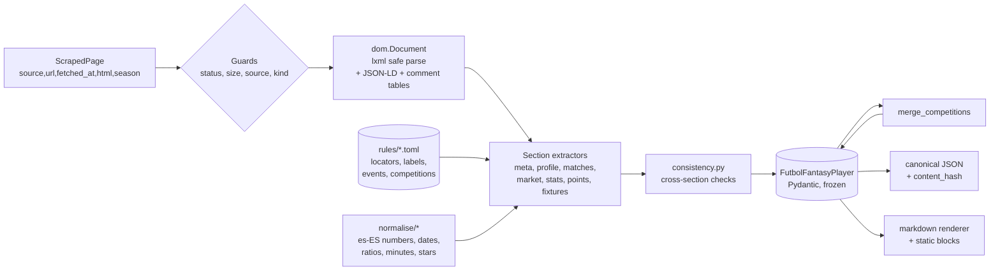

# Plan: player stats parser (`backend/scraping` — `parser` service)

Status: **proposed**

Owner of this plan: the **parser** half of the new `backend/scraping` project.
The **scraper** half (linked data, slug resolution by Hamming distance, page
download, orchestration, threads, proxies, cache) and the **API** half
(`/players/...` segments, weather, distance) have their own plans. This plan
defines what the parser accepts, what it returns, and what it guarantees.

Source material: the product brief `PROMPT 3.md` and the FutbolFantasy sample
for `https://www.futbolfantasy.com/jugadores/raphinha/laliga-26-27`. That sample
is the **golden output specification**, not the input markup.

**Decision (2026-10-04).** Non-LaLiga stats use the same FutbolFantasy template on
`/jugadores/{slug}/{competition-season}`. Section 5 is the extraction spec.

---

## 1. Goal, scope, non-goals, assumptions

### 1.1 Goal

Turn one saved HTML page into **typed, hierarchical, byte-stable** data, and turn
that data into a **Markdown** document, with no network, no clock, no randomness
and no LLM. The same `ScrapedPage` must always produce the same JSON bytes and
the same Markdown bytes.

### 1.2 In scope

| # | Deliverable | Brief item |
|---|-------------|------------|
| 1 | `ParserService.parse_futbolfantasy(page) -> FutbolFantasyPlayer` (hierarchical JSON-ready model) | 5 |
| 2 | `ParserService.to_markdown(model) -> str` (deterministic MD, golden = the user's Raphinha sample) | 6 |
| 3 | `ParserService.parse_futbolfantasy` on each competition page, then `merge_competitions` into one player (section 5) | non-LaLiga stats |
| 4 | `ParserService.parse(page) -> ParsedPlayer` (dispatch by `page.source`, plus content hash) | convenience |
| 5 | Typed errors, section-level warnings, `missing` list, fail-closed page detection | pitfalls doc |
| 6 | Extract-rule tables (data, not code), sanitised HTML fixtures, golden files | discovery |
| 7 | Offline helper CLI `fantasy-parse` (file in, JSON/MD out; never touches the network) | dev loop |

### 1.3 Non-goals

- Downloading anything, caching HTML, resolving slugs, rate limits, proxies,
  user agents, thread pools (all **scraper**).
- Weather (OpenWeatherMap) and travel distance for upcoming matches (**API**).
- Market-value history from the LaLiga Fantasy API and per-fixture LaLiga stats
  from Fantasy (**API**). The parser's `market` and `fixtures` come from
  FutbolFantasy and are a *complementary* source, not the primary one.
- Computing anything the page does not publish: no DAZN points outside LaLiga,
  no age, no injury duration, no "form" number. Big chances on other
  competitions come from FutbolFantasy ("Ocasiones claras creadas"), not from
  a substitute metric.
- Inferring values with heuristics or an LLM. Unknown stays `null`.
- Persisting anything. No Postgres/Redis in the parser.
- Exposing HTTP. The parser is a library imported by the scraping service app.

### 1.4 Assumptions

1. Python 3.14, `uv`, `ruff`, `black` (line length 100), `pytest` with
   `--cov-fail-under=80` (target 90 to match the repo's pre-commit gate for
   auth/api).
2. Input is `ScrapedPage` (shared contract): `source` (`futbolfantasy` only),
   `url`, `fetched_at` (timezone-aware UTC), `status_code`, `html`,
   `from_cache`, `season`, `player_slug`.
3. The **rendered** page text is Spanish (`es-ES`).
4. Dates without a year (`19/09`) belong to a season; resolution uses only the
   injected `fetched_at` (see 2.4), never the system clock.
5. `fetched_at` of a cached page is the **original** fetch time (scraper
   guarantee, to be confirmed in the scraper plan).

### 1.5 Ambiguities and resolutions

| # | Ambiguity | Resolution |
|---|-----------|------------|
| A1 | The sample MD is an *output* derived from a rendered page; **the HTML markup is not in the repo**. | Milestone **M0 (discovery)** saves real pages, records locators in a discovery doc, and commits sanitised fixtures. No selector is written before M0. All locators are **data** in `rules/*.toml`, validated at load time, never string literals inside extractors. |
| A2 | Some content (market widget, expandable per-match layers) may be loaded by XHR/JS and absent from server HTML. | M0 classifies every section as `static` / `hidden-in-DOM` / `xhr`. If `xhr`, the parser needs **companion pages** (contract addendum C1 below). Sections that are not in the delivered HTML become `null` + `missing`, never guessed. |
| A3 | The sample mixes extractable data and analyst prose (`Eventos (iconos)` text such as "2 goles, asistencia, penalti"; "Estadísticas crudas" abbreviations like `oc. falladas`, `faltas rec.`; singular/plural inconsistencies such as `Gol (1)` vs `Goles (1)`). | The renderer defines **one canonical wording** (see 4.7). Byte equality with the user's file is therefore impossible by design for those cells. Conformance test compares section headings, table headers, row counts and all numeric cells; the narrative cells are on a documented allow-list (4.8). |
| A4 | `Alcance y limitaciones`, `Referencia cruzada`, `Iconografía`, `Herramientas asociadas`, "Eventos usados en puntuación", "Otros modos" are not per-player data. | Static blocks live in `rules/static_blocks.es.toml` and in typed constants (`DAZN_CROSS_REFERENCE`, icon table, event catalog). They are **rendered**, not stored in the JSON model (JSON carries only `meta.static_blocks_version`). One source of truth: the icon table and event catalog also drive extraction. |
| A5 | "Local" column in *Próximos 5 partidos* shows `Sí (🏠)` or `—`; `—` hides "away" vs "unknown". | JSON `is_home: bool | null`. Renderer prints `Sí (🏠)` for `true`, `—` for `false` **and** `null` (golden). Round-trip JSON → MD is lossy for that cell only. |
| A6 | The *Últimos 5* widget has no competition column. | Do not guess `other` first. Match the row to a match already on the LaLiga page or on a downloaded club-competition page by day, month and score. If it still has no score (upcoming), match day, month and kickoff to `a.partido` on the cached club page (logo `alt`). Anything left, including national-team friendlies, is `other` plus `competition_unresolved`. Live calendar rows read tooltip, rival crest, and logo `alt` directly; see [live-parse-gaps.md](live-parse-gaps.md). |
| A7 | `Fecha` is `dd/mm` without year. | Resolve against injected `fetched_at` converted to `Europe/Madrid`: recent list → latest date ≤ today with that day/month; upcoming list → earliest date ≥ today; both sequentially to keep the ordering monotonic. Cross-check with season window; mismatch → warning. |
| A8 | "Valor mínimo reciente (serie) 69.641.365 (07/08)" is older than the "Ventana gráfico 30 días", and "Temporada mercado en widget 25/26" differs from the page season 26/27. | Keep values verbatim from the page (`window_days`, `widget_season`). If extracted from a series, mark `derived=true`. Season mismatch → warning `market_season_mismatch`. Never "fix" the data. |
| A9 | Which scoring mode to read. | Only the LaLiga Fantasy Oficial block. Other modes in the same HTML are ignored. If that block is missing, points are `0` and the warning is `points_mode_missing`. |
| A10 | The sample has no "Noticias" section but the brief requires news. | `profile.news` is modelled. The renderer emits `## Noticias` **only when the list is non-empty**, placed after `Mercado`. If the Raphinha fixture contains news, the section is a documented golden deviation (4.8). |
| A11 | `Todas | 0` in the injury map and `Otros | 0` look inconsistent with the zone counts. | Parsed verbatim as `BodyZoneCount`; no repair. The consistency pass may add warning `injury_map_total_mismatch` but never changes values. |
| A12 | `Edad 29 años` depends on the clock. | Stored as published (`age_years`). Never recomputed. |
| A13 | One player needs the LaLiga page plus one page per competition slug, and the market widget may be a separate URL. | Contract addenda **C1–C3** below. |

### 1.6 Contract addenda proposed to the shared contract

These are additive and keep the agreed signatures valid. They must be accepted by
the scraper and API plans.

| Id | Addendum | Reason |
|----|----------|--------|
| C1 | `ScrapedPage.kind: Literal["player","market_widget","competition"] = "player"` and `season_slug: str` (`laliga-26-27`, `champions-26-27`, …). `parse_futbolfantasy(page, *, companions: Sequence[ScrapedPage] = ())` | Market widget and competition pages are separate documents. |
| C2 | `ParserService.merge_competitions(pages: Sequence[FutbolFantasyPlayer]) -> FutbolFantasyPlayer` | One parsed model per competition page. |
| C3 | Recent non-LaLiga rows take stats from the matching competition page | Join key `(date, competition)`. |

The parser **never** reads `from_cache`, `status_code` (except to reject non-200)
or HTTP headers for output values, so a cached and a fresh page with the same
HTML produce identical output.

---

## 2. Architecture

### 2.1 Pipeline



### 2.2 Library choice: **lxml** (`lxml.html`) + `cssselect`

| Option | Verdict |
|--------|---------|
| `lxml` | **Chosen.** One C parser (libxml2) giving both CSS (via `cssselect`, compiled to XPath once at rule-load time) and XPath, exposes HTML comment nodes when needed, `no_network=True`, `huge_tree=False`, never executes scripts, stable document order. |
| `selectolax` | Faster, CSS only. Comment access is awkward; no XPath for "label cell → next sibling" patterns. Documented fallback if lxml has no Python 3.14 wheel (verify in M1). |
| `BeautifulSoup` | Slow, behaviour depends on the chosen backend (`html.parser` vs `lxml`), which hurts the determinism argument. Rejected. |

Parser construction: `HTMLParser(encoding="utf-8", remove_comments=False,
remove_pis=True, no_network=True, huge_tree=False, recover=True)`. After the
JSON-LD / designated data scripts are read with `json.loads` (data only, never
executed), `<script>`, `<style>`, `<noscript>`, `<template>`, `<iframe>` are
removed before any text extraction.

### 2.3 Rules as data

Locators, label dictionaries, event dictionaries, icon tables and competition
aliases are **TOML files** loaded with stdlib `tomllib` into frozen Pydantic
`RuleSet` models (no YAML dependency). Rule-load validation (runs once, cached
with `functools.cache`, pure):

- unique rule ids; every `normaliser` name exists in `normalise.REGISTRY`;
- every CSS selector compiles; every XPath compiles;
- every `target_path` exists in the output model (checked by walking the model);
- every leaf field of the output model is covered by a rule, a derivation, or the
  explicit `UNMAPPED_ALLOWLIST` (test `rules_cover_model`).

Rule schema (conceptual; see 3.2 for the mapping table):

| Key | Meaning |
|-----|---------|
| `id` | Stable id, e.g. `profile.personal.birth_date`. Used in warnings. |
| `target_path` | Dotted path in the JSON model. |
| `locator` | `css:`, `xpath:` or `label:` (find a cell by its **Spanish label text**, take the sibling/value cell). Label locators are preferred for key/value tables: they survive row reordering. |
| `fallbacks` | Ordered alternative locators (tried in order; first match wins; which one matched is recorded in the report for drift monitoring). |
| `read` | `text` \| `attr:<name>` \| `count` (number of matched nodes, e.g. stars). |
| `normaliser` | Name from the registry (`es_int`, `es_decimal`, `date_dmy`, `ratio`, …). |
| `many` | List semantics. |
| `required` | `required` → missing raises; `expected` → missing yields warning; `optional` → missing yields `missing[]` only. |

Engine code (`dom/locators.py`, `extractors/base.py`) is generic. A section
extractor only composes rule results into a model and applies the section's
failure policy. Irregular tables (fixtures with expandable layers) use a
`TableSpec` (row locator + per-column cell locators), still data.

### 2.4 Time and year resolution

Only `page.fetched_at` is read. Algorithm `resolve_day_month(day, month, anchor,
direction)` converts `anchor` to `Europe/Madrid` (`zoneinfo`, `tzdata` pinned as
a dependency because `python:3.14-slim` has no tz database), then walks back
(`recent`) or forward (`upcoming`) to the nearest valid date (handles 29/02).
`Fecha de extracción` is the Madrid-local date of `fetched_at`.

---

## 3. Module layout and models

### 3.1 Layout

```text
backend/scraping/
├── pyproject.toml                 # package fantasy_scraping, uv, ruff, black, pytest-cov
├── README.md
├── src/fantasy_scraping/
│   ├── models/page.py             # ScrapedPage (shared with scraper; owned by contract)
│   ├── scraper/                   # scraper plan
│   └── parser/
│       ├── __init__.py            # ParserService + public models + errors
│       ├── service.py             # ParserService (thin orchestrator)
│       ├── settings.py            # ParserSettings (frozen dataclass; injected, no env reads)
│       ├── errors.py              # ParserError, ParseError, UnsupportedLayoutError
│       ├── hashing.py             # canonical_json(), content_hash(), input_hash()
│       ├── consistency.py         # cross-section invariants -> PartialParseWarning
│       ├── merge.py               # merge_competitions()
│       ├── models/
│       │   ├── base.py            # ParserModel (frozen, extra="forbid", snake_case fields)
│       │   ├── common.py          # Score, Ratio, CountPercent, MinutesNote, StatLine, Competition, warnings
│       │   ├── stats.py           # 19 fields, fantasy_points and dazn_points
│       │   ├── futbolfantasy.py   # FutbolFantasyPlayer tree
│       │   └── parsed.py          # ParsedPlayer
│       ├── dom/
│       │   ├── document.py        # safe parse, size cap, script stripping, whitespace clean
│       │   ├── locators.py        # css/xpath/label locator compile + apply
│       │   ├── tables.py          # generic <table>/div-grid -> rows
│       │   └── jsonld.py          # JSON-LD reader (Person/SportsPerson)
│       ├── rules/
│       │   ├── schema.py          # ExtractRule, TableSpec, RuleSet
│       │   ├── loader.py          # tomllib -> validated RuleSet (cached)
│       │   ├── futbolfantasy.toml
│       │   ├── labels.es.toml     # label -> metric key (personal, status, season stats, points)
│       │   ├── events.toml        # event label/abbr -> EventKey, category, md_label, icon, dazn_key
│       │   ├── competitions.toml  # FutbolFantasy labels -> Competition
│       │   ├── stat_slugs.toml    # section 5 slug map
│       │   └── static_blocks.es.toml
│       ├── normalise/
│       │   ├── registry.py        # name -> callable
│       │   ├── text.py            # clean_text, strip_accents, casefold_key
│       │   ├── numbers.py         # es_int, es_decimal, es_percent, signed_delta
│       │   ├── dates.py           # date_dmy, day_month, resolve_day_month, time_hhmm, duration_days
│       │   ├── ratios.py          # ratio "16 / 25 (64 %)", count_percent "7 (100 %)"
│       │   ├── minutes.py         # "Sale 76'", "90'", "Entra 62'"
│       │   ├── stars.py           # ★★★ or N star elements
│       │   └── enums.py           # position, foot, risk level, availability, hierarchy
│       ├── extractors/
│       │   ├── base.py            # SectionExtractor protocol, ExtractionContext, SectionResult
│       │   ├── meta.py  identity.py  status.py  personal.py  position.py
│       │   ├── injuries.py  news.py  matches.py  market.py
│       │   ├── season_stats.py  fantasy_points.py  fixtures.py
│       └── markdown/
│           ├── renderer.py        # to_markdown(): section order + joiner
│           ├── sections.py        # one pure function per section -> list[str]
│           ├── tables.py          # table builder (alignment, escaping)
│           ├── formatters.py      # fmt_int, fmt_decimal, fmt_signed, fmt_date, fmt_percent
│           └── escape.py
└── tests/parser/
    ├── fixtures/futbolfantasy/    # sanitised real HTML (see section 8)
    ├── golden/                    # *.json, *.md (+ the user's reference MD)
    ├── test_normalise_*.py  test_rules_*.py  test_extract_*.py
    ├── test_markdown_*.py  test_determinism.py
    ├── test_purity.py  test_service.py  test_errors.py  conftest.py
```

Dependency rules (enforced by `test_purity.py`, an AST scan): `parser` must not
import `httpx`, `requests`, `socket`, `urllib.request`, `subprocess`, `random`,
`secrets`, `locale`, `time`, `os.environ`, nor `datetime.now/today/utcnow`;
`parser` must not import `scraper`; `scraper` may import only
`parser.models.page`/public names. `backend/auth` must not import
`fantasy_scraping`; `backend/api` imports `fantasy_scraping.parser.models` (or a
copied/generated schema, decision for the API plan) — never `scraper`.

### 3.2 Model base and conventions

`ParserModel`: `frozen=True`, `extra="forbid"` (the parser output is *our*
contract, unlike `FlexibleModel` read models that mirror unstable upstream JSON;
the instability lives on the HTML side and is handled by fail-closed rules),
Python `snake_case` attributes, `camelCase` serialisation aliases
(`alias_generator=to_camel`, `serialize_by_alias=True`, `populate_by_name=True`)
to stay consistent with Fantasy-side names (`weekPoints`, `playerTeamId`,
`marketValue`).

Type conventions: money, counts, minutes → `int`; averages, grades, percentages
→ `float` parsed exactly from the published decimal string
(`float(Decimal("16.71"))`, deterministic); dates → `date` (ISO in JSON), clock
times → `"HH:MM"` string; no `dict` fields with data-dependent keys (lists of
`{key, value}` instead) so key order never depends on content.

### 3.3 Model tree (JSON hierarchy)

`T?` = nullable. Every nullable leaf that the page did not expose is also listed
in `missing`.

```text
ParsedPlayer
├── source: "futbolfantasy"
├── futbolfantasy: FutbolFantasyPlayer?
└── content_hash: str                     # sha256 hex of canonical JSON of the model

FutbolFantasyPlayer
├── schema_version: str                   # "1"
├── meta: PageMeta
├── profile: PlayerProfile
├── matches: MatchesBlock
├── market: MarketBlock?
├── season_stats: SeasonStats?
├── fantasy_points: FantasyPoints?
├── fixtures: list[FixtureRow]            # LaLiga rows, page order (newest first as published)
├── missing: list[str]                    # sorted dotted JSON paths absent in the page
└── warnings: list[PartialParseWarning]   # ordered by (section order, rule id, index)
```

**`PageMeta`** (MD "Meta")

| Field | Type | Source |
|-------|------|--------|
| `source` | `"futbolfantasy"` | `page.source` |
| `url` | `str` (http/https only) | `page.url` |
| `slug` | `str` | `page.player_slug`, verified against canonical URL |
| `season_url` | `str?` ("laliga-26-27") | last URL segment |
| `season_label` | `str?` ("LaLiga 2026/27") | page title/heading; fallback from `season_url` |
| `club` | `str?` ("FC Barcelona") | header/JSON-LD |
| `totals_scope` | `"laliga"` | static (the page states LaLiga-only totals) |
| `market_widget_url` | `str?` | link href (absolute, https) |
| `market_widget_id` | `int?` (4288) | parsed from the href path |
| `extracted_on` | `date` | Madrid date of `page.fetched_at` |
| `fetched_at` | `datetime` (UTC) | `page.fetched_at` |
| `parser_version`, `rules_version`, `layout` | `str` | constants (`futbolfantasy-player-v1`) |
| `input_sha256` | `str` | sha256 of `page.html.encode("utf-8")` |
| `static_blocks_version` | `str` | rules file version |
| `json_ld` | `JsonLdPerson?` | cross-check source (2.5) |

**`PlayerProfile`** (MD: Identidad, Estado fantasy, Información personal,
Posición, Lesiones, Mercado→puja, Noticias)

| Field | Type | Notes |
|-------|------|-------|
| `identity` | `Identity` | `shirt_number: int?`, `display_name: str`, `position_code: PositionCode?` (`POR`/`DEF`/`MED`/`DEL`), `club_badge: str?` (badge alt text) |
| `injury` | `CurrentInjury?` | `diagnosis: str`, `since: date?`, `ongoing: bool`. `null` when the header has no medical state. |
| `availability` | `Availability?` | `status: "available"\|"doubtful"\|"injured"\|"suspended"\|"unknown"`, `matchday: int?`, `label: str` (published text) |
| `form` | `Form?` | `value: float?`, `visual_only: bool` — sample says "indicador visual"; if no number in DOM, `value=null`, `visual_only=true`, warning `form_visual_only` |
| `start_probability` | `StartProbability?` | `matchday: int`, `percent: int` (0–100) |
| `injury_risk` | `InjuryRisk?` | `level: "low"\|"medium"\|"high"?`, `label: str` |
| `hierarchy` | `Hierarchy?` | `label: str` ("Dios"), `rank: int?` (from `labels.es.toml`; unknown label → `rank=null` + warning `hierarchy_unmapped`) |
| `max_profitable_bid` | `MaxProfitableBid?` | `label: str`, `amount: int?`, `profitable: bool?` ("Sin rentabilidad" → `profitable=false`, `amount=null`) |
| `personal` | `PersonalInfo?` | `full_name`, `age_years: int?`, `birth_date: date?`, `birth_place`, `nationalities: list[str]` (split on ` / `, page order), `height_cm: int?`, `preferred_foot: "left"\|"right"\|"both"?`, `contract_end: date?`, `social: list[SocialLink]` (`network`, `url`; http/https only) |
| `position` | `PositionInfo?` | `main: str` ("Delantero"), `demarcations: list[str]` (page order), `field_map_available: bool` |
| `platform_roles` | `list[PlatformRole]` | `platform` ("LaLiga F."), `role` ("MD / DL" verbatim); page order |
| `injury_history` | `InjuryHistory?` | `body_map: list[BodyZoneCount]` (`zone: str`, `incidents: int`), `body_map_note: str?`, `entries: list[InjuryEntry]` |
| `news` | `list[NewsItem]` | `title`, `url`, `published_on: date?`, `source: str?`, `summary: str?`; `[]` only when the news container exists and is empty |

`InjuryEntry`: `start: date`, `end: date?`, `ongoing: bool` (end text
"Actualidad"), `diagnosis: str`, `duration_days: int?`.

**`MatchesBlock`**

```text
MatchesBlock
├── recent: list[RecentMatch]      # 0..5, page order (newest first)
└── upcoming: list[UpcomingMatch]  # 0..5, page order (soonest first)

RecentMatch
├── date: date
├── matchday: int?                 # "J" column (the competition's own matchday)
├── competition: Competition       # laliga|conference_league|europa_league|champions_league|copa_del_rey|supercopa|other
├── competition_raw: str?          # published label, ≤ 80 chars
├── score: Score?                  # {home:int, away:int} in published order
├── player_side: "home"|"away"?    # from row marker or fixtures-table linkage
├── minutes: MinutesNote           # {raw, event, minutes?, minute?}
├── stats: DaznStats?              # LaLiga: linked fixtures row; others: competition page join
└── stats_source: "futbolfantasy"|null

UpcomingMatch
├── date: date
├── matchday: int?
├── kickoff: str?                  # "HH:MM", Europe/Madrid, not converted
├── is_home: bool?
├── competition: Competition
└── competition_raw: str?
```

`minutes.event`: `full` ("90'"), `subbed_off` ("Sale 76'"), `subbed_on`
("Entra 62'"), `unused`, `unknown`. `minutes.minutes` = `minute` for
`subbed_off` **only when** the row is known to be a start (starter flag from the
fixtures table); otherwise `null` + warning `minutes_assumed_unknown`. Cross
check from the sample: 76+68+90+90+85+79+62 = 550 season minutes.

**`MarketBlock`** (MD "Mercado LaLiga Fantasy Oficial")

| Field | Type | Notes |
|-------|------|-------|
| `current_value` | `int?` | `172.907.890` |
| `last_change` | `MarketChange?` | `date`, `absolute: int`, `percent: float` (`−307.085 (−0,18 %)`) |
| `max_recent` / `min_recent` | `MarketExtreme?` | `value: int`, `date: date`, `derived: bool` |
| `window_days` | `int?` | `Ventana gráfico 30 días` |
| `widget_season` | `str?` | `"25/26"` verbatim |
| `daily_moves` | `list[MarketMove]` | `date`, `change: int`, `value: int` (extract of last N published) |
| `series` | `list[MarketPoint]?` | `date`, `value`; only if the widget payload is in the delivered pages; else `null` + `missing` |

Consistency (warning only): `value[i] − value[i+1] == change[i]` — holds in the
sample (`172.907.890 − 173.214.975 = −307.085`).

**`SeasonStats`** (MD "Estadísticas de temporada (LaLiga)")

```text
SeasonStats
├── view: "totals" | "breakdown" ?       # "Vista Totales"
├── matches_counted: int?                # "acumulado tras 7 partidos"
├── participation: Participation         # matches_played:int, starter:CountPercent, substitute:CountPercent, minutes:int
├── attack: AttackStats                  # goals, assists, assists_without_goal, penalty_goals,
│                                        # shots_on_target:Ratio, goals_per_shot:Ratio, woodwork_shots,
│                                        # clear_chances_created, clear_chances_missed, own_goals,
│                                        # passes:Ratio, key_passes, successful_dribbles, crosses:Ratio,
│                                        # corners_won, corners_accurate:Ratio, free_kicks_accurate:Ratio,
│                                        # direct_free_kicks_on_target:Ratio
├── discipline: DisciplineStats          # fouls_received, fouls_committed, yellow_cards, red_cards, aerial_duels_won
├── defense: DefenseStats                # possessions_lost, errors_leading_to_goal, interceptions, ball_steals,
│                                        # effective_clearances, blocked_shots, last_man_steals,
│                                        # penalties_scored:Ratio, penalties_missed, penalties_committed, penalties_won
├── goalkeeper: GoalkeeperStats?         # saves, standout_saves, claimed_crosses, goals_conceded, goal_line_saves, penalties_saved (GK pages only)
├── other: list[LabeledValue]            # unmapped labels (label, raw, parsed_int?, parsed_ratio?), page order
└── selector_catalog: list[StatGroup]    # {group:str, stats:list[str]} read from the selector options
```

All numeric leaves are nullable; a metric whose label is absent is `null`, one
that is present as `0` is `0`. `Ratio` = `{numerator:int, denominator:int?,
percent:int?}`; `CountPercent` = `{count:int, percent:int?}`.

**`FantasyPoints`** (MD "Puntos fantasy — LaLiga Fantasy Oficial")

| Field | Type | Notes |
|-------|------|-------|
| `mode` | `str` | Active tab label; must equal "LaLiga Fantasy Oficial" (A9) |
| `matches_counted` | `int?` | "7 partidos con puntos" |
| `total`, `total_home`, `total_away` | `GrossNet` | `gross: float?` (`—` → `null`), `net: float?` |
| `average`, `average_home`, `average_away`, `average_last_3` | `GrossNet` | `16,71` → `16.71` |
| `scoring_modes` | `list[ScoringMode]` | `platform`, `variants: list[str]` ("Biwenger (Picas, …)" → platform + variants) |

Consistency: `total.net == Σ fixtures.week_points` (117 in the sample),
`total_home + total_away == total`, `average ≈ total / matches` to 2 decimals.

**`FixtureRow`** (MD "Partidos LaLiga — tabla principal" + "Desglose por partido")

| Field | Type | Notes |
|-------|------|-------|
| `matchday` | `int` | `J` |
| `match` | `FixtureMatch` | `home_code`, `away_code` (e.g. `SEV`, `BAR`), `home_goals`, `away_goals` |
| `player_side` | `"home"\|"away"?` | row/club marker |
| `minutes_out` | `MinutesNote` | "Salida" column |
| `stars` | `int?` | count of ★ (1–3) |
| `grade` | `float?` | "Nota num." `10,0` |
| `dazn_points` | `int?` | 0–4 |
| `week_points` | `int?` | LaLiga Fantasy total for the match (`21`); Fantasy-side name `weekPoints` |
| `icon_events` | `list[IconEvent]` | `kind` (`goal`,`assist`,`penalty`,`yellow_card`,`red_card`,`substitution`,`dazn_bolt`), `count` — decoded with the icon table |
| `stats` | `DaznStats` | the 19 fields (3.4) |
| `extra_events` | `list[EventStat]` | events that are not one of the 19 (corners, key passes…): `event` (`EventKey`), `label`, `count`, `points?` |
| `layers` | `FixtureLayers?` | the four expandable layers |

`FixtureLayers`: `statistical_points: list[EventStat]?` (count + `X p`),
`relevo: RelevoLayer?` (`dazn_points: int`, `breakdown: list[LabeledNumber]`),
`marca_grade: MarcaGrade?` (`grade: float`, `contributions: list[LabeledNumber]`),
`events: list[EventCount]?` ("Evento (conteo)"; composite `oc. creadas/falladas
(1/1)` → two `EventCount`s through `events.toml`).

### 3.4 Per-fixture DAZN-style stats

`DaznStats` has **19 explicit fields** (not a dict: fixed key order, typed,
OpenAPI-friendly). Each is a `StatLine`:

```text
StatLine
├── count: int?
├── points: float?                  # "X p" published points; null when not published
├── status: "ok"|"implied_zero"|"partial"|"unavailable"|"not_applicable"
├── source: "futbolfantasy"|null
└── reason: str?                    # stable code: "layer_missing", "column_absent",
                                    # "definition_differs", "goalkeeper_only", "league_only", "no_per_match_total"
```

`implied_zero`: the expand layer exists for a match the player played and the
event is absent from the published list → `count=0, points=0`. If the layer is
missing the line is `unavailable/layer_missing`, never `0`. `not_applicable`:
goalkeeper-only fields on outfield players.

| # | Field (`alias`) | Spanish label | FutbolFantasy per-match source (`X p` layer) | Impossible / caveat |
|---|-----------------|---------------|-----------------------------------------------|---------------------|
| 1 | `minutesPlayed` | Minutos jugados | "Minutos jugados" (Tiempo) count + points; "Salida" column | — |
| 2 | `goals` | Goles | "Goles" (+ "goles de penalti" in extras) | — |
| 3 | `assists` | Asistencias | "Asistencias de gol" (`sin gol` kept in extras) | — |
| 4 | `bigChancesCreated` | Grandes ocasiones creadas | "Ocasiones claras creadas" | — |
| 5 | `ballsIntoBox` | Balones al área | "Balones al área" (match layer only; not in season totals) | — |
| 6 | `penaltiesCommitted` | Penaltis cometidos | "Penaltis cometidos" | — |
| 7 | `penaltiesSaved` | Penaltis salvados | "Penaltis parados" (GK) | `not_applicable` for outfield |
| 8 | `saves` | Salvadas | "Paradas" (GK) | `not_applicable` for outfield |
| 9 | `clearances` | Despejes claros | "Despejes (efectivos)" | — |
| 10 | `penaltiesMissed` | Penaltis fallados | "Penaltis fallados" | — |
| 11 | `ownGoals` | Goles en propia | "Goles en propia" | — |
| 12 | `goalsConceded` | Goles en contra | "Goles encajados" (team context in match) | — |
| 13 | `yellowCards` | Tarjetas amarillas | "Tarjetas amarillas" | — |
| 14 | `redCard` | Tarjeta roja | "Tarjeta roja" | — |
| 15 | `shots` | Intentos de gol | on-target / woodwork / blocked per match | `partial` when only components exist (`no_per_match_total`); season total in `season_stats` |
| 16 | `successfulDribbles` | Regates efectivos | "Regates con éxito" | — |
| 17 | `ball_recoveries` | Recuperaciones | «Balones robados», «Balones recuperados» and recuperaciones are the same stat | use whichever label the page has |
| 18 | `ballsLost` | Balones perdidos | "Posiciones perdidas" | — |
| 19 | `daznPoints` | Puntos DAZN | "Puntos DAZN" column + Relevo layer (0–4) | `count=null`, `points=value`; `league_only` outside LaLiga |

`points` come only from the FutbolFantasy `X p` layer. The API may overwrite
LaLiga rows with Fantasy API values; the parser records `source` so the API can tell.

### 3.5 MD section → JSON path → HTML hint → normaliser → failure behaviour

"HTML hint" is only the *kind* of locator expected; concrete selectors are
produced in M0 and stored in `rules/`. Policy: **R** required (missing → raise),
**E** expected (missing → `null` + warning + `missing`), **O** optional (missing
→ `missing` only).

| MD section | JSON path | HTML hint (to confirm in M0) | Normaliser | Failure behaviour |
|------------|-----------|------------------------------|------------|-------------------|
| Meta: Fuente, Temporada URL, Club | `meta.url`, `meta.season_url`, `meta.club` | `page.url`; canonical/og:url; header | `clean_text`, `url_http` | `meta.url` always set; slug mismatch with canonical → `ParseError(slug_mismatch)` |
| Meta: Mercado (widget) | `meta.market_widget_url/_id` | anchor to `/analytics/laliga-fantasy/mercado/detalle/{id}` | `url_http`, `path_int` | **O** |
| Meta: Fecha de extracción | `meta.extracted_on` | none (injected) | `madrid_date(fetched_at)` | always |
| Meta: Ámbito de totales | static | — | — | static block |
| Identidad en la ficha | `profile.identity` | header: shirt number, name, position tag, badge `img[alt]` | `es_int`, `position_code` | name **R** (no name ⇒ not a player sheet); others **E** |
| Estado: Estado médico | `profile.injury` | header status line | `clean_text` + link to history | **O** (absent ⇒ `null`, no warning) |
| Estado: Disponibilidad | `profile.availability` | header status label ("Disponible para la jornada 8") | `availability` regex + enum table | **E**; unknown text ⇒ `status=unknown`, label kept, warning `availability_unmapped` |
| Estado: Forma | `profile.form` | visual indicator element | `form_value` | **O**; visual-only ⇒ `visual_only=true` |
| Estado: Titular (próx. jornada) | `profile.start_probability` | probability widget ("J8", "50 %") | `matchday_label`, `es_percent` | **E** |
| Estado: Riesgo de lesión | `profile.injury_risk` | label next to "Riesgo de lesión" | `risk_level` enum table | **E** |
| Estado: Jerarquía | `profile.hierarchy` | label next to "Jerarquía" | `hierarchy_rank` table | **E** |
| Información personal | `profile.personal.*` | label/value pairs (label locators) | `clean_text`, `date_dmy`, `es_int`+unit, `foot`, `split_slash` | **E** per field; JSON-LD fallback; mismatch with JSON-LD ⇒ `jsonld_mismatch` |
| Posición y demarcaciones | `profile.position` | label/value + list items | `clean_text`, list | **E** |
| Etiquetas por plataforma | `profile.platform_roles` | table/list of (logo alt, role) | `clean_text` | **O**; `[]` if container present and empty |
| Lesiones: Mapa | `profile.injury_history.body_map`, `body_map_note` | zone counters (data attribute or text) | `es_int` | **E**; verbatim (A11) |
| Lesiones: Historial | `profile.injury_history.entries` | table rows (start, end/"Actualidad", diagnosis, duration) | `date_dmy`, `duration_days` | container missing ⇒ `null`+warning; header present + zero rows ⇒ `[]` (legitimately injury-free) |
| Calendario: Últimos 5 | `matches.recent` | header widget list (date, J, score, minutes) | `day_month`+`resolve_day_month`, `es_int`, `score`, `minutes_note`, `competition_alias` | **E**; fewer than 5 rows is valid; row with unparsable date ⇒ row dropped + warning (never fabricated) |
| Calendario: Próximos 5 | `matches.upcoming` | header widget list (date, J, time, home icon) | same + `time_hhmm`, `home_flag` | **E**; fewer than 5 valid |
| Mercado: Valor actual, Variación | `market.current_value`, `market.last_change` | widget/analytics block | `es_int`, `signed_delta`, `es_percent` | **E**; widget absent (JS) ⇒ `market=null` + `missing` |
| Mercado: máximo/mínimo/ventana/temporada | `market.max_recent/min_recent/window_days/widget_season` | widget text or series | `es_int`, `day_month`, `es_int` | **O** |
| Mercado: Puja máxima rentable | `profile.max_profitable_bid` | label near market widget | `bid_amount` ("Sin rentabilidad" ⇒ `profitable=false`) | **E** |
| Mercado: Últimos movimientos | `market.daily_moves` | table rows | `day_month`, `signed_delta`, `es_int` | **O** |
| Estadísticas de temporada (4 groups) | `season_stats.*` | stat blocks with label/value; group headings | `es_int`, `ratio`, `count_percent` + `labels.es.toml` | block missing ⇒ that group `null` + warning; unknown label ⇒ `other[]` + warning `stat_label_unmapped` |
| Métricas disponibles en selector | `season_stats.selector_catalog` | selector options / optgroups | `clean_text` | **O** |
| Puntos fantasy: agregados | `fantasy_points.*` | aggregates table (gross/net) | `es_decimal`, `dash_null` | mode ≠ LaLiga Fantasy Oficial ⇒ `null`+warning (A9) |
| Puntos fantasy: otros modos | `fantasy_points.scoring_modes` | tabs list | `platform_variants` | **O** |
| Puntos fantasy: herramientas | static | — | — | static block |
| Partidos LaLiga: tabla | `fixtures[]` | main table rows (J, match, minute, stars, grade, DAZN, total, icons) | `es_int`, `match_line`, `minutes_note`, `stars`, `es_decimal`, `icons` | table missing ⇒ `fixtures=[]`+**error-level warning**, and counts toward the drift ratio (7.2); header present + zero rows ⇒ `[]` |
| Desglose por partido: capas | `fixtures[].layers`, `.stats`, `.extra_events` | expandable row content (4 layers) | `event_count`, `points_suffix` (`3 p`), `events.toml` | layer missing ⇒ `layers=null`, DAZN lines `unavailable/layer_missing` |
| Desglose: eventos usados | static (`events.toml`) | — | — | static block |
| Iconografía | static (icon table, also used for decoding) | icon class/alt | `icon_kind` | unknown icon ⇒ warning `icon_unmapped`, event skipped |
| Alcance y limitaciones | static | — | — | static block |
| Referencia cruzada | static (`DAZN_CROSS_REFERENCE`) | — | — | static block |

### 3.6 JSON-LD reader (`dom/jsonld.py`)

Collects every `<script type="application/ld+json">` in document order, loads
with `json.loads`, flattens `@graph` and lists, keeps the first object whose
`@type` is `Person`, `Athlete` or `SportsPerson`. Output `JsonLdPerson` =
`name`, `birth_date`, `birth_place`, `nationalities`, `height_cm`, `url`,
`same_as: list[str]` (http/https only). Malformed JSON ⇒ block skipped + warning
`jsonld_invalid`. Precedence: **DOM value wins**; JSON-LD fills `null`s and is
cross-checked (mismatch ⇒ warning). Existence of JSON-LD on the page is verified
in M0; the scraper also caches it separately (brief item 1).

---

## 4. Markdown renderer

### 4.1 Contract

`to_markdown(model: FutbolFantasyPlayer, options: RenderOptions = RenderOptions()) -> str`.
Pure function of the model only. `RenderOptions(include_static_blocks=True,
include_empty_sections=False)` is frozen and part of the golden test matrix.
Output: UTF-8 text, LF line endings, **exactly one trailing `\n`**, no trailing
spaces, no tabs.

### 4.2 Document skeleton and section order

| # | Heading (exact) | Source | Empty behaviour |
|---|-----------------|--------|-----------------|
| 0 | `# {display_name} — Ficha FutbolFantasy ({season_label})` + intro sentence (static) | `profile.identity`, `meta` | `display_name` missing ⇒ renderer raises `RenderError` |
| 1 | Meta table (`\| Meta \| Valor \|`) | `meta` | rows with `null` values omitted |
| 2 | `## Identidad en la ficha` | `profile.identity` | omitted rows |
| 3 | `## Estado fantasy (cabecera)` | `profile.*` | section omitted if every row is empty |
| 4 | `## Información personal` | `profile.personal` | idem |
| 5 | `## Posición y demarcaciones` + `### Etiquetas por plataforma` | `profile.position`, `platform_roles` | sub-section omitted if empty |
| 6 | `## Lesiones` → `### Mapa…`, `### Historial (extracto reciente)` | `profile.injury_history` | `[]` ⇒ line `*Sin lesiones registradas en la ficha.*`; `null` ⇒ section omitted |
| 7 | `## Calendario reciente y próximo` → `### Últimos 5 partidos (widget cabecera)`, `### Próximos 5 partidos` | `matches` | empty list ⇒ sub-heading + `*Sin partidos publicados.*` |
| 8 | `## Mercado LaLiga Fantasy Oficial` → `### Últimos movimientos diarios (extracto)` | `market`, `profile.max_profitable_bid` | `market=null` ⇒ section omitted |
| 8b | `## Noticias` (A10) | `profile.news` | omitted when empty |
| 9 | `## Estadísticas de temporada (LaLiga)` → Participación, Ataque y creación, Disciplina y duelos, Defensa pérdidas y penaltis, Métricas disponibles en selector | `season_stats` | each sub-table omitted when its group is `null` |
| 10 | `## Puntos fantasy — LaLiga Fantasy Oficial` | `fantasy_points` | `null` ⇒ omitted |
| 11 | `## Partidos LaLiga — tabla principal` | `fixtures` | `[]` ⇒ omitted |
| 12 | `## Desglose por partido (al expandir ficha)` | static layer table + event catalog | omitted if `include_static_blocks=False` |
| 13 | `## Iconografía en columna «Eventos»` | static | idem |
| 14 | `## Alcance y limitaciones` | static | idem |
| 15 | `## Referencia cruzada (concepto DAZN ↔ campo en ficha)` | `DAZN_CROSS_REFERENCE` | idem |

Between H2 sections: a blank line, `---`, a blank line (as in the golden). Each
H2/H3 is followed by one blank line; each table by one blank line. Section
renderers are pure functions `render_x(model, opts) -> list[str]`; the joiner is
the only place that adds separators.

### 4.3 Tables

- Header and alignment rows are constants per table in `markdown/sections.py`
  (column order = golden). Numeric columns use `---:`, text columns `---`.
- Empty cell for `null`: `—` (U+2014) in numeric/identity tables, `` (empty) is
  never used.
- `|` inside a cell ⇒ `\|`; `\` ⇒ `\\`; newlines/tabs ⇒ single space; the
  characters `* _ [ ] < > `` ` `` in **page-derived free text** (diagnosis, news
  title, role) are backslash-escaped. Renderer-authored markup (`**21**`, links,
  `(🏠)`) is not escaped.
- Links: `[text](url)` only for `http`/`https` URLs, validated at parse time.

### 4.4 Number, date and unit formatting (no `locale` module)

| Value | Rule | Example |
|-------|------|---------|
| Integer ≥ 1 000 | `.` thousands separator, custom function | `172.907.890` |
| Negative | U+2212 `−`, never `-` | `−307.085` |
| Positive delta columns / change cells | explicit `+` | `+1.658.150` |
| Decimal (averages, grades, percent change) | `,` decimal; fixed decimals per field (averages 2, grades 1, `last_change.percent` 2); `Decimal(str(x)).quantize(…, ROUND_HALF_UP)` | `16,71`, `10,0`, `−0,18 %` |
| Percentage | integer or decimal, then space, then `%` (ordinary space, as in the golden) | `64 %` |
| Ratio | `{n} / {d} ({p} %)`; no `(p %)` when `percent` is null | `16 / 25 (64 %)`, `3 / 3` |
| Count + percent | `{n} ({p} %)` | `7 (100 %)` |
| Dates | `dd/mm/yyyy` (birth, contract); `dd/mm/yy` (injury history); `dd/mm` (match & market widgets); ISO `yyyy-mm-dd` for `extracted_on` | `14/12/1996`, `29/09/26`, `19/09` |
| Minutes | `{n}'`; `Sale {n}'` | `76'`, `Sale 70'` |
| Duration | `1 día`, `N días` | `47 días` |
| Kick-off | `HH:MMh` | `18:30h` |
| Stars | `★` × n | `★★★` |
| Booleans | `Sí (🏠)` / `—` for `is_home` | (A5) |
| Age | `{n} años` | `29 años` |
| Height | `{n} cm` | `176 cm` |

### 4.5 Static blocks

`rules/static_blocks.es.toml` holds, with a `version` string: the intro
sentence, "Ámbito de totales", "Herramientas asociadas", the four-layer table,
the *Iconografía* wording, *Alcance y limitaciones*, the *Otros modos* note. The
event catalog (grouped by category) is generated from `events.toml`; the
*Iconografía* table from the icon table; *Referencia cruzada* from
`DAZN_CROSS_REFERENCE`. Changing wording requires bumping
`static_blocks_version` (it is in `meta`, hence in the content hash).

### 4.6 Plain-language event cells

- **"Eventos (iconos)"** from `icon_events`, fixed kind order `goal, assist,
  penalty, yellow_card, red_card`; count 1 ⇒ bare singular (`gol`,
  `asistencia`, `penalti`, `tarjeta amarilla`), count ≥ 2 ⇒ `N plural`
  (`2 goles`); joined with `, `; none ⇒ `—`.
- **"Estadísticas crudas"** from `layers.events` in **page order**, label =
  `md_label` from `events.toml` (lower-case, the abbreviations used in the user's
  sample such as `oc. falladas`, `faltas rec.`, `posesiones perdidas`), always the
  plural form, as `label (n)`; composite events `label (a/b)`; joined by `, `.
  No layer ⇒ `—`.

### 4.7 Golden policy

The user's Markdown is committed as `tests/parser/golden/raphinha_laliga_26_27.reference.md`
(read-only spec). Two different checks:

1. **Snapshot** (byte-exact): `to_markdown(parse(fixture)) ==
   golden/raphinha_laliga_26_27.expected.md`. `expected.md` is generated by the
   renderer, reviewed against the reference once in M5, then frozen. Updating it
   needs `--update-golden` (custom pytest option) and a reviewed diff.
2. **Conformance** (`test_markdown_conformance_user_reference`): both documents
   are parsed with a tiny MD-table reader; asserted equal: H1/H2/H3 sequence,
   table headers and alignment, row counts, and every cell **except** the
   allow-list below.

### 4.8 Documented deviations (conformance allow-list)

| Where | Deviation | Why |
|-------|-----------|-----|
| *Partidos LaLiga* column "Eventos (iconos)" | canonical wording (4.6) | analyst prose in sample (`1 gol` vs `asistencia`) |
| *Partidos LaLiga* column "Estadísticas crudas" | canonical labels, plural, page order | sample mixes `Gol (1)` / `Goles (1)`, `penalti (1)` / `penaltis (2)` |
| `Estado fantasy` → "Forma" | text from `visual_only` flag | sample text is editorial |
| `Posición…` → "Mapa de campo" | fixed text from `field_map_available` | editorial |
| `Puntos fantasy` intro line "Modo seleccionado en capturas de referencia" | `Modo seleccionado: **{mode}**` | the screenshot note is not data |
| `## Noticias` | extra section if news present | brief requires news |
| *Calendario reciente* "Minutos / notas" | `(partido no liguero en calendario)` replaced by a competition column suffix `· {competition}` only when `competition != laliga` | the note is analyst prose |

Every deviation is listed in `tests/parser/golden/DEVIATIONS.md`, asserted by the
conformance test (a deviation not listed fails the test).

---

## 5. FutbolFantasy stats (LaLiga and other competitions)

Same parser for every competition page. The scraper delivers one `ScrapedPage`
per slug (`laliga-26-27`, `champions-26-27`, `copa-del-rey-25-26`,
`europa-league-…`, `supercopa-espana-…`, `amistoso-…`).
`parse_futbolfantasy` runs on each. `merge_competitions` concatenates fixture
rows and tags `competition` from the slug.

Implementation uses the lxml document already chosen in section 2. The
selectors below are the contract. Do not add BeautifulSoup.

### 5.1 Four layers

| Id | What | Locator |
|----|------|---------|
| A | Season totals (Spanish labels) | `#profile-stats-puntos .statsglobales` — `.bigstat` (`.label` / `.value`) and `.stat.info` (`.cell.label.info-left` / `.cell.value.info-right`). `.statsglobales` may have `d-none`; the HTML is still in the response |
| B | Per-match JSON | `.poligono-wrapper[data-indices]`: HTML-unescape, `json.loads`, then `json.loads` of `partidos_info`. Integers per match. Averages elsewhere in the payload are decimal strings — do not sum those |
| C | Per-match numeric cells | `tr.plegado span.stat-val`. Class `stat-{slug}` is the key. Text is the integer. Ignore the class `stat-val` itself |
| D | Expand text | `div.estadistica`: either `N Label → N p` (count and FutbolFantasy points; seen on LaLiga, Champions, Europa League) or `Label (N)` (count only; seen on Copa del Rey) |

Priority per metric: **A**, then **C**, then fill gaps from **B** (sums) or **D**.
When A has no row, set the season total to the sum of C and mark `derived=true`.
A zero omitted from C is not a value; do not invent it. A and the sum of C
disagree → warning `total_mismatch`, keep A.

`partidos_info` has no minutes and no ocasiones claras. Minutes come from A,
from the match-row minute (`70'`), or from the minutos chart script. Ocasiones
claras come from A or `stat-ocasiones-claras-creadas`.

### 5.2 Slug → `stat-val` class

`option value` and class (drop the `stat-` prefix to get the key):

| value | class |
|-------|-------|
| `goles` | `stat-goles` |
| `asistencias` | `stat-asistencias` |
| `ocasiones-claras-creadas` | `stat-ocasiones-claras-creadas` |
| `pases-area-exito` | `stat-pases-area-exito` |
| `tiros-totales` | `stat-tiros-totales` |
| `regates-exito` | `stat-regates-exito` |
| `posesiones-perdidas` | `stat-posesiones-perdidas` |
| `penaltis-cometidos` | `stat-penaltis-cometidos` |
| `penaltis-fallados` | `stat-penaltis-fallados` |
| `penaltis-parados` | `stat-penaltis-parados` |
| `paradas` | `stat-paradas` |
| `despejes` | `stat-despejes` |
| `goles-propia-meta` | `stat-goles-propia-meta` |
| `goles-encajados` | `stat-goles-encajados` |
| `tarjetas-amarillas` | `stat-tarjetas-amarillas` |
| `tarjeta-roja` | `stat-tarjeta-roja` |
| `balones-recuperados` | `stat-balones-recuperados` |
| `balones-robados` | `stat-balones-robados` |

A value that contains `|` (for example `tiros-puerta|tiros-totales`) exposes
one class per side (`stat-tiros-puerta`, `stat-tiros-totales`).

### 5.3 DAZN field → FutbolFantasy

| DAZN field | Take |
|------------|------|
| Minutos jugados | label «Minutos jugados»; per match the row minute or the minutos chart |
| Goles | `goles` |
| Asistencias | `asistencias` |
| Grandes ocasiones creadas | «Ocasiones claras creadas» / `ocasiones-claras-creadas` |
| Balones al área | `pases-area-exito` or desglose text. No season total in the DOM; sum C or use D |
| Penaltis cometidos | `penaltis-cometidos` |
| Penaltis salvados | `penaltis-parados` (JSON `penaltis_atajados` when present) |
| Salvadas | `paradas` |
| Despejes claros | `despejes` / JSON `despejes_efectivos`. Same caveat as before: the site counts effective clearances |
| Penaltis fallados | `penaltis-fallados` |
| Goles en propia | `goles-propia-meta` |
| Goles en contra | `goles-encajados` |
| Tarjetas | `tarjetas-amarillas`, `tarjeta-roja` |
| Intentos de gol | `tiros-totales` / JSON `tiros` |
| Regates efectivos | `regates-exito` |
| Recuperaciones | `balones-robados`, `balones-recuperados` and the label «Balones recuperados» are the same field (`ball_recoveries`). Use whichever the page publishes. |
| Balones perdidos | `posesiones-perdidas` |
| Puntos | Two integers on every stat: `fantasy_points` from the LaLiga Fantasy Oficial block only, and `dazn_points` from the DAZN column only. Biwenger, Marca, Mister, Comunio and the other modes are not read. A missing number is `0`. Outside LaLiga, `dazn_points` is `0`. |

### 5.4 Merge

`merge_competitions(pages: Sequence[FutbolFantasyPlayer]) -> FutbolFantasyPlayer`.
Profile, injuries and news come from the LaLiga page. Fixtures are the
concatenation, stable by `(date, competition_slug, matchweek)`. Recent matches
prefer the LaLiga widget order, then fill a non-LaLiga row's `stats` from the
competition page joined on date. No join → `stats` null and warning
`competition_page_missing`.

---

## 6. Determinism and correctness

### 6.1 Rules

1. **No ambient inputs.** Only `ScrapedPage` and the frozen `ParserSettings` are
   read. `fetched_at` is the only time source.
2. **Locale-fixed parsing.** Hand-written `es_int`, `es_decimal`, `date_dmy`; no
   `locale`, no `strptime` with `%b/%a`, no `str.format` with locale.
3. **Order is structural.** Lists follow document order; fixed model field order;
   no `set`/`frozenset` in any code path that feeds output; no `dict` keyed by
   page data in models; where a mapping is internal it is built from a TOML list
   (ordered) and iterated through the list.
4. **Whitespace-insensitive.** `clean_text`: `unicodedata.normalize("NFKC")`
   (NBSP ⇒ space), map `’ ‘ ´` to `'`, collapse `\s+` to one space, strip.
   Numeric normalisers also map U+2212/U+2013/U+2012 to `-`. Output never depends
   on indentation, line breaks between tags, attribute order or quote style.
5. **No IO, no LLM, no randomness.** Enforced by `test_purity.py`.

### 6.2 Canonical JSON and hashing

Canonical form = **model field order** (not sorted keys): since there are no
data-keyed dicts, `model.model_dump_json(by_alias=True)` (compact, UTF-8, no
`ensure_ascii`) is stable and keeps human-friendly ordering. `canonical_json()`
wraps it. `content_hash` = `sha256(canonical_json(model))` hex.
`input_sha256` (in `meta`) = sha256 of the HTML bytes. Suggested cache key for
the API: `(parser_version, rules_version, input_sha256)`; suggested ETag:
`content_hash`. `from_cache` and `status_code` are excluded from the model.

### 6.3 Tests that prove it

| Test | What it proves |
|------|----------------|
| Idempotence | `parse(p) == parse(p)`; `canonical_json` equal; hash equal |
| Hash seed independence | subprocess run with `PYTHONHASHSEED` ∈ {0, 1, 4242} produces identical hashes |
| Locale independence | subprocess with `LC_ALL=C` vs `es_ES.UTF-8` identical |
| Whitespace mutation (Hypothesis, `derandomize=True`) | inserting/removing inter-tag whitespace, newlines, re-quoting attributes, adding comments and `<script>` blocks does not change JSON |
| Round trip | `to_markdown(FutbolFantasyPlayer.model_validate_json(canonical_json(m))) == to_markdown(m)` |
| Golden JSON | `canonical_json(parse(fixture))` equals `golden/*.json` byte for byte |
| Property tests on normalisers | `format(parse(x)) == x` for canonical ints (`fmt_int(es_int(s)) == s`), decimal/ratio round trips |
| Consistency (golden data) | sums and arithmetic hold on Raphinha: Σ minutes = 550, Σ points = 117, home 52 + away 65, last-3 average 18,00, market moves arithmetic |
| Purity | AST scan for forbidden imports/calls |

### 6.4 Consistency pass (`consistency.py`)

Runs after extraction, produces **warnings only** (never mutates data):
`minutes_sum_mismatch`, `points_sum_mismatch`, `home_away_total_mismatch`,
`average_mismatch`, `market_moves_mismatch`, `injury_duration_mismatch` (closed
rows: `(end − start).days`, minimum 1), `recent_vs_fixtures_mismatch`,
`jsonld_mismatch`, `market_season_mismatch`. These are the main drift
detectors, because a silently wrong column typically breaks an invariant.

---

## 7. Errors and partial results

### 7.1 Types

```text
ParserError(Exception)        code: str, detail: str, section: str | None
├── ParseError                the input cannot be a valid player sheet / is rejected
│     codes: input_invalid (naive fetched_at, wrong source/kind), upstream_status (non-200),
│            html_too_large, html_empty, not_a_player_page, slug_mismatch, season_mismatch
└── UnsupportedLayoutError    the page looks like a player sheet but the markup drifted
      codes: layout_drift (too many sections failed), required_anchor_missing,
             table_unknown, duplicate_column
PartialParseWarning           (Pydantic model, not an exception)
      code, section, path (dotted JSON path), rule_id, message (constant text),
      severity: "info"|"warning"|"error", preview: str? (≤ 40 chars of cleaned text, no markup)
```

### 7.2 Partial-result policy (section isolation)

- Each section extractor runs inside a `try/except ParserSectionError`; one
  broken section yields `null` (or `[]` only when the container exists and is
  legitimately empty) plus a warning. A bug-level exception (not a
  `ParserSectionError`) is **not** swallowed.
- **Not a player sheet at all** (no `<h1>` name, no canonical `/jugadores/{slug}`
  path, none of the core anchors) ⇒ `ParseError(not_a_player_page)`.
- **Drift threshold**: sections are weighted in `settings` (`required` identity,
  core = `matches.recent`, `fixtures`, `season_stats`, `profile.personal`). If the
  identity is missing, or more than `MAX_FAILED_CORE_SECTIONS` (default 2 of 4)
  fail, raise `UnsupportedLayoutError(layout_drift)` instead of returning a
  hollow model. This is the fail-closed rule from the proxy pitfalls doc: a
  hollow success must never look like "player with no data".
- Distinguishing **empty by design** from **broken**: container found + header
  found + zero rows ⇒ `[]`; container or header not found ⇒ `null` + warning.

### 7.3 Safety

- Never echo raw HTML in errors, warnings or logs. Messages are constants plus
  rule ids and counts; `preview` is cleaned text ≤ 40 chars and is excluded from
  public API responses by default. A test asserts that no 20-character window of
  the input appears in any error `detail`.
- `html` larger than `settings.max_html_bytes` (default 6 MiB) ⇒
  `ParseError(html_too_large)` **before** parsing; row/node caps
  (`max_rows`, default 500) stop pathological tables.
- Only `http`/`https` URLs are emitted (`javascript:`, `data:` dropped); relative
  URLs are resolved against `page.url` with `urllib.parse.urljoin`.
- No script execution; JSON blocks are read as data only.

### 7.4 Mapping to the API error body

The API plan owns HTTP; the parser proposes the mapping to the existing
`{ "error", "detail" }` model (see `fantasy_api.domain.errors`):

| Parser | API `error` | HTTP |
|--------|-------------|------|
| `ParseError(upstream_status)` with 404 | `player_not_found` | 404 |
| `ParseError(not_a_player_page \| slug_mismatch \| season_mismatch)` | `scrape_unusable` | 502 |
| `ParseError(html_too_large \| html_empty)` | `scrape_unusable` | 502 |
| `ParseError(input_invalid)` | `scrape_invalid_input` | 500 (programming error) |
| `UnsupportedLayoutError` | `scrape_layout_changed` | 502 |
| Success with warnings | `200`, `warnings` forwarded (codes only) | 200 |

Never forward `preview` or any page text in error bodies.

---

## 8. Test plan

Conventions as in the repo: `{method_name}_{state_under_test}_{expected_behavior}`,
Arrange-Act-Assert, sections `# ---- Mocks, fixtures & helpers ---- #`,
`# ---- Happy path ---- #`, `# ---- Error paths ---- #`,
`# ---- Edge cases ---- #`. Command:

```bash
cd backend/scraping && uv run pytest --cov=src --cov-report=term-missing --cov-fail-under=80
```

### 8.1 Fixtures (committed, sanitised)

Produced in M0 by `scripts/sanitise_fixture.py` (offline): removes tracking and
ad scripts, cookies/CSRF/meta tokens, inline event handlers, emails, user-specific
blocks and unrelated page chrome, keeps structure, classes, `data-*`, JSON-LD and
the data blocks the parser needs. Copyright/terms review of committing third-party
markup is an open question (section 10.3).

| Fixture | Purpose |
|---------|---------|
| `futbolfantasy/raphinha_laliga_26_27.html` | main golden (7 LaLiga matches, 1 non-LaLiga recent match, injury history, market widget) |
| `futbolfantasy/goalkeeper_*.html` | GK stats group, `penaltiesSaved`/`saves`, `goalkeeper` block |
| `futbolfantasy/no_injuries_*.html` | `injury=null`, `injury_history.entries=[]` legitimately, `entries` header present |
| `futbolfantasy/new_signing_few_matches_*.html` | fewer than 5 recent / upcoming, 1–2 fixtures, no averages yet |
| `futbolfantasy/recent_non_laliga_*.html` | competition resolution (champions/europa/cup), `competition_unresolved` |
| `futbolfantasy/no_market_widget_*.html` | async widget absent ⇒ `market=null` + `missing` |
| `futbolfantasy/layout_drift_*.html` | player page with a renamed container structure ⇒ `UnsupportedLayoutError` |
| `futbolfantasy/not_a_player_*.html` | team/home page ⇒ `ParseError(not_a_player_page)` |
| `futbolfantasy/status_404.html` + `scraped_page(status_code=404)` | `upstream_status` |

### 8.2 Unit tests (non-exhaustive, by area)

- **Normalisers:** `es_int` (`172.907.890`, `−307.085`, `+1.658.150`, `0`, `1.5` ⇒
  error because grouping is invalid for ints), `es_decimal` (`16,71`, `10,0`,
  `−0,18`), `es_percent` (`64 %`, `−0,18 %`), `ratio` (`16 / 25 (64 %)`, `3 / 3`,
  `1 / 5 (20 %)`), `count_percent` (`7 (100 %)`), `minutes_note` (`Sale 76'`, `90'`,
  `Entra 62'`, empty), `stars`, `date_dmy` (`29/09/26`, `14/12/1996`, invalid day
  ⇒ error), `day_month` + `resolve_day_month` (year rollover, 29/02, today
  boundary at Madrid midnight), `duration_days` (`1 día`, `3 días`),
  `time_hhmm` (`18:30h`), enum tables (unknown ⇒ `None` + warning, not an
  exception).
- **Rules:** schema validation, unknown normaliser, bad CSS, duplicate ids,
  model coverage (`rules_cover_model`), every `events.toml` entry has a unique
  label key, every competition alias unique.
- **Extractors:** one test module per section with Happy / Error / Edge sections
  (required missing, container empty, container missing, label reordered,
  duplicate label).
- **Merge:** `merge_competitions` join by `(date, competition)`; ambiguous join ⇒
  warning and no fill; LaLiga rows untouched.
- **Markdown:** per-section render, escaping (`|`, `*`, newlines), formatters,
  empty-section rules, trailing newline, snapshot + conformance (4.7).
- **Errors:** no input echo, size cap, naive datetime, wrong source, 404.
- **Service:** `parse()` dispatch, `content_hash` stability, `to_markdown`
  needs `profile.identity.display_name`.

### 8.3 Coverage and CI

`--cov-fail-under=80` (contract), target 90 for `parser/`. Add `backend/scraping`
to the root pre-commit (ruff, black, pytest) and to `.github/workflows/ci.yml`.
Fixtures are excluded from ruff/black. Golden update flag
`--update-golden` is refused in CI (`CI=true`).

---

## 9. Milestones, risks, open questions

### 9.1 Milestones

| # | Milestone | Deliverable and acceptance criteria | Size |
|---|-----------|-------------------------------------|------|
| M0 | **Discovery** | Real Raphinha + goalkeeper + no-injury + new-signing + competition pages saved raw under git-ignored `tmp/`; sanitised fixtures committed; `docs/scraping/parser-discovery.md` lists every section as `static`/`hidden-in-DOM`/`xhr` with the chosen locator, JSON-LD presence, competition marker, scoring-mode active-tab marker, expandable-layer location. Contract addenda C1–C3 agreed. **Exit:** every MD section of the sample has a status; unknowns listed. | M (1–2 d) |
| M1 | **Scaffold + core** | `backend/scraping` uv project, ruff/black/pytest wired, `ParserModel`, common models, errors, hashing, safe `dom/document.py`, all normalisers with tests, `test_purity.py`, lxml wheel on Python 3.14 confirmed (else selectolax fallback decision). **Exit:** ≥90 % coverage on `normalise/`, CI green. | M (2 d) |
| M2 | **Rule engine + profile** | `rules/schema.py`, loader, locators, `RuleSet` validation, extractors for meta, identity, status, personal, position, platform roles, injuries, news, JSON-LD. **Exit:** profile segment of the Raphinha golden JSON matches; rules cover all profile model fields. | M (3 d) |
| M3 | **Matches, market, stats, points** | extractors for `matches.recent/upcoming`, `market`, `season_stats`, `fantasy_points`, year resolution, competition resolution, consistency pass (part). **Exit:** Σ checks pass on Raphinha; recent/upcoming sample values match 3.3. | M (3 d) |
| M4 | **Fixtures + layers** | `fixtures[]`, icon decoding, four layers, 19-field `DaznStats`, `events.toml`, `implied_zero`/`unavailable` semantics. **Exit:** all 7 Raphinha rows match the sample table; GK fixture yields `saves`/`penaltiesSaved`. | L (4 d) |
| M5 | **Markdown renderer** | renderer, formatters, escaping, static blocks, snapshot + conformance tests, `DEVIATIONS.md`. **Exit:** conformance passes; snapshot reviewed; round-trip test green. | M (3 d) |
| M6 | **Other competitions** | Parse Champions, Copa and Europa fixtures with section 5 (A/B/C/D). `merge_competitions`. **Exit:** Raphinha Champions totals (70 min, 2 goals) and Copa totals (113 min, 1 goal, 1 assist) match the saved pages; a goalkeeper Champions page yields `paradas`. | L (4 d) |
| M7 | **Determinism + hardening** | Hypothesis mutation tests, hash-seed/locale subprocess tests, drift fixtures, error-leak test, size caps, coverage ≥ 90 % on parser. **Exit:** all 6.3 tests green in CI. | S (2 d) |
| M8 | **Integration + docs** | `ParserService` facade, `fantasy-parse` CLI (offline), `backend/scraping/README.md`, `docs/scraping/parser.md`, update `docs/architecture.md`, `docs/README.md`, root `README.md`, `AGENTS.md` layout/domain tables, handoff doc of model segments for the API plan. **Exit:** API plan can import the models and generate OpenAPI schemas without changes to the parser. | S (1–2 d) |

Critical path: M0 → M1 → M2 → M3 → M4 → M5; M6 can start after M1 in parallel
with M2–M5 (independent code, shared models).

### 9.2 Risk register

| # | Risk | Likelihood | Impact | Mitigation |
|---|------|------------|--------|------------|
| R1 | Markup drift (renamed classes, redesign) | High over months | Parser breaks | Label-based locators, fallbacks per rule, consistency invariants as drift detectors, `layout_drift` fail-closed, fixtures from several players, rules versioned with `rules_version`, report of which fallback matched |
| R2 | JS-rendered content (market chart, expand layers, news) not in server HTML | Medium | Sections `null` | M0 classification; companion pages (C1); API falls back to Fantasy API for market and fixtures; parser reports `missing` |
| R3 | Season URL changes (`laliga-26-27` ⇒ other slug) / players with several seasons per slug | Medium | Wrong season parsed | `season_mismatch` check against `page.season`; no URL-pattern assumption inside parser except canonical path check |
| R4 | FutbolFantasy terms of use and robots | Medium | Legal / blocking | Scraper plan owns rate limits/caching; committing third-party HTML fixtures reviewed (10.3); parser never fetches |
| R6 | Competition cannot be determined for recent widget rows | Medium | `other` mislabel | Three-step resolution + `competition_unresolved` warning; open question Q4 |
| R7 | Float rounding in renderer | Low | Golden flakiness | `Decimal(str(x)).quantize(ROUND_HALF_UP)` with fixed decimals; property tests |
| R8 | Third-party text/PII (social links, news) | Low | Content issues | http/https filter, length caps, API decides what to expose |
| R9 | lxml wheel/ABI issues on Python 3.14 | Low–Medium | Build failure | Verified in M1; selectolax fallback documented |
| R10 | Sample MD diverges from real HTML (hand-edited by the user) | Medium | Golden mismatch | Conformance test with explicit deviation list; ask the user to confirm A3 wording |
| R11 | Hypothesis tests flaky | Low | CI noise | `derandomize=True`, fixed example database |

### 9.3 Owner answers (2026-10-04)

| Topic | Decision |
|-------|----------|
| Extra pages | Yes: market widget plus one page per current-season club competition. |
| Real HTML | Outside git, under `tmp/ff-fixtures/`. |
| Competition label | Match date and score on the pages already downloaded. Upcoming rows use the cached club `a.partido` block. |
| Scoring mode | Only LaLiga Fantasy Oficial. |
| Points | Every stat field has `points`. A missing figure is `0`, not `null`. Sum of those points is checked against the match total; a mismatch is `points_total_mismatch` and the numbers are not adjusted. |
| Shots | If the total is absent, sum shots on target, woodwork and blocked, and mark `derived=true`. |
| Second yellow | Two yellows (`yellow_cards` +2, points −1 each). Not a red. |
| News | Yes in the Markdown and in `profile.news`. |
| Field names | `snake_case` (`minutes_played`, `big_chances_created`). |
| Coverage | 80 % now, 90 % when the package joins pre-commit. |

Kickoff times stay as published on the page (Europe/Madrid). Markdown wording stays the canonical singular/plural from the sample; byte equality is required for structure and numbers, not for analyst prose.

---

### 9.4 Documentation and repo changes tied to this plan (implementation phase)

- `backend/scraping/README.md`, `docs/scraping/parser.md`,
  `docs/scraping/parser-discovery.md` (M0 output).
- `docs/architecture.md`: new service in layout and system context; `AGENTS.md`
  layout table; root `README.md`; `docs/README.md` index.
- API side (not part of this plan): consuming the models, `X-Service-Token`
  between API and scraping service, `docs/api/endpoint-schemas.md` regeneration.

---

## Engineering standards

- **Standards (coding-style skill):** Python 3.14, PEP 8, black + ruff (100 columns), pyright
  `basic` (as `backend/api`), bandit in pre-commit and CI, pytest ≥ 80% coverage, uv only.
- **Typing and docs:** type hints on public APIs, constants and variables; Google docstrings
  (Args, Returns, Raises) on public classes and methods; one-line docstrings on private helpers;
  no comments in code (rationale lives in the plan or PR).
- **Practices:** Pydantic for all data structures; `logging` only (no `print`); context managers
  for HTTP clients, files and locks (`async with`); no mutable default arguments
  (`Field(default_factory=...)`); specific exception types; composition over inheritance; fewer
  lines preferred over abstraction.
- **Naming:** `CamelCase` classes, `snake_case` variables and functions, `UPPER_CASE` constants.
- **Review gate:** findings use the `LFB-NNN` prefix.

### CRS conformance

The parser is a pure transformation layer, so the stack is reduced, not skipped:

| Layer | Component | Rule |
|-------|-----------|------|
| Controller | `fantasy_scraping/api/players.py` | Validate the token and the query. Call `PlayerDocumentService` only. Map errors to `{error, detail}`. No scrape and no extraction |
| Service | `PlayerDocumentService` then `ParserService` | `PlayerDocumentService` calls `ScraperService` and then `ParserService`. `ParserService` orchestrates extractors and `merge_competitions`. No HTTP in the parser |
| Repository | `RuleRepository` (loads and validates the TOML rule files and the FutbolFantasy slug map) | The only component that reads files; injected into the service |
| Extractors and renderer | pure functions | No network, clock or randomness |

---

## Cross-plan reconciliation

The three player-stats plans ([scraper](player-stats-scraper.md),
[parser](player-stats-parser.md), [endpoint](player-stats-endpoint.md)) were
drafted in parallel. Resolve these gaps before implementation starts.

| # | Gap | Decision |
|---|-----|----------|
| R1 | Scraper returns HTML. Parser returns JSON. | `GET /internal/players/futbolfantasy` runs both and returns the merged JSON. The API does not parse HTML. Timeout 30 s. |
| R2 | Several HTML documents per player. | `ScrapedPage.kind` is `player`, `market_widget` or `competition`, with `season_slug`. The facade merges them. |
| R3 | Catalog fields `name`, `slug`, `team` are `null` in the live `GET /players` sample. | The API sends nickname plus team name (resolved from `teams-master`) as `player_name` and `team` query parameters; the scraper never receives a Fantasy `slug`. |
| R4 | Network: Compose `internal` is `internal: true` (no egress). | The scraping service joins `internal` and a new `egress` network; the API stays on `internal` only. |
| R5 | Coverage gate: plans say ≥80%, pre-commit enforces ≥90% for `auth` and `api`. | Use 80% in `backend/scraping` until it is added to pre-commit, then align to 90%. |
| R6 | Stat key names. | `snake_case` (`minutes_played`). Defined in the parser and copied in `fantasy_api/schemas/player_stats.py`. Not imported across packages. |
| R7 | Non-LaLiga stats. | FutbolFantasy competition pages only. |

Implementation order of the three test suites:

1. **Parser tests.** Pure functions. No network. HTML fragments in the test, real pages only under gitignored `tmp/ff-fixtures/`.
2. **Scraper tests.** `httpx.MockTransport`. Route resolution, competition slug selection, cache, rate limit. No live site in CI.
3. **Endpoint tests.** `MockTransport` for Fantasy and for `GET /internal/players/futbolfantasy`. Market JWT first, then fixtures (`last` 10, max 60).

The facade test (scraper HTML in, parser JSON out) sits between 1 and 2, still inside `backend/scraping`, before any API test calls that endpoint.
